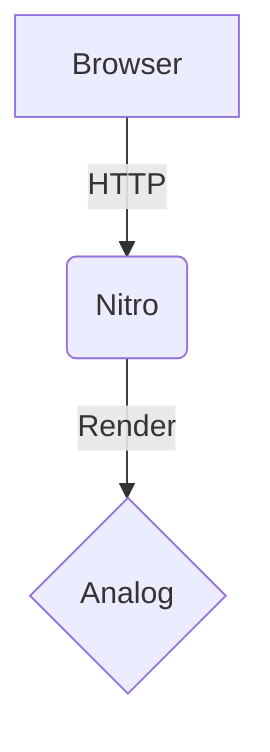

# 指南

> 基于 Analog v1.x / v2.x（`@analogjs/platform` / `@analogjs/router` / `@analogjs/content`）+ Angular v17/v18/v19/v20+ + Vite v5/v6/v8 + Nitro v2 编写。涵盖文件路由全集 / Layouts / Server Routes / Server-Side Data Fetching / Form Actions / Route Metadata / Middleware / Markdown Content / SSR / SSG / Nitro Adapter / 与 Angular 标准项目共存 / 常见踩坑。

## 文件路由全集

Analog 在 Angular Router 之上叠加「**文件即路由**」约定——`src/app/pages/` 下所有 `*.page.ts` 文件自动收集成 Angular `Routes[]`。共 5 类主路由 + 2 类辅助。

### 总览：5 种主路由类型

| 类型 | 写法 | 示例 | URL |
|---|---|---|---|
| Index 路由 | `(name).page.ts` 或 `index.page.ts` | `(home).page.ts` | `/` |
| 静态路由 | `name.page.ts` | `about.page.ts` | `/about` |
| 嵌套静态 | `parent/child.page.ts` 或 `parent.child.page.ts` | `about/team.page.ts` | `/about/team` |
| 路由组 | `(group)/page.ts`（不影响 URL） | `(auth)/login.page.ts` | `/login` |
| 动态路由 | `[param].page.ts` | `[productId].page.ts` | `/:productId` |
| Layout 路由 | parent 同名 + 子文件夹 | `products.page.ts` + `products/` | `/products` + `/products/*` |
| Pathless Layout | `(group).page.ts` + `(group)/` | `(auth).page.ts` + `(auth)/` | 共享 layout 但不加 URL |
| Catch-all | `[...name].page.ts` | `[...not-found].page.ts` | `**` (404) |

### Index 路由

首页用 `(home).page.ts` 或 `index.page.ts`：

```ts
// src/app/pages/(home).page.ts → /
import { Component } from "@angular/core";

@Component({
  template: `<h2>Welcome Home</h2>`,
})
export default class HomePageComponent {}
```

> **两种写法等价**：`(home)` 括号语法 vs `index` 直接命名——团队约定二选一即可。`(home)` 可读性更好（一眼看出是首页），`index` 更对齐其他元框架的命名习惯（Next.js / Nuxt）。

### 静态路由

```ts
// src/app/pages/about.page.ts → /about
import { Component } from "@angular/core";

@Component({
  template: `<h2>About</h2>`,
})
export default class AboutPageComponent {}
```

### 嵌套静态路由

两种语法等价：

```treeview
# 方式 1：文件夹嵌套
src/app/pages/
├── about/
│   ├── (about-home).page.ts    → /about
│   ├── team.page.ts            → /about/team
│   └── contact.page.ts         → /about/contact

# 方式 2：点号
src/app/pages/
├── about.page.ts               → /about
├── about.team.page.ts          → /about/team
└── about.contact.page.ts       → /about/contact
```

**选择策略**：

- **需要共享 layout** → 文件夹嵌套（配合 parent `about.page.ts`）
- **只是路径分组、无共享布局** → 点号写法更扁平
- **混合使用合法**：可以在同一项目中按需选择

### 路由组（不影响 URL）

`(group)/` 括号文件夹是「**逻辑分组**」——文件夹存在但不出现在 URL 中：

```treeview
src/
└── app/
    └── pages/
        └── (auth)/
            ├── login.page.ts      → /login
            ├── signup.page.ts     → /signup
            └── forgot.page.ts     → /forgot
```

**用途**：

- 按业务域组织文件（`(auth)` / `(marketing)` / `(dashboard)`）
- 与同名 Pathless Layout `(auth).page.ts` 配合共享布局
- **不修改 URL 路径**——访问 `/login` 而非 `/auth/login`

### 动态路由

`[xxx]` 方括号语法：

```ts
// src/app/pages/products/[productId].page.ts → /products/:productId
import { Component, inject } from "@angular/core";
import { ActivatedRoute } from "@angular/router";
import { AsyncPipe } from "@angular/common";
import { map } from "rxjs";

@Component({
  imports: [AsyncPipe],
  template: `
    <h2>Product</h2>
    <p>ID: {{ id$ | async }}</p>
  `,
})
export default class ProductPage {
  private route = inject(ActivatedRoute);
  id$ = this.route.paramMap.pipe(map((p) => p.get("productId")));
}
```

> Angular 模板的插值（如 <span v-pre>`{{ id$ | async }}`</span>）在 VitePress 内联反引号中需要用 `<span v-pre>` 包裹，避免被 Vue 渲染。代码块内安全无需处理。

#### Component Input Bindings（推荐写法）

启用 `withComponentInputBinding()` 后，参数变成 Input：

```ts
// src/app/app.config.ts
import { provideFileRouter } from "@analogjs/router";
import { withComponentInputBinding } from "@angular/router";

providers: [provideFileRouter(withComponentInputBinding())];
```

```ts
// src/app/pages/products/[productId].page.ts
import { Component, Input } from "@angular/core";

@Component({
  template: `<p>ID: {{ productId }}</p>`,
})
export default class ProductPage {
  @Input() productId!: string;
}
```

**优势**：

- 无需注入 `ActivatedRoute` + 订阅 `paramMap`
- 类型推断（多个参数都自动成为 Input）
- 配合 Server Load 时，`load` 也是一个 Input（详见后文）

#### 多参数 / 复合参数

```treeview
src/app/pages/users/[userId]/posts/[postId].page.ts → /users/:userId/posts/:postId
```

```ts
@Component({...})
export default class PostPage {
  @Input() userId!: string;
  @Input() postId!: string;
}
```

### Layout 路由

**核心模式**：parent 同名文件 + 同名子文件夹。

```treeview
src/
└── app/
    └── pages/
        ├── products/
        │   ├── (products-list).page.ts   → /products
        │   └── [productId].page.ts       → /products/:productId
        └── products.page.ts              ← parent layout（必须有 router-outlet）
```

parent `products.page.ts`（layout）：

```ts
// src/app/pages/products.page.ts
import { Component } from "@angular/core";
import { RouterOutlet } from "@angular/router";

@Component({
  imports: [RouterOutlet],
  template: `
    <h2>Products</h2>
    <nav><a routerLink="/products">All</a></nav>

    <router-outlet />
  `,
})
export default class ProductsLayout {}
```

子页面 `products/(products-list).page.ts`：

```ts
@Component({
  template: `<h3>Products List</h3>`,
})
export default class ProductsListPage {}
```

**关键点**：

- parent 名字必须**与子文件夹同名**（`products.page.ts` ↔ `products/`）
- parent 必须 `imports: [RouterOutlet]` + 模板包含 `<router-outlet />`
- 子文件夹下任意 `*.page.ts` 都继承这个 layout
- 嵌套 layout 可继续叠加（`products/[productId]/edit.page.ts` 也可以再有 `products/[productId].page.ts` 作为子 layout）

#### Pathless Layout

`(group).page.ts` + `(group)/` —— 共享 layout 但不增加 URL 路径段：

```treeview
src/
└── app/
    └── pages/
        ├── (auth)/
        │   ├── login.page.ts      → /login (layout: (auth).page.ts)
        │   └── signup.page.ts     → /signup (layout: (auth).page.ts)
        └── (auth).page.ts         ← 共享布局
```

`(auth).page.ts`：

```ts
@Component({
  imports: [RouterOutlet],
  template: `
    <div class="auth-shell">
      <header><h1>Auth</h1></header>
      <main><router-outlet /></main>
    </div>
  `,
})
export default class AuthLayout {}
```

**含义**：`/login` 和 `/signup` 共享 `AuthLayout` 包裹，但路径不包含 `auth`。

### Catch-all 路由

`[...xxx]` 三个点匹配任意剩余路径（对应 Angular Router 的 `**`）：

```ts
// src/app/pages/[...not-found].page.ts → 通配符 **
import { Component } from "@angular/core";
import { RouterLink } from "@angular/router";
import { injectResponse } from "@analogjs/router/tokens";
import type { RouteMeta } from "@analogjs/router";

export const routeMeta: RouteMeta = {
  title: "Page Not Found",
  canActivate: [
    () => {
      const response = injectResponse();
      if (import.meta.env.SSR && response) {
        // 在 SSR 时设置 HTTP 404 状态码
        response.statusCode = 404;
        response.end();
      }
      return true;
    },
  ],
};

@Component({
  imports: [RouterLink],
  template: `
    <h2>404 - Page Not Found</h2>
    <a routerLink="/">Go Home</a>
  `,
})
export default class NotFoundPage {}
```

**关键点**：

- 必须返回 HTTP 404 状态码（否则爬虫认为页面成功）
- 嵌套 catch-all 也合法：`/products/[...invalid].page.ts` 处理 `/products/foo/bar/baz`
- 通常配合 Markdown：`src/app/pages/[...not-found].md` 也可以

### 完整路由表示例

对于下列文件结构：

```treeview
src/
└── app/
    └── pages/
        ├── (auth)/
        │   ├── login.page.ts
        │   └── signup.page.ts
        ├── (marketing)/
        │   ├── about.md
        │   └── contact.md
        ├── products/
        │   ├── (product-list).page.ts
        │   ├── [productId].edit.page.ts
        │   └── [productId].page.ts
        ├── (auth).page.ts
        ├── (home).page.ts
        ├── [...not-found].md
        └── products.page.ts
```

Analog 生成的路由表：

| 路径 | 页面 | 共享 Layout |
|---|---|---|
| `/` | `(home).page.ts` | — |
| `/about` | `(marketing)/about.md` | — |
| `/contact` | `(marketing)/contact.md` | — |
| `/login` | `(auth)/login.page.ts` | `(auth).page.ts` |
| `/signup` | `(auth)/signup.page.ts` | `(auth).page.ts` |
| `/products` | `products/(product-list).page.ts` | `products.page.ts` |
| `/products/1` | `products/[productId].page.ts` | `products.page.ts` |
| `/products/1/edit` | `products/[productId].edit.page.ts` | `products.page.ts` |
| `/unknown` | `[...not-found].md` | — |

### `withExtraRoutes` 手动追加路由

需要混入手动定义的路由（如来自老代码或第三方库）：

```ts
// src/app/app.config.ts
import { ApplicationConfig } from "@angular/core";
import { Routes } from "@angular/router";
import { provideFileRouter, withExtraRoutes } from "@analogjs/router";

const customRoutes: Routes = [
  {
    path: "custom",
    loadComponent: () =>
      import("./custom-component").then((m) => m.CustomComponent),
  },
];

export const appConfig: ApplicationConfig = {
  providers: [provideFileRouter(withExtraRoutes(customRoutes))],
};
```

`withExtraRoutes` 的路由会**前置**合并到自动发现的路由数组——优先级更高。

### `withDebugRoutes` 可视化

```ts
import { provideFileRouter, withDebugRoutes } from "@analogjs/router";

providers: [provideFileRouter(withDebugRoutes())];
```

访问 `/__analog/routes` 看完整路由表（含每条路由对应的文件、layout、是否动态等）。

> **不要在生产打包时启用** `withDebugRoutes()`——可以通过 `mode === 'development'` 条件加载：
>
> ```ts
> import.meta.env.DEV ? withDebugRoutes() : (() => () => {})()
> ```

## Server Routes（API + Nitro）

Analog 的服务端能力由 **Nitro + h3** 提供。所有 server 代码放在 `src/server/`，文件即路由。

### 目录结构

```
src/
└── server/
    ├── routes/
    │   └── api/                       ← 所有文件 → /api/* 路径
    │       ├── hello.ts               → GET/POST/... /api/hello
    │       ├── users/
    │       │   └── [id].get.ts        → GET /api/users/:id
    │       └── [...].ts               → 兜底所有 /api/* 未匹配请求
    └── middleware/                    ← 中间件
        └── 1.auth.ts                  → 数字前缀控制顺序
```

### 基础 API Route

```ts
// src/server/routes/api/hello.ts → /api/hello
import { defineEventHandler } from "h3";

export default defineEventHandler(() => ({
  message: "Hello World",
  timestamp: Date.now(),
}));
```

启动 dev server 后，访问 `http://localhost:5173/api/hello`：

```json
{ "message": "Hello World", "timestamp": 1747800000000 }
```

### 动态 API 参数

`[name]` 方括号语法，`getRouterParam` 或 `event.context.params` 读取：

```ts
// src/server/routes/api/v1/hello/[name].ts → /api/v1/hello/:name
import { defineEventHandler, getRouterParam } from "h3";

export default defineEventHandler((event) => {
  const name = getRouterParam(event, "name");
  return `Hello, ${name}!`;
});
```

或：

```ts
export default defineEventHandler((event) => {
  return `Hello, ${event.context.params?.["name"]}!`;
});
```

### HTTP 方法后缀

`.get.ts` / `.post.ts` / `.put.ts` / `.patch.ts` / `.delete.ts` 限定方法：

```ts
// src/server/routes/api/v1/users/[id].get.ts
import { defineEventHandler, getRouterParam } from "h3";

export default defineEventHandler(async (event) => {
  const id = getRouterParam(event, "id");
  // TODO: fetch user by id from DB
  return { id, name: "Alice" };
});
```

```ts
// src/server/routes/api/v1/users.post.ts
import { defineEventHandler, readBody } from "h3";

export default defineEventHandler(async (event) => {
  const body = await readBody<{ name: string; email: string }>(event);
  // TODO: insert into DB
  return { id: Date.now(), ...body };
});
```

**关键点**：

- **`.get.ts` / `.post.ts` 等只匹配对应方法**——访问错误方法返回 405
- **没有后缀的文件**：默认处理**所有方法**（GET / POST / PUT / DELETE）
- 同一资源 GET + POST：同一目录下两个文件 `users.get.ts` + `users.post.ts`

### 查询参数 `getQuery`

```ts
// src/server/routes/api/v1/search.ts → /api/v1/search?q=...&page=...
import { defineEventHandler, getQuery } from "h3";

export default defineEventHandler((event) => {
  const { q, page = "1" } = getQuery<{ q: string; page?: string }>(event);
  return {
    query: q,
    page: parseInt(page),
    results: [],
  };
});
```

### Catch-all API

`[...].ts` 兜底所有未匹配请求：

```ts
// src/server/routes/api/[...].ts
import { defineEventHandler } from "h3";

export default defineEventHandler((event) => {
  return { error: "Not Found", path: event.path };
});
```

### 错误处理 `createError`

未捕获错误返回 500，要返回特定状态码用 `createError`：

```ts
// src/server/routes/api/v1/products/[id].ts
import { defineEventHandler, getRouterParam, createError } from "h3";

export default defineEventHandler((event) => {
  const param = getRouterParam(event, "id");
  const id = parseInt(param ?? "");

  if (!Number.isInteger(id)) {
    throw createError({
      statusCode: 400,
      statusMessage: "ID must be an integer",
    });
  }

  if (id > 100) {
    throw createError({
      statusCode: 404,
      statusMessage: "Product not found",
    });
  }

  return { id, name: `Product ${id}` };
});
```

### XML / RSS 输出

设置 `content-type` 为 `text/xml`：

```ts
// src/server/routes/api/rss.xml.ts
import { defineEventHandler, setHeader } from "h3";

export default defineEventHandler((event) => {
  const feed = `<?xml version="1.0" encoding="UTF-8"?>
<rss version="2.0">
  <channel>
    <title>My Blog</title>
    <link>https://example.com</link>
    <description>My blog posts</description>
  </channel>
</rss>`;

  setHeader(event, "content-type", "text/xml");
  return feed;
});
```

> **配合 SSG**：要让 `/api/rss.xml` 在构建时预渲染为静态文件，将其加入 `vite.config.ts` 的 `prerender.routes`：
>
> ```ts
> analog({
>   prerender: {
>     routes: async () => ["/", "/api/rss.xml"],
>   },
> });
> ```
>
> 构建后产物在 `dist/analog/public/api/rss.xml`。

### Cookie 操作

```ts
// 设置 cookie
import { setCookie } from "h3";

export default defineEventHandler((event) => {
  setCookie(event, "sessionId", "abc123", {
    httpOnly: true,
    secure: true,
    maxAge: 60 * 60 * 24, // 1 day
    sameSite: "lax",
  });
  return { ok: true };
});
```

```ts
// 读取 cookies
import { parseCookies } from "h3";

export default defineEventHandler((event) => {
  const cookies = parseCookies(event);
  const sessionId = cookies["sessionId"];
  return { sessionId };
});
```

### WebSocket（实验性）

需在 `vite.config.ts` 中启用：

```ts
// vite.config.ts
analog({
  nitro: {
    experimental: {
      websocket: true,
    },
  },
});
```

> **注意 HMR 端口冲突**：Vite dev server 的 HMR WebSocket 默认与主服务器同端口。要避免冲突，移除 `angular.json` / `project.json` 中的 port 配置，让 `vite.config.ts` 中的配置生效：
>
> ```ts
> server: {
>   port: 3000,
>   hmr: {
>     port: 3002,
>     path: "vite-hmr",
>   },
> }
> ```

定义 WebSocket handler：

```ts
// src/server/routes/api/ws/chat.ts → ws://example.com/api/ws/chat
import { defineWebSocketHandler } from "h3";

export default defineWebSocketHandler({
  open(peer) {
    peer.send({ user: "server", message: `Welcome ${peer}!` });
    peer.publish("chat", { user: "server", message: `${peer} joined!` });
    peer.subscribe("chat");
  },
  message(peer, message) {
    if (message.text().includes("ping")) {
      peer.send({ user: "server", message: "pong" });
    } else {
      const msg = { user: peer.toString(), message: message.toString() };
      peer.send(msg);
      peer.publish("chat", msg);
    }
  },
  close(peer) {
    peer.publish("chat", { user: "server", message: `${peer} left!` });
  },
});
```

### Server-Sent Events（SSE）

```ts
// src/server/routes/api/sse.ts
import { defineEventHandler, createEventStream } from "h3";

export default defineEventHandler(async (event) => {
  const eventStream = createEventStream(event);

  const interval = setInterval(async () => {
    await eventStream.push(`Message @ ${new Date().toLocaleTimeString()}`);
  }, 1000);

  eventStream.onClosed(async () => {
    clearInterval(interval);
    await eventStream.close();
  });

  return eventStream.send();
});
```

客户端用浏览器原生 `EventSource`：

```ts
const sse = new EventSource("/api/sse");
sse.onmessage = (e) => console.log("received:", e.data);
sse.onerror = () => sse.close();
```

## Server-Side Data Fetching

页面进入前的服务端数据加载——`.server.ts` 文件中导出 `async load` 函数。

### 基础写法

```ts
// src/app/pages/blog/index.server.ts
import type { PageServerLoad } from "@analogjs/router";

export const load = async ({
  params, // 路由参数
  req, // H3 Request
  res, // H3 Response
  fetch, // 内置 fetch
  event, // 完整 H3 event
}: PageServerLoad) => {
  const posts = await fetch<Post[]>("/api/v1/posts");
  return { posts };
};

interface Post {
  id: number;
  title: string;
  excerpt: string;
}
```

组件中通过 `injectLoad` 接收：

```ts
// src/app/pages/blog/index.page.ts
import { Component } from "@angular/core";
import { toSignal } from "@angular/core/rxjs-interop";
import { injectLoad } from "@analogjs/router";

import type { load } from "./index.server"; // 仅类型导入

@Component({
  template: `
    <h1>Blog</h1>
    @if (data(); as d) {
      @for (post of d.posts; track post.id) {
        <article>
          <h3>{{ post.title }}</h3>
          <p>{{ post.excerpt }}</p>
        </article>
      }
    }
  `,
})
export default class BlogIndexPage {
  data = toSignal(injectLoad<typeof load>(), { requireSync: true });
}
```

**核心约束**：

- **`*.server.ts` 不会进入 client bundle**——里面可以用 Node API、数据库客户端、敏感 keys
- **必须 `import type`** 导入 `load`——确保是纯类型引用
- `injectLoad<typeof load>()` 返回 `Observable<LoadResult<typeof load>>`，配合 `toSignal` 转为 Signal
- `{ requireSync: true }`：路由 resolver 在组件实例化前已完成，可同步访问，避免初始 undefined
- 内置 `fetch` 直接调用内部 API（在 SSR 时绕过 HTTP，直接 Nitro 内部路由）

### 用 Component Input Bindings 接收

启用 `withComponentInputBinding()` 后：

```ts
import { Component, Input } from "@angular/core";
import type { LoadResult } from "@analogjs/router";
import type { load } from "./index.server";

@Component({
  template: `
    @for (post of data?.posts ?? []; track post.id) {
      <article>{{ post.title }}</article>
    }
  `,
})
export default class BlogIndexPage {
  @Input() set load(value: LoadResult<typeof load>) {
    this.data = value;
  }
  data?: LoadResult<typeof load>;
}
```

### `getLoadResolver`：在 RouteMeta resolver 中访问 load

如果你已经有 `RouteMeta.resolve` resolver，想复用 `load` 的数据：

```ts
import type { RouteMeta } from "@analogjs/router";
import { getLoadResolver } from "@analogjs/router";

export const routeMeta: RouteMeta = {
  resolve: {
    extra: async (route) => {
      // 获取本路由的 load 数据
      const loadData = await getLoadResolver(route);
      return {
        ...loadData,
        timestamp: Date.now(),
      };
    },
  },
};
```

### Server Context 注入

在 server 端访问 Request / Response / Base URL：

```ts
// src/app/some.service.ts（在 SSR + client 都可注入）
import { Injectable } from "@angular/core";
import {
  injectRequest,
  injectResponse,
  injectBaseURL,
} from "@analogjs/router/tokens";

@Injectable({ providedIn: "root" })
export class MyService {
  request = injectRequest(); // H3 Request 对象（仅 SSR 时有值）
  response = injectResponse(); // H3 Response 对象（仅 SSR 时有值）
  baseUrl = injectBaseURL(); // server base URL，如 "https://example.com"
}
```

> 在 client 端，三者均为 `null` ——服务端独占数据应在 `*.server.ts` 中处理。

### `requestContextInterceptor`：相对 URL 自动绝对化

`HttpClient` 用相对路径 `/api/foo` 时，SSR 阶段没有 host header 会失败。`requestContextInterceptor` 自动加 host：

```ts
// src/app/app.config.ts
import {
  provideHttpClient,
  withFetch,
  withInterceptors,
} from "@angular/common/http";
import { requestContextInterceptor } from "@analogjs/router";

providers: [
  provideHttpClient(
    withFetch(),
    withInterceptors([
      // 其他拦截器（如 auth、logging）...
      requestContextInterceptor, // ⚠️ 必须放最后
    ])
  ),
];
```

> **`requestContextInterceptor` 必须放数组最后**——它在最末层加 host，其他拦截器（如 auth）在前面修改请求。

### TransferState 自动缓存

`HttpClient` 在 SSR 阶段的所有请求会通过 Angular `TransferState` 序列化到 HTML，client hydration 后直接读缓存——不重复请求。**无需手动配置**。

### 覆盖默认 base URL

如部署在子路径或不同域名下，设置环境变量：

```bash
# .env
VITE_ANALOG_PUBLIC_BASE_URL="http://localhost:5173"
```

```bash
# 生产
VITE_ANALOG_PUBLIC_BASE_URL="https://api.example.com"
```

## Form Server Actions

仿 Remix / SvelteKit / SolidStart 的表单提交模式——`.server.ts` 中导出 `async action`，配合 `FormAction` 指令。

### 基础写法

页面：

```ts
// src/app/pages/newsletter.page.ts
import { Component, signal } from "@angular/core";
import { FormAction } from "@analogjs/router";

type FormErrors = { email?: string } | undefined;

@Component({
  imports: [FormAction],
  template: `
    @if (!signedUp()) {
      <form
        method="post"
        (onSuccess)="onSuccess()"
        (onError)="onError($any($event))"
        (onStateChange)="errors.set(undefined)"
      >
        <input type="email" name="email" />

        @if (errors()?.email) {
          <p class="error">{{ errors()?.email }}</p>
        }

        <button type="submit">Subscribe</button>
      </form>
    } @else {
      <p>Thanks for signing up!</p>
    }
  `,
})
export default class NewsletterPage {
  signedUp = signal(false);
  errors = signal<FormErrors>(undefined);

  onSuccess() {
    this.signedUp.set(true);
  }

  onError(result?: FormErrors) {
    this.errors.set(result);
  }
}
```

服务端 action：

```ts
// src/app/pages/newsletter.server.ts
import {
  type PageServerAction,
  redirect,
  json,
  fail,
} from "@analogjs/router/server/actions";
import { readFormData } from "h3";

export async function action({ event }: PageServerAction) {
  const body = await readFormData(event);
  const email = body.get("email") as string;

  // 校验
  if (!email) {
    return fail(422, { email: "Email is required" });
  }
  if (!email.includes("@")) {
    return fail(422, { email: "Invalid email format" });
  }

  // 业务逻辑（DB / 邮件 / etc.）
  console.log("Subscribed:", email);

  return json({ type: "success" });
}
```

**核心三件套**：

| 函数 | 用途 | 返回值 |
|---|---|---|
| `json(data)` | 返回成功响应 | 标记为 success，组件 `(onSuccess)` 触发 |
| `redirect(path)` | 重定向 | 浏览器导航到 `path`（必须是绝对路径） |
| `fail(status, data)` | 校验错误 | 标记为 error，组件 `(onError)` 触发，`data` 透传 |

### `FormAction` 指令的三个事件

| 事件 | 触发时机 |
|---|---|
| `(onSuccess)` | server 返回 `json(...)` 时 |
| `(onError)` | server 返回 `fail(status, data)` 或异常时 |
| `(onStateChange)` | 表单 submit 开始时（用于清空旧错误） |

### Progressive Enhancement（JS 禁用也能用）

`FormAction` 是 progressive enhancement：

- JS 启用：fetch 提交 + 事件回调，不刷新页面
- JS 禁用：原生 `<form method="post">` 提交，浏览器整页刷新——依然能完成

服务端代码完全相同，UX 自动降级。

### 多表单同页

加 `<input type="hidden" name="action" value="...">` 区分：

```html
<form method="post">
  <input type="email" name="email" />
  <input type="hidden" name="action" value="subscribe" />
  <button type="submit">Subscribe</button>
</form>

<form method="post">
  <input type="text" name="search" />
  <input type="hidden" name="action" value="search" />
  <button type="submit">Search</button>
</form>
```

```ts
export async function action({ event }: PageServerAction) {
  const body = await readFormData(event);
  const action = body.get("action") as string;

  switch (action) {
    case "subscribe": {
      const email = body.get("email") as string;
      // ...
      return json({ ok: true });
    }
    case "search": {
      const q = body.get("search") as string;
      return redirect(`/search?q=${encodeURIComponent(q)}`);
    }
    default:
      return fail(400, { error: "Unknown action" });
  }
}
```

### GET 表单（搜索）

GET 表单 + query 参数 + Server Load 一起用：

```ts
// src/app/pages/search.page.ts
import { Component, computed } from "@angular/core";
import { toSignal } from "@angular/core/rxjs-interop";
import { injectLoad, FormAction } from "@analogjs/router";

import type { load } from "./search.server";

@Component({
  imports: [FormAction],
  template: `
    <form method="get">
      <input type="text" name="search" [value]="searchTerm()" />
      <button type="submit">Search</button>
    </form>

    @if (searchTerm()) {
      <p>Search Term: {{ searchTerm() }}</p>
    }
  `,
})
export default class SearchPage {
  loader = toSignal(injectLoad<typeof load>(), { requireSync: true });
  searchTerm = computed(() => this.loader().searchTerm);
}
```

```ts
// src/app/pages/search.server.ts
import type { PageServerLoad } from "@analogjs/router";
import { getQuery } from "h3";

export async function load({ event }: PageServerLoad) {
  const query = getQuery(event);
  const search = (query["search"] as string) ?? "";

  return {
    loaded: true,
    searchTerm: search,
  };
}
```

> **GET 表单不需要 `action()` server 函数**——浏览器把表单数据作为 query string 拼到当前 URL，`load()` 通过 `getQuery(event)` 读取。

## Route Metadata（`RouteMeta`）

每个 `*.page.ts` 文件可同时导出 `routeMeta`，传给 Angular Router：

```ts
import type { RouteMeta } from "@analogjs/router";
import { inject } from "@angular/core";

import { AboutService } from "./about.service";

export const routeMeta: RouteMeta = {
  title: "About Analog",
  canActivate: [() => true],
  providers: [AboutService],
};

@Component({...})
export default class AboutPage {
  private service = inject(AboutService);
}
```

**`RouteMeta` 主要字段**：

| 字段 | 类型 | 用途 |
|---|---|---|
| `title` | `string \| ResolveFn<string>` | 页面 `<title>` |
| `meta` | `MetaTag[] \| ResolveFn<MetaTag[]>` | meta 标签 |
| `canActivate` | `CanActivateFn[]` | 路由守卫 |
| `canDeactivate` | `CanDeactivateFn[]` | 离开守卫 |
| `resolve` | `Record<string, ResolveFn>` | Angular Router resolver |
| `providers` | `Provider[]` | 该路由专属 providers |
| `redirectTo` | `string` | 重定向目标 |
| `pathMatch` | `'full' \| 'prefix'` | 重定向匹配模式 |

### 重定向路由

只重定向不渲染：

```ts
// src/app/pages/index.page.ts
import type { RouteMeta } from "@analogjs/router";

export const routeMeta: RouteMeta = {
  redirectTo: "/home",
  pathMatch: "full",
};

// ⚠️ 不要 export default class —— 纯重定向文件不需要组件
```

嵌套重定向：

```ts
// src/app/pages/cities/index.page.ts
export const routeMeta: RouteMeta = {
  redirectTo: "/cities/new-york",
  pathMatch: "full",
};
```

> **嵌套重定向 `redirectTo` 必须是绝对路径**（`/cities/new-york` 而非 `new-york`）—— Angular Router 限制。

### Meta 标签

```ts
export const routeMeta: RouteMeta = {
  title: "Refresh every 30s",
  meta: [
    {
      httpEquiv: "refresh",
      content: "30",
    },
    {
      name: "description",
      content: "This page refreshes every 30 seconds",
    },
  ],
};
```

输出到 `<head>`：

```html
<meta http-equiv="refresh" content="30" />
<meta name="description" content="This page refreshes every 30 seconds" />
```

### Open Graph + SEO

```ts
export const routeMeta: RouteMeta = {
  title: "My Blog Post",
  meta: [
    { name: "description", content: "Article description" },
    { name: "author", content: "Analog Team" },
    { property: "og:title", content: "My Blog Post" },
    { property: "og:description", content: "Article description" },
    { property: "og:image", content: "https://example.com/cover.png" },
    { property: "og:url", content: "https://example.com/blog/post-1" },
    { property: "og:type", content: "article" },
    { name: "twitter:card", content: "summary_large_image" },
  ],
};
```

### 动态 meta（基于数据）

```ts
// src/app/pages/blog/posts.[slug].page.ts
import type { RouteMeta } from "@analogjs/router";
import type { ResolveFn } from "@angular/router";
import { inject } from "@angular/core";

import { injectActivePostAttributes } from "@analogjs/content";

const postTitleResolver: ResolveFn<string> = (route) => {
  const attrs = injectActivePostAttributes(route);
  return attrs.title;
};

const postMetaResolver: ResolveFn<MetaTag[]> = (route) => {
  const attrs = injectActivePostAttributes(route);
  return [
    { name: "description", content: attrs.description },
    { property: "og:title", content: attrs.title },
    { property: "og:description", content: attrs.description },
    { property: "og:image", content: attrs.coverImage },
  ];
};

export const routeMeta: RouteMeta = {
  title: postTitleResolver,
  meta: postMetaResolver,
};
```

## Middleware（服务端中间件）

服务端请求级中间件——`src/server/middleware/*.ts`：

```ts
// src/server/middleware/1.auth.ts
import {
  defineEventHandler,
  getRequestURL,
  parseCookies,
  sendRedirect,
} from "h3";

export default defineEventHandler(async (event) => {
  const pathname = getRequestURL(event).pathname;

  // 仅对 /admin/* 路径生效
  if (pathname.startsWith("/admin")) {
    const cookies = parseCookies(event);
    const token = cookies["authToken"];

    if (!token) {
      return sendRedirect(event, "/login", 401);
    }
  }
});
```

**关键约束**：

- 中间件**只能修改请求 / 返回 redirect**，不能正常 return 数据（其他 handler 会接管）
- 按**文件名顺序执行**（数字前缀 `1.` `2.` `99.` 控制顺序）
- 必须将中间件目录加入 `tsconfig.app.json` 的 `include`：
  ```json
  {
    "include": [
      "src/**/*.d.ts",
      "src/app/pages/**/*.page.ts",
      "src/server/middleware/**/*.ts"
    ]
  }
  ```

### 设置 headers

```ts
import { defineEventHandler, setHeaders } from "h3";

export default defineEventHandler((event) => {
  setHeaders(event, {
    "x-powered-by": "Analog",
    "x-frame-options": "DENY",
  });
});
```

### 访问环境变量

`process.env` 在中间件中可用：

```ts
import { defineEventHandler } from "h3";

export default defineEventHandler((event) => {
  console.log("Path:", event.path);
  console.log("Server-only var:", process.env["SERVER_SECRET"]);
  console.log("Public var:", process.env["VITE_PUBLIC_API_KEY"]);
});
```

> **环境变量约定**：`VITE_*` 前缀对 client 可见，无前缀仅 server 可访问。详见 [Vite 文档](https://vitejs.dev/guide/env-and-mode.html)。

## Markdown Content Routes

Analog 内置 `@analogjs/content` 包，支持把 Markdown 作为路由 / 集合 / 内嵌内容。

### 启用

```ts
// src/app/app.config.ts
import { provideContent, withMarkdownRenderer } from "@analogjs/content";

providers: [provideContent(withMarkdownRenderer())];
```

```ts
// vite.config.ts
analog({
  content: {
    highlighter: "prism", // 或 "shiki"
  },
});
```

### Markdown 作为路由

```md
<!-- src/app/pages/about.md → /about -->
---
title: About
meta:
  - name: description
    content: About this site
---

## About

Welcome to Analog.

[Back Home](./)
```

访问 `/about` 直接渲染——支持 Frontmatter / 代码高亮 / 链接 / 图片 / 表格等。

### 嵌入 Markdown 到组件（`injectContent`）

适合博客详情页这种「读单个 markdown 文件 + Angular 组件 + 自定义模板」场景：

```treeview
src/
├── app/
│   └── pages/
│       └── blog/
│           └── posts.[slug].page.ts
└── content/
    ├── 2026-01-01-hello.md
    └── 2026-02-15-world.md
```

```md
<!-- src/content/2026-01-01-hello.md -->
---
title: Hello World
slug: 2026-01-01-hello
description: My first post
coverImage: https://images.unsplash.com/photo-xxx
---

This is my first post.

\`\`\`ts
const greet = (name: string) => `Hello, \${name}!`;
\`\`\`
```

页面：

```ts
// src/app/pages/blog/posts.[slug].page.ts
import { Component } from "@angular/core";
import { AsyncPipe } from "@angular/common";
import { injectContent, MarkdownComponent } from "@analogjs/content";

export interface PostAttributes {
  title: string;
  slug: string;
  description: string;
  coverImage: string;
}

@Component({
  imports: [MarkdownComponent, AsyncPipe],
  template: `
    @if (post$ | async; as post) {
      <article>
        <h1>{{ post.attributes.title }}</h1>
        
        <analog-markdown [content]="post.content" />
      </article>
    }
  `,
})
export default class BlogPostPage {
  post$ = injectContent<PostAttributes>(); // 默认按 `slug` 路由参数读
}
```

### 列出多篇 Markdown（`injectContentFiles`）

```ts
// src/app/pages/blog/(blog-list).page.ts
import { Component } from "@angular/core";
import { RouterLink } from "@angular/router";
import { injectContentFiles } from "@analogjs/content";

import type { PostAttributes } from "./posts.[slug].page";

@Component({
  imports: [RouterLink],
  template: `
    <h1>Blog</h1>
    <ul>
      @for (post of posts; track post.slug) {
        <li>
          <a [routerLink]="['/blog', 'posts', post.attributes.slug]">
            {{ post.attributes.title }}
          </a>
        </li>
      } @empty {
        <li>No posts yet.</li>
      }
    </ul>
  `,
})
export default class BlogListPage {
  posts = injectContentFiles<PostAttributes>((file) =>
    file.filename.includes("/src/content/")
  );
}
```

> **`injectContentFiles` 仅返回 metadata**（`filename` / `slug` / `attributes`）—— **不加载 body 内容**。如要读 body，对每个文件单独调用 `injectContent` 或在详情页中加载。

### 子目录组织

```treeview
src/
└── content/
    ├── posts/
    │   ├── hello.md
    │   └── world.md
    └── projects/
        ├── project-a.md
        └── project-b.md
```

```ts
readonly post$ = injectContent<PostAttributes>({
  param: "slug",
  subdirectory: "posts",
});

readonly project$ = injectContent<ProjectAttributes>({
  param: "slug",
  subdirectory: "projects",
});
```

### 递归子目录 + Catch-all 路由

复杂文档站需要任意层级的 Markdown 路由：

```treeview
src/
├── app/pages/docs/[...slug].page.ts
└── content/docs/
    ├── getting-started/
    │   ├── welcome.md
    │   └── first-upload.md
    └── assets/
        └── upload.md
```

```ts
// src/app/pages/docs/[...slug].page.ts
@Component({...})
export default class DocPage {
  doc$ = injectContent({
    param: "slug",
    subdirectory: "docs",
  });
}
```

请求 `/docs/getting-started/welcome` 自动解析到 `src/content/docs/getting-started/welcome.md`。

### Prism 高亮

```ts
// app.config.ts
import { withPrismHighlighter } from "@analogjs/content/prism-highlighter";

provideContent(withMarkdownRenderer(), withPrismHighlighter());
```

```ts
// vite.config.ts
analog({
  content: {
    highlighter: "prism",
    prismOptions: {
      additionalLangs: ["prism-diff", "prism-bash", "prism-yaml"],
    },
  },
});
```

样式：

```css
/* src/styles.css */
@import "prismjs/themes/prism.css";
@import "prismjs/plugins/diff-highlight/prism-diff-highlight.css";
```

### Shiki 高亮（推荐生产）

更现代的语法高亮，VSCode 同款：

```ts
// app.config.ts
import { withShikiHighlighter } from "@analogjs/content/shiki-highlighter";

provideContent(withMarkdownRenderer(), withShikiHighlighter());
```

```ts
// vite.config.ts
analog({
  content: {
    highlighter: "shiki",
    shikiOptions: {
      highlight: {
        theme: "github-dark",
      },
      highlighter: {
        additionalLangs: ["diff", "yaml"],
        themes: ["github-dark", "github-light"],
      },
    },
  },
});
```

### Mermaid 图表

```ts
// app.config.ts
provideContent(
  withMarkdownRenderer({
    loadMermaid: () => import("mermaid"),
  })
);
```

启用后，markdown 中：

````md

````

会自动渲染为 SVG。

## SSR：服务端渲染

Analog 默认启用 SSR——`provideClientHydration()` 已在 `app.config.ts` 中配置。

### 不兼容 SSR 的依赖

某些 Angular 第三方库（如 Apollo / Material 部分组件 / Spartan）在 SSR 环境下报错。添加到 `ssr.noExternal`：

```ts
// vite.config.ts
export default defineConfig({
  ssr: {
    noExternal: [
      "apollo-angular",
      "apollo-angular/**",
      "@spartan-ng/**",
      // glob 也支持
    ],
  },
  plugins: [analog()],
});
```

> 详见 [Vite SSR Externals 文档](https://vitejs.dev/guide/ssr.html#ssr-externals)。

### Hybrid Rendering：部分路由仅 client

通过 `routeRules` 配置某些路由只在 client 渲染：

```ts
// vite.config.ts
analog({
  prerender: {
    routes: ["/", "/404.html"],
  },
  nitro: {
    routeRules: {
      // /admin/* 都不 SSR
      "/admin/**": { ssr: false },
      // 404 页面是 fallback
      "/404.html": { ssr: false },
    },
  },
});
```

**应用场景**：

- 后台管理页面（用户已登录后才访问，无需 SSR）
- 高度交互的页面（地图 / 富文本编辑器）
- 包含浏览器专属 API 的页面（WebGL / WebAudio）

### 完全关闭 SSR

```ts
// vite.config.ts
analog({
  ssr: false,
  prerender: {
    routes: [],
  },
});
```

此时项目是纯 client SPA——构建产物只有 `dist/analog/public`，无 `dist/analog/server`。

## SSG：静态站点生成

构建时预渲染静态 HTML——同一份代码 SSR + SSG 切换。

### 显式列出路由

```ts
// vite.config.ts
analog({
  prerender: {
    routes: async () => [
      "/",
      "/about",
      "/blog",
      "/blog/posts/2026-01-01-hello",
    ],
  },
});
```

### 从 Content 目录批量预渲染

针对博客 / 文档站，遍历整个内容目录：

```ts
import analog, { type PrerenderContentFile } from "@analogjs/platform";

analog({
  prerender: {
    routes: async () => [
      "/",
      "/blog",
      {
        contentDir: "src/content/blog",
        transform: (file: PrerenderContentFile) => {
          // 跳过 draft
          if (file.attributes.draft) {
            return false;
          }
          const slug = file.attributes.slug || file.name;
          return `/blog/${slug}`;
        },
      },
    ],
  },
});
```

`transform` 返回值含义：

- `string` → 该路径加入预渲染列表
- `false` → 跳过该文件

### 递归子目录（`recursive: true`）

默认只匹配顶层文件。要遍历嵌套目录：

```ts
analog({
  prerender: {
    routes: async () => [
      "/",
      {
        contentDir: "src/content/docs",
        recursive: true,
        transform: (file: PrerenderContentFile) => {
          const slug = file.attributes.slug || file.name;
          // file.relativePath 是文件相对 contentDir 的目录路径
          return file.relativePath
            ? `/docs/${file.relativePath}/${slug}`
            : `/docs/${slug}`;
        },
      },
    ],
  },
});
```

### 纯静态构建（无 server）

```ts
analog({
  static: true,
  prerender: {
    routes: async () => [
      "/",
      "/about",
      "/blog",
      // SPA fallback
      "/404.html",
    ],
  },
  nitro: {
    routeRules: {
      "/404.html": { ssr: false },
    },
  },
});
```

> `ssr` 必须仍为 `true`（默认）——`static: true` 表示只输出预渲染产物，不打包 server runtime。

构建产物全在 `dist/analog/public/`，可直接部署到任何静态托管（GitHub Pages / S3 / Netlify / CDN）。

### Prerender Server-Side Data

让 `*.server.ts` 的 `load()` 返回值一起被预渲染（client 侧不需要再发请求）：

```ts
analog({
  static: true,
  prerender: {
    routes: async () => [
      "/",
      {
        route: "/shipping",
        staticData: true, // ⚠️ 预渲染 server load 数据
      },
    ],
  },
});
```

### Sitemap 自动生成

```ts
analog({
  prerender: {
    routes: async () => ["/", "/blog"],
    sitemap: {
      host: "https://example.com",
    },
  },
});
```

构建后 `dist/analog/public/sitemap.xml` 自动生成。

精细控制 `lastmod` / `changefreq` / `priority`：

```ts
analog({
  prerender: {
    sitemap: { host: "https://example.com" },
    routes: async () => [
      "/",
      "/blog",
      {
        route: "/blog/post-1",
        sitemap: { lastmod: "2026-01-01" },
      },
      {
        contentDir: "/src/content/archived",
        transform: (file) => `/archived/${file.attributes.slug}`,
        sitemap: (file) => ({
          lastmod: file.attributes.updatedAt,
          changefreq: "never",
        }),
      },
    ],
  },
});
```

### Post-rendering Hooks

构建时对每个 HTML 文件做后处理：

```ts
import type { PrerenderRoute } from "nitropack";

analog({
  static: true,
  prerender: {
    routes: async () => ["/", "/aboutus"],
    postRenderingHooks: [
      async (route: PrerenderRoute) => {
        if (route.route === "/aboutus") {
          const gTag = `<script>...</script>`;
          route.contents = route.contents?.concat(gTag);
        }
      },
    ],
  },
});
```

**用途**：

- 内联 critical CSS
- 注入 GA / Plausible / 第三方统计
- 删除特定 script 标签
- 修改 meta tags

## Nitro Adapter：多端部署

同一份代码部署到 17+ 个平台——通过 Nitro `preset` 选择。

### 默认 Node.js

```bash
npm run build
node dist/analog/server/index.mjs
# Listening on http://localhost:3000
```

可配置环境变量：

- `NITRO_PORT` 或 `PORT`（默认 3000）
- `NITRO_HOST` 或 `HOST`

### 常用 Preset 列表

| Preset | 平台 | 配置方式 |
|---|---|---|
| `node-server` | Node.js standalone（默认） | 默认 |
| `vercel` | Vercel Serverless Functions | `BUILD_PRESET=vercel` |
| `vercel-edge` | Vercel Edge Functions | `BUILD_PRESET=vercel-edge` |
| `netlify` | Netlify Functions | `BUILD_PRESET=netlify` |
| `netlify-edge` | Netlify Edge Functions | `BUILD_PRESET=netlify-edge` |
| `cloudflare-pages` | Cloudflare Pages | `BUILD_PRESET=cloudflare-pages` |
| `cloudflare` | Cloudflare Workers | `BUILD_PRESET=cloudflare` |
| `firebase` | Firebase Cloud Functions | `BUILD_PRESET=firebase` |
| `aws-lambda` | AWS Lambda | `BUILD_PRESET=aws-lambda` |
| `azure` | Azure Functions | `BUILD_PRESET=azure` |
| `deno-server` | Deno Deploy | `BUILD_PRESET=deno-server` |
| `bun` | Bun runtime | `BUILD_PRESET=bun` |
| `static` | 纯静态站点 | `static: true` |
| `github-pages` | GitHub Pages（SSG） | `BUILD_PRESET=github_pages` + 配 `.nojekyll` |
| `render-com` | Render.com | `BUILD_PRESET=render-com` |
| `digital-ocean` | DigitalOcean App Platform | `BUILD_PRESET=digital-ocean` |
| `edgio` | Edgio | `edgio init --connector=@edgio/analogjs` |
| `zerops` | Zerops（官方合作） | `zerops.yml` 文件 |

### 切换 Preset 的两种方式

**方式 1：环境变量（推荐 CI/CD）**

```bash
BUILD_PRESET=cloudflare-pages npm run build
```

**方式 2：`vite.config.ts`**

```ts
analog({
  nitro: {
    preset: "vercel",
  },
});
```

### Vercel

零配置——push 仓库到 Vercel 即可部署。Vercel 自动检测 Analog 项目。

如未自动识别，手动设置：

```ts
// vite.config.ts
analog({
  nitro: { preset: "vercel" },
});
```

或环境变量 `BUILD_PRESET=vercel`。

### Cloudflare Pages

1. Cloudflare Dashboard → Workers & Pages → Connect to Git
2. **Build Command**：`npm run build`
3. **Build Output Directory**：`dist/analog/public`
4. **环境变量**：（可选）`BUILD_PRESET=cloudflare-pages`

本地预览：

```bash
BUILD_PRESET=cloudflare-pages npm run build
npx wrangler pages dev ./dist/analog/public
```

### Netlify

CLI 模式：

```bash
npx netlify init
npx netlify deploy
```

手动配置：

- **Publish directory**：`dist/analog/public`
- **Functions directory**：`netlify/functions`

或在仓库根放 `netlify.toml`：

```toml
[build]
  command = "npm run build"
  publish = "dist/analog/public"
  functions = "netlify/functions"
```

### Firebase Hosting + Functions

需要 **Blaze 计划**（云函数收费）。

```bash
firebase init   # 选 Hosting + Functions
firebase deploy
```

`firebase.json`：

```json
{
  "functions": {
    "source": "dist/analog/server"
  },
  "hosting": [
    {
      "public": "dist/analog/public",
      "cleanUrls": true,
      "rewrites": [
        {
          "source": "**",
          "function": "server"
        }
      ]
    }
  ]
}
```

`vite.config.ts`：

```ts
analog({
  nitro: {
    preset: "firebase",
    firebase: {
      nodeVersion: "20",
      gen: 2,
      httpsOptions: {
        region: "us-east1",
        maxInstances: 100,
      },
    },
  },
});
```

### GitHub Pages（SSG）

完全静态。在 `gh-pages` 分支根放 `.nojekyll` 文件（避免 Jekyll 处理）。

推荐 GitHub Actions：

```yaml
# .github/workflows/deploy.yml
name: Deploy to GitHub Pages

on:
  push:
    branches: [main]

jobs:
  deploy:
    runs-on: ubuntu-latest
    steps:
      - uses: actions/checkout@v4
      - uses: actions/setup-node@v4
        with:
          node-version: "20.x"
      - run: npm ci
      - run: npm run build
      - uses: actions/upload-pages-artifact@v3
        with:
          path: dist/analog/public
      - uses: actions/deploy-pages@v4
```

### 自定义 URL 前缀（basehref）

部署到 `example.com/basehref/` 之类子路径：

1. `vite.config.ts`：

```ts
export default defineConfig(({ mode }) => ({
  base: "/basehref",
  plugins: [
    analog({
      ...(mode === "production"
        ? { apiPrefix: "basehref" }
        : { apiPrefix: "basehref/api" }),
      prerender: { routes: async () => [] },
    }),
  ],
}));
```

2. `app.config.ts` 提供 `APP_BASE_HREF`：

```ts
import { APP_BASE_HREF } from "@angular/common";

providers: [
  { provide: APP_BASE_HREF, useValue: import.meta.env.BASE_URL || "/" },
];
```

3. HttpClient 用 `injectAPIPrefix()`：

```ts
import { injectAPIPrefix } from "@analogjs/router/tokens";

const apiPrefix = injectAPIPrefix();
this.http.get(`${apiPrefix}/v1/hello`);
```

4. 生产环境设环境变量：

```bash
NITRO_APP_BASE_URL=/basehref/ node dist/analog/server/index.mjs
```

## Astro Angular（Island 架构）

Analog 还提供 `@analogjs/astro-angular`——让 Angular 组件能作为 Astro Island 使用：

```bash
npx astro add @analogjs/astro-angular
```

```astro
---
// src/pages/index.astro
import Counter from "../components/Counter.ts";
---

<html>
  <body>
    <h1>Static Astro</h1>
    <!-- Angular 组件作为 Island，仅可见时激活 -->
    <Counter client:visible />
  </body>
</html>
```

Counter 是普通 Angular Standalone Component——Astro 在 HTML 中嵌入，仅当用户滚动到该组件可见区域时才下载 Angular runtime + 组件代码并 hydrate（**部分 hydration**）。

> 这是 Analog 与众不同的能力——其他 Angular 元框架都做不到「Angular 组件作为 Island」。详见 [Astro Angular 集成文档](https://analogjs.org/docs/packages/astro-angular/overview)。

## 与 Angular 标准项目共存策略

Analog 不替代 Angular CLI——两者可在同一项目共存：

### 保留 Angular CLI 命令

```bash
ng generate component my-component  # 生成 standalone 组件（Angular 19+ 默认）
ng generate service my-service       # 生成 service
ng update                            # 升级 Angular
```

`angular.json` 中所有 builder 已经切到 `@analogjs/platform:vite`——`ng build` / `ng serve` 实际运行的是 Vite。

### 混入 NgModule（不推荐）

Analog 设计上假设 standalone API——但如果你**必须**用 NgModule（如使用某老旧第三方库），可以在 `(home).page.ts` 中导入：

```ts
import { Component, NgModule } from "@angular/core";
import { CommonModule } from "@angular/common";
import { LegacyModule } from "legacy-lib";

@Component({
  standalone: true,
  imports: [CommonModule, LegacyModule],
  template: `...`,
})
export default class HomePage {}
```

> **建议**：尽可能升级到 standalone 版本。NgModule 支持在 Angular 中长期来看会逐步弱化。

### `@analogjs/platform:vite` builder（库项目）

对于 Angular 库项目，可以用 Analog 的 Vite builder：

```json
// projects/my-lib/project.json
{
  "architect": {
    "build": {
      "builder": "@analogjs/platform:vite",
      "options": {
        "configFile": "projects/my-lib/vite.config.ts",
        "outputPath": "dist/projects/my-lib"
      }
    }
  }
}
```

```ts
// projects/my-lib/vite.config.ts
import { defineConfig } from "vite";
import angular from "@analogjs/vite-plugin-angular";

export default defineConfig({
  plugins: [angular()],
  build: {
    target: ["esnext"],
    lib: {
      entry: "src/public-api.ts",
      fileName: "fesm2022/my-lib",
      formats: ["es"],
    },
    rollupOptions: {
      external: [/^@angular\/.*/, "rxjs", "rxjs/operators"],
    },
  },
});
```

详见 [构建库指南](https://analogjs.org/docs/guides/libraries)。

### Nx workspace

Analog 与 Nx 紧密集成——`create-analog` 支持生成 Nx 项目：

```bash
npm create analog@latest
# 选择 Nx workspace 选项
```

Nx 中 Analog 项目结构：

```
apps/
└── my-app/
    ├── src/
    │   ├── app/pages/
    │   └── server/
    ├── vite.config.ts
    └── project.json
```

构建：

```bash
nx build my-app
nx serve my-app
nx test my-app
```

## 常见踩坑

### 1. `*.server.ts` 中的代码出现在 client bundle

**症状**：客户端打包后报错 "Module 'fs' not found" 或泄漏 secrets。

**原因**：

- `*.server.ts` 文件被 `import` 而非 `import type`
- 在非 `*.server.ts` 文件中直接 `import` server-only 代码

**正确做法**：

```ts
// ❌ 错误：值导入
import { load } from "./[id].server";

// ✅ 正确：类型导入
import type { load } from "./[id].server";
```

### 2. SSR 时 `HttpClient` 请求失败 "no host"

**症状**：`localhost:5173/api/foo` 在 SSR 阶段返回 ECONNREFUSED 或 "Invalid URL"。

**原因**：HttpClient 用相对路径时 SSR 阶段没有 host header。

**解决**：在 `app.config.ts` 中注册 `requestContextInterceptor`（必须在拦截器数组**最后**）：

```ts
provideHttpClient(
  withFetch(),
  withInterceptors([
    /* 其他拦截器 */
    requestContextInterceptor, // 最后
  ])
);
```

### 3. Angular 模板插值在 VitePress 中被错误解析

**症状**：在 VitePress 内联反引号中写 Angular 模板示例时，<span v-pre>`{{ data() }}`</span> 被当成 Vue 表达式编译失败。

**解决**：用 `<span v-pre>` 包裹反引号本身：

```md
模板中 <span v-pre>`{{ data() | json }}`</span> 渲染数据。
```

代码块（```` ```ts ````）内的 <span v-pre>`{{ }}`</span> 不会被解析，无需特殊处理。

### 4. 第三方 Angular 库在 SSR 报错

**症状**：dev 模式控制台 `[vite] Error: ... is not a function`，引用 `@apollo/client` / `@spartan-ng/*` / `@angular/material` 部分组件。

**解决**：加入 `ssr.noExternal`：

```ts
// vite.config.ts
export default defineConfig({
  ssr: {
    noExternal: ["apollo-angular", "apollo-angular/**", "@spartan-ng/**"],
  },
});
```

### 5. Zone.js + Zoneless 混淆

**症状**：升级 Angular 后 SSR build 报 "Zone is not defined"。

**原因**：Angular 18+ 引入 zoneless，但 SSR 入口仍可能需要 zone.js polyfill。

**解决**：在 `main.server.ts` 头部确保 `@angular/platform-server/init` 引入：

```ts
import "@angular/platform-server/init"; // ⚠️ 必须在最前
import { render } from "@analogjs/router/server";
// ...
```

Angular 20+ 后 zoneless 默认稳定，可移除 zone.js：

```ts
// app.config.ts
import { provideZonelessChangeDetection } from "@angular/core";

providers: [provideZonelessChangeDetection()];
```

### 6. 路由文件没生效

**症状**：新增 `src/app/pages/foo.page.ts` 但 `/foo` 404。

**原因**：

- 没有 `export default class`（路由必须是 default export）
- dev server 缓存了旧的路由列表
- 文件名拼写错误（如 `.pages.ts` 而非 `.page.ts`）

**解决**：

- 确认 default export + 文件后缀
- 重启 dev server（`Ctrl+C` 重新 `npm run start`）
- 访问 `/__analog/routes` 查看 Analog 实际发现的路由

### 7. Nitro 调试

**症状**：API route 返回 500 但日志不详细。

**解决**：

- 在 handler 中加 `console.log(event)` / `console.log(error)`——Nitro 日志直接打印到 dev server 终端
- 启用 verbose 日志：在 `vite.config.ts` 添加 `nitro: { logLevel: 'debug' }`
- 查看产物：`dist/analog/server/index.mjs` 是完整的 Nitro 输出，可手动 `node dist/analog/server/index.mjs` 单独运行

### 8. `prerender` 路径列表与 content 目录不同步

**症状**：博客新增 markdown 文件后，构建 SSG 时该文件没有被预渲染。

**原因**：`prerender.routes` 是手动列表，没用 `contentDir` 动态扫描。

**解决**：用 `contentDir + transform`：

```ts
analog({
  prerender: {
    routes: async () => [
      "/",
      "/blog",
      {
        contentDir: "src/content/blog",
        transform: (file) => `/blog/${file.attributes.slug || file.name}`,
      },
    ],
  },
});
```

### 9. WebSocket HMR 与项目 WebSocket 冲突

**症状**：启用 Nitro websocket 后，dev server 报 "port already in use" 或 HMR 失效。

**原因**：Vite HMR WebSocket 与项目自定义 WS 同端口。

**解决**：分离端口：

```ts
// vite.config.ts
server: {
  port: 3000,        // 主服务
  hmr: {
    port: 3002,      // HMR 独立端口
    path: "vite-hmr",
  },
}
```

同时**删除** `angular.json` / `project.json` 中的 `serve.options.port`（避免覆盖）。

### 10. Form Action 提交后页面不响应

**症状**：表单提交后服务端 action 已执行，但 client `(onSuccess)` 事件没触发。

**原因**：

- `<form>` 没引入 `FormAction` 指令（必须在组件 `imports` 中加）
- `(onSuccess)` 拼写错误（不是 `(success)` 或 `(onsuccess)`）
- server action 没 `return json({...})` 而是直接 `return data`

**解决**：

```ts
@Component({
  imports: [FormAction],  // ⚠️ 必须导入
  template: `
    <form method="post" (onSuccess)="handle($event)">  <!-- ⚠️ 注意大小写 -->
      ...
    </form>
  `,
})
```

```ts
// action 必须用 json/fail/redirect 三个辅助
return json({ success: true }); // ✅
return { success: true }; // ❌
```

## 接下来读什么

- [参考](./reference.md)：API 速查 / 文件约定 / `vite.config.ts` 全部 `analog()` 选项 / Nitro preset 列表 / 命名约定 / 常用集成包
