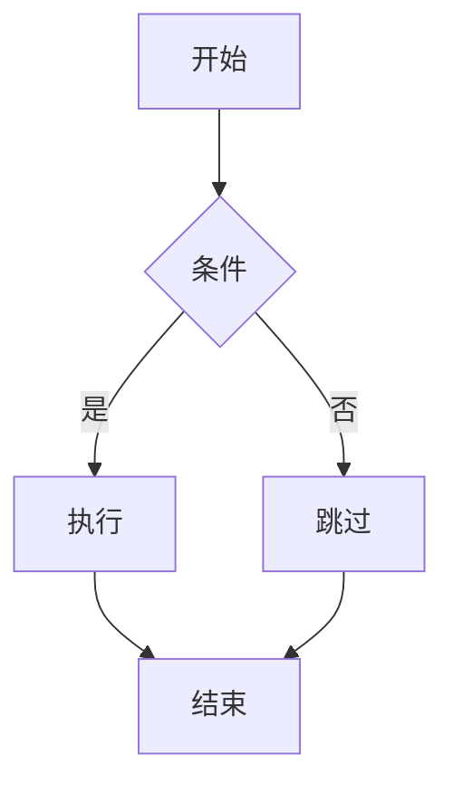

# 指南

> 基于 Docusaurus 3.x —— 文档系统 / 博客系统 / MDX / 多版本文档 / i18n / Swizzle / Plugin / Algolia 搜索 / Markdown 增强 / 客户端 API / 部署

## 文档系统（`docs/`）

文档系统由 `@docusaurus/plugin-content-docs` 提供，是 Docusaurus 的灵魂。

### 文档发现规则

`docs/` 目录下的每个 `.md` / `.mdx` 文件**自动**成为路由：

```
docs/intro.md                                → /docs/intro
docs/tutorial-basics/create-a-page.md        → /docs/tutorial-basics/create-a-page
docs/api/server/auth.md                      → /docs/api/server/auth
```

文档 **id** 由文件相对路径推断：

- `docs/intro.md` → id 为 `intro`
- `docs/tutorial-basics/create-a-page.md` → id 为 `tutorial-basics/create-a-page`

可以在 frontmatter 显式覆盖：

```md
---
id: my-custom-id
---
```

### 路径定制

```ts
// docusaurus.config.ts
presets: [
  [
    'classic',
    {
      docs: {
        path: 'docs',                       // 源目录（默认 docs）
        routeBasePath: 'docs',              // URL 前缀（默认 docs）
        tagsBasePath: 'tags',               // 标签页 URL（默认 tags）
        sidebarPath: './sidebars.ts',
        editUrl: 'https://github.com/.../',
        breadcrumbs: true,                  // 显示面包屑
        showLastUpdateAuthor: true,         // 显示最后更新者
        showLastUpdateTime: true,           // 显示最后更新时间
        // 默认全部收起 / 默认全部可折叠
        sidebarCollapsed: true,
        sidebarCollapsible: true,
        // 控制 frontmatter 数字前缀（默认会从文件名删除前缀）
        numberPrefixParser: true,
      },
    },
  ],
],
```

### Docs-only 模式

如果只有文档没有博客，可以让文档占据网站根目录：

```ts
docs: {
  routeBasePath: '/',          // 文档放在根
}
// 然后禁用 blog
blog: false,
```

这样 `docs/intro.md` 就成了 `/intro`，而不是 `/docs/intro`。

### Frontmatter 全集

```md
---
id: my-doc-id                                    # 文档 ID（默认文件路径）
title: 自定义标题                                  # h1 标题
sidebar_label: 简短标签                           # 侧边栏文本
sidebar_position: 2                              # 排序权重
slug: /custom-url                                # URL 路径
description: SEO 描述                             # meta description
keywords: [docusaurus, react, ssg]               # SEO 关键词
image: /img/cover.png                            # 社交分享图
tags: [tutorial, beginner]                       # 标签
hide_title: false                                # 隐藏 h1
hide_table_of_contents: false                    # 隐藏右侧 TOC
toc_min_heading_level: 2                         # TOC 最小层级
toc_max_heading_level: 4                         # TOC 最大层级
pagination_label: 上一篇文档                      # 翻页链接文本
pagination_prev: tutorial/intro                  # 上一篇文档 ID
pagination_next: tutorial/advanced               # 下一篇文档 ID
displayed_sidebar: tutorialSidebar               # 显式指定 sidebar
draft: false                                     # 草稿（dev 可见，生产忽略）
unlisted: false                                  # 未列出（不在 sidebar/搜索，但可访问）
custom_edit_url: https://github.com/.../doc.md   # 自定义编辑链接
last_update:
  author: 杨二小
  date: 2026-05-18
---
```

### 自动生成侧边栏（autogenerated）

最常用——`sidebars.ts` 只写一行：

```ts
const sidebars = {
  tutorialSidebar: [{ type: 'autogenerated', dirName: '.' }],
}
```

规则：

1. **目录** → category（label = `_category_.json` 的 label，或目录名）
2. **文件** → doc 链接（label = frontmatter 的 `sidebar_label`，或 title）
3. **排序**：`sidebar_position` > `_category_.json.position` > 文件名字典序
4. **嵌套**：目录可任意嵌套，自动生成 category 树

### `_category_.json` 完整字段

```json
{
  "label": "基础教程",
  "position": 2,
  "collapsible": true,
  "collapsed": false,
  "className": "css-class-name",
  "link": {
    "type": "generated-index",
    "title": "基础教程总览",
    "description": "从这里开始",
    "slug": "/category/basics",
    "keywords": ["basics", "tutorial"],
    "image": "/img/cat.jpg"
  },
  "customProps": {
    "anyExtraData": "可在 Swizzle 后的组件中读取"
  }
}
```

`link.type`：

- `generated-index`：**自动生成**该 category 的索引页（含所有子文档卡片）
- `doc`：指定一个文档 ID 作为 category 主页（`{ type: 'doc', id: 'intro' }`）
- 省略：点击 category 不跳转，只展开/折叠

### 手写 sidebar

```ts
// sidebars.ts
import type { SidebarsConfig } from '@docusaurus/plugin-content-docs'

const sidebars: SidebarsConfig = {
  tutorialSidebar: [
    'intro',
    {
      type: 'category',
      label: '基础',
      collapsed: false,
      items: [
        'basics/install',
        'basics/config',
        {
          type: 'category',
          label: '深入',
          items: ['basics/deep/a', 'basics/deep/b'],
        },
      ],
    },
    {
      type: 'category',
      label: '进阶',
      link: { type: 'generated-index', slug: '/category/advanced' },
      items: [{ type: 'autogenerated', dirName: 'advanced' }],
    },
    {
      type: 'link',
      label: 'API 参考（外部）',
      href: 'https://api.example.com',
    },
    {
      type: 'html',
      value: '<hr />',
      defaultStyle: true,
    },
    {
      type: 'ref',
      id: 'tutorial-extras/manage-docs-versions',
    },
  ],
}

export default sidebars
```

各 item 类型：

| type | 用途 |
|---|---|
| 字符串 `'foo'` | doc id 简写（等价 `{ type: 'doc', id: 'foo' }`） |
| `doc` | 链接到内部 doc |
| `link` | 外部链接 |
| `category` | 分组（可嵌套） |
| `autogenerated` | 自动生成（按 `dirName` 扫描目录） |
| `html` | 任意 HTML（`<hr>` / 自定义分隔符） |
| `ref` | 引用其他 sidebar 的 doc（不计入「上一篇/下一篇」） |

## 博客系统（`blog/`）

`@docusaurus/plugin-content-blog` 提供完整的博客系统——文章 / 作者 / 标签 / 归档 / RSS。

### 文章文件结构

三种命名（任选其一）：

```
blog/
├── 2026-05-18-hello.mdx                  # 平铺，自动提取 2026-05-18 为日期
├── 2026/05/18/world.mdx                  # 嵌套目录
├── 2026-04-20-tutorial/                  # ⭐ 推荐：含目录
│   ├── index.mdx
│   ├── cover.jpg
│   └── diagram.svg
├── authors.yml                           # 作者档案（必需，否则用 inline）
└── tags.yml                              # 标签声明（可选）
```

> 推荐 `2026-05-18-name/index.mdx` 形式——可以把图片视频放一起（co-located assets）。

### 完整 Frontmatter

```mdx
---
slug: my-first-post                       # URL（默认从文件名提取）
title: 我的第一篇博客                       # 文章标题
authors: [yangerxiao]                     # 作者 ID 数组（引用 authors.yml）
# 或内联：
# authors:
#   - name: 杨二小
#     title: 开发者
#     url: https://github.com/...
tags: [hello, docusaurus]                 # 标签（建议在 tags.yml 声明）
date: 2026-05-18T10:00:00                 # 发布时间
image: /img/blog/cover.jpg                # 列表页缩略图 + 社交分享图
description: SEO 描述
keywords: [blog, docusaurus]
draft: false                              # 草稿（dev 可见，prod 跳过）
unlisted: false                           # 不在列表/RSS，但 URL 可访问
hide_table_of_contents: false
toc_min_heading_level: 2
toc_max_heading_level: 4
last_update:
  date: 2026-05-19
  author: 杨二小
---

摘要内容……

{/* truncate */}

详情页才显示的正文……
```

### `authors.yml` 完整示例

```yaml
yangerxiao:
  name: 杨二小
  title: 全栈开发
  url: https://github.com/yangerxiao
  image_url: https://github.com/yangerxiao.png
  email: yangerxiao@example.com
  page: true                  # 生成作者档案页 /blog/authors/yangerxiao
  socials:
    x: yangerxiao             # x.com/yangerxiao
    github: yangerxiao
    linkedin: yangerxiao
    bluesky: yangerxiao.bsky.social
    mastodon: '@yangerxiao@mastodon.social'
    youtube: yangerxiao
    twitter: yangerxiao
    instagram: yangerxiao
    twitch: yangerxiao
    stackoverflow: 12345/yangerxiao

# 内联引用（无需 yaml 全局声明）
guest-2026-05:
  name: 客座作者
  title: 嘉宾
```

frontmatter `authors: [yangerxiao]` 引用，多作者用 `authors: [yangerxiao, guest-2026-05]`。

### `tags.yml`

```yaml
hello:
  label: 问候
  permalink: /hello
  description: 与新功能相关的问候帖

docusaurus:
  label: Docusaurus
  permalink: /docusaurus
  description: 关于 Docusaurus 工具本身的文章
```

如果配置 `onInlineTags: 'throw'`，没在 `tags.yml` 中声明的标签会**构建失败**，避免标签泛滥。

### Truncate Marker（摘要截断）

```mdx
摘要会显示在 /blog 列表页。

{/* truncate */}             ← MDX 用

或

<!-- truncate -->            ← MD 用

详情页才显示的正文。
```

### 博客配置完整选项

```ts
blog: {
  path: 'blog',                          // 源目录
  routeBasePath: 'blog',                 // URL 前缀
  blogTitle: 'Docusaurus 博客',
  blogDescription: '最新文章',
  blogSidebarCount: 5,                   // 'ALL' 显示全部
  blogSidebarTitle: '最近文章',
  postsPerPage: 10,                      // 'ALL' 全部一页
  showReadingTime: true,                 // 显示阅读时间
  showLastUpdateAuthor: false,
  showLastUpdateTime: false,
  truncateMarker: /<!--\s*(truncate)\s*-->/,
  sortPosts: 'descending',
  editUrl: 'https://github.com/.../edit/main/',
  feedOptions: {
    type: 'all',                         // 'rss' | 'atom' | 'json' | 'all' | null
    copyright: `Copyright © ${new Date().getFullYear()}`,
    language: 'zh-CN',
    title: 'Docusaurus 博客 RSS',
    description: '订阅最新文章',
    limit: 20,
  },
  authorsMapPath: 'authors.yml',
  tags: 'tags.yml',
  onInlineTags: 'warn',                  // 'ignore' | 'warn' | 'throw'
  onInlineAuthors: 'warn',
  pageBasePath: 'page',                  // 分页 URL
  archiveBasePath: 'archive',            // 归档 URL（null 关闭）
  authorsBasePath: 'authors',
  tagsBasePath: 'tags',
}
```

### RSS / Atom / JSON Feed

构建后自动生成在：

- `https://example.com/blog/rss.xml`
- `https://example.com/blog/atom.xml`
- `https://example.com/blog/feed.json`

navbar 默认带 RSS 图标（点 `/blog` 右上角），可在 `themeConfig.navbar.items` 中自定义。

### Blog-only 模式

只要博客没有文档：

```ts
docs: false,
blog: {
  routeBasePath: '/',                    // 博客占据根 URL
  blogTitle: '我的博客',
}
```

## MDX 完整能力

Docusaurus 3.x 默认用 **MDX 3**——`.md` / `.mdx` 都按 MDX 编译（除非 `format: 'md'`）。

### import / export

```mdx
---
title: MDX 示例
---

import HelloComponent from '@site/src/components/Hello'
import { Tabs, TabItem } from '@theme/Tabs'

export const version = '1.0.0'
export const fmt = (n) => `v${n}`

# MDX 完整示例

当前版本：{fmt(version)}

<HelloComponent name="Docusaurus" />

<Tabs>
  <TabItem value="js" label="JavaScript">JS 代码</TabItem>
  <TabItem value="ts" label="TypeScript">TS 代码</TabItem>
</Tabs>
```

`@site` 是项目根别名，`@theme` 是当前主题别名。

### JS 表达式插值

```mdx
export const count = 42
export const list = ['a', 'b', 'c']

数字：{count}

数组：{list.map(x => <li key={x}>{x}</li>)}

条件：{count > 0 ? '正' : '零'}

日期：{new Date().toLocaleDateString()}
```

> MDX 3 解析规则：
>
> - `{` / `}` 字面字符要 escape：`&#123;` / `&#125;` 或反引号包裹 `` `{value}` ``
> - `<` 字面字符：`&lt;` 或反引号
> - 大写组件名 `<Highlight>` 才解析为 React 组件；小写 `<div>` 为 HTML

### 自定义全局 MDX 组件

让所有 MDX 文件都能用某些组件——不用每个文件 import：

```bash
npm run swizzle @docusaurus/theme-classic MDXComponents -- --wrap --typescript
```

生成 `src/theme/MDXComponents.tsx`：

```tsx
// src/theme/MDXComponents.tsx
import MDXComponents from '@theme-original/MDXComponents'
import Highlight from '@site/src/components/Highlight'
import Badge from '@site/src/components/Badge'

export default {
  ...MDXComponents,
  /** 现在所有 MDX 都可以直接用 <Highlight> / <Badge>，无需 import */
  Highlight,
  Badge,
  /** 也可以覆盖原生 HTML 标签 */
  h1: (props) => <h1 {...props} style={{ color: 'red' }} />,
}
```

随后任意 MDX 文件直接使用：

```mdx
<Highlight color="#25c2a0">高亮文本</Highlight>

<Badge>New</Badge>
```

### MDX 3 严格模式应对（升级常见坑）

从 v2 升级到 v3 时常见错误：

**坑 1：`{` 被识别为 JSX 表达式**

```mdx
<!-- ❌ v3 报错 -->
配置示例：{ "key": "value" }

<!-- ✅ 改法 1：转义 -->
配置示例：&#123; "key": "value" &#125;

<!-- ✅ 改法 2：反引号 -->
配置示例：`{ "key": "value" }`

<!-- ✅ 改法 3：代码块 -->
​```json
{ "key": "value" }
​```
```

**坑 2：`<URL>` 自动链接失效**

```mdx
<!-- ❌ v3 不再支持 -->
访问 <https://example.com>

<!-- ✅ 改用标准 Markdown 链接 -->
访问 [https://example.com](https://example.com)
```

**坑 3：HTML 实体**

```mdx
<!-- ❌ v3 不再自动解析 -->
&copy; 2026

<!-- ✅ 用 Unicode 字面 -->
© 2026
```

**坑 4：检测工具**

```bash
npx docusaurus-mdx-checker
```

扫描所有 MDX 文件并报告兼容性问题。

## Markdown 增强特性

### Admonitions（提示框）

```md
:::note
普通注记
:::

:::tip
小贴士
:::

:::info
信息提示
:::

:::warning
警告
:::

:::danger
危险（红色）
:::
```

带标题：

```md
:::note[补充说明]
内容
:::
```

嵌套（增加冒号数量）：

```md
:::::info[父级]
父级内容

::::danger[子级]
子级内容
::::
:::::
```

自定义 admonition 类型：

```ts
// docusaurus.config.ts
docs: {
  admonitions: {
    keywords: ['note', 'tip', 'custom-warning'],
    extendDefaults: true,
  },
}
```

### Tabs（标签页）

```mdx
import Tabs from '@theme/Tabs'
import TabItem from '@theme/TabItem'

<Tabs>
  <TabItem value="apple" label="Apple" default>
    🍎 苹果
  </TabItem>
  <TabItem value="orange" label="Orange">
    🍊 橙子
  </TabItem>
  <TabItem value="banana" label="Banana">
    🍌 香蕉
  </TabItem>
</Tabs>
```

**同步切换**（多个 Tabs 共享选择）：

```mdx
<Tabs groupId="os">
  <TabItem value="mac" label="macOS">Command + C</TabItem>
  <TabItem value="win" label="Windows">Ctrl + C</TabItem>
</Tabs>

<!-- 同一页面任意位置的同 groupId 都会同步 -->

<Tabs groupId="os">
  <TabItem value="mac" label="macOS">Command + V</TabItem>
  <TabItem value="win" label="Windows">Ctrl + V</TabItem>
</Tabs>
```

**URL 持久化**（写入 query string）：

```mdx
<Tabs queryString="os">
  <TabItem value="mac" label="macOS">...</TabItem>
  <TabItem value="win" label="Windows">...</TabItem>
</Tabs>
```

URL 变成 `/docs/foo?os=mac`，刷新页面后保持选择。

### Code Blocks（代码块）

**带标题**：

````md
```ts title="hello.ts"
const message: string = 'Hello'
```
````

**行高亮（Magic Comments）**：

````md
```ts
function add(a: number, b: number) {
  // highlight-next-line
  return a + b
  // highlight-start
  // 多行高亮
  console.log('start')
  console.log('end')
  // highlight-end
}
```
````

**行高亮（元数据数字）**：

````md
```ts {1,4-6}
function add(a, b) {
  return a + b
}

const x = 1
const y = 2
const z = 3
```
````

**显示行号**：

````md
```ts showLineNumbers
const a = 1
const b = 2
```
````

**从某一行开始计数**：

````md
```ts showLineNumbers=10
const a = 1   // 显示为第 10 行
```
````

**自定义 Magic Comment**：

```ts
// docusaurus.config.ts
themeConfig: {
  prism: {
    magicComments: [
      {
        className: 'code-block-error-line',
        line: 'this-line-error',
      },
      {
        className: 'code-block-success-line',
        block: { start: 'success-start', end: 'success-end' },
      },
    ],
  },
}
```

### npm2yarn 插件（一键多包管理器切换）

安装：

```bash
npm install --save @docusaurus/remark-plugin-npm2yarn
```

配置：

```ts
docs: {
  remarkPlugins: [
    [require('@docusaurus/remark-plugin-npm2yarn'), { sync: true }],
  ],
}
```

使用：

````md
```bash npm2yarn
npm install docusaurus
```
````

会自动生成 Tabs，包含 npm / yarn / pnpm / bun 四种命令——`sync: true` 让全页面所有 npm2yarn 块同步切换。

### 数学公式（KaTeX）

```bash
npm install --save remark-math@6 rehype-katex@7
```

```ts
import remarkMath from 'remark-math'
import rehypeKatex from 'rehype-katex'

docs: {
  remarkPlugins: [remarkMath],
  rehypePlugins: [rehypeKatex],
}

// 加 KaTeX CSS
stylesheets: [
  { href: 'https://cdn.jsdelivr.net/npm/katex@0.13.24/dist/katex.min.css' },
],
```

使用：

```md
行内公式：$E = mc^2$

块公式：

$$
\int_a^b f(x) dx = F(b) - F(a)
$$
```

### Mermaid 流程图

```bash
npm install --save @docusaurus/theme-mermaid
```

```ts
themes: ['@docusaurus/theme-mermaid'],
markdown: {
  mermaid: true,
}
```

使用：

````md

````

## 多版本文档（versioning）

Docusaurus 最差异化的功能——一行命令快照当前文档为新版本。

### 创建版本

```bash
npm run docusaurus docs:version 1.0.0
```

执行后：

```
my-website/
├── docs/                            # ← 当前开发版（标记为 "next"）
│   └── ...
├── versioned_docs/
│   └── version-1.0.0/               # ← ⭐ 新建：1.0.0 快照
│       └── ...（拷贝自 docs/）
├── versioned_sidebars/
│   └── version-1.0.0-sidebars.json  # ← ⭐ sidebar 快照
├── versions.json                    # ← ⭐ ["1.0.0"]
└── sidebars.ts                      # ← 还是「当前开发版」用
```

### URL 映射

| 文件路径 | URL |
|---|---|
| `docs/intro.md` | `/docs/next/intro`（开发版） |
| `versioned_docs/version-1.0.0/intro.md` | `/docs/intro`（默认） |
| `versioned_docs/version-0.9.0/intro.md` | `/docs/0.9.0/intro` |

最新已发布版本默认占据 `/docs/<id>` 路径，**开发版（next）** 推到 `/docs/next/<id>`。

### 版本配置

```ts
docs: {
  /** 哪个版本是「默认」展示（占据 /docs/<id>） */
  lastVersion: 'current',         // 'current' 表示 docs/（next）；或具体版本号
  /** 是否构建当前开发版 */
  includeCurrentVersion: true,
  /** 限制构建版本（CI 加速） */
  onlyIncludeVersions: ['1.0.0', '2.0.0'],
  /** 各版本元数据 */
  versions: {
    current: {
      label: 'Next 🚧',
      path: 'next',
      banner: 'unreleased',           // 'none' | 'unreleased' | 'unmaintained'
    },
    '2.0.0': {
      label: '2.0.0',
      path: '',                       // 默认版本路径为空（即 /docs/）
      banner: 'none',
      badge: true,
    },
    '1.0.0': {
      label: '1.0.0',
      path: '1.0.0',
      banner: 'unmaintained',
    },
  },
}
```

`banner` 三种：

- `'none'`：无横幅
- `'unreleased'`：「这是开发中版本」提示
- `'unmaintained'`：「这是旧版本」提示

### Version Dropdown

navbar 中添加版本切换器：

```ts
navbar: {
  items: [
    {
      type: 'docsVersionDropdown',
      position: 'right',
      dropdownItemsAfter: [{ to: '/versions', label: '所有版本' }],
      dropdownActiveClassDisabled: true,
    },
  ],
}
```

### 删除版本

直接操作文件：

1. 删除 `versioned_docs/version-X.X.X/` 目录
2. 删除 `versioned_sidebars/version-X.X.X-sidebars.json`
3. 编辑 `versions.json`，移除该版本

### 最佳实践

- **不要每个小版本都 version**——只在「破坏性 API 变更」时打版本
- **保持活跃维护版本 < 10 个**——多了 CI 慢，用户也眼花
- `onlyIncludeVersions` 在 CI 中限制构建版本（如 PR 预览只构建 next）
- 链接文档**用文件路径**（`./foo.md`），Docusaurus 自动转换为带版本的 URL

## i18n 国际化

支持多语言文档站——按 locale 拆目录。

### 配置 locale

```ts
// docusaurus.config.ts
i18n: {
  defaultLocale: 'zh-Hans',
  locales: ['zh-Hans', 'en', 'ja'],
  localeConfigs: {
    'zh-Hans': {
      label: '简体中文',
      direction: 'ltr',
      htmlLang: 'zh-CN',
      calendar: 'gregory',
      path: 'zh-Hans',                // URL 路径
    },
    en: {
      label: 'English',
      htmlLang: 'en-US',
      path: 'en',
    },
    ja: {
      label: '日本語',
      htmlLang: 'ja-JP',
      path: 'ja',
    },
  },
}
```

URL 规则：

- `zh-Hans`（默认）：`/docs/intro`（无前缀）
- `en`：`/en/docs/intro`
- `ja`：`/ja/docs/intro`

### 提取翻译

```bash
npm run write-translations -- --locale en
```

执行后生成：

```
i18n/
└── en/
    ├── code.json                                    # React 代码中的 <Translate> 字符串
    ├── docusaurus-theme-classic/
    │   ├── navbar.json                              # navbar 翻译
    │   └── footer.json                              # footer 翻译
    ├── docusaurus-plugin-content-docs/
    │   └── current.json                             # docs 翻译 metadata
    └── docusaurus-plugin-content-blog/
        └── options.json
```

### 翻译文档

文档内容直接翻译——**复制原文件到 i18n 目录下对应位置**：

```
docs/intro.md
i18n/en/docusaurus-plugin-content-docs/current/intro.md   # 英文版
```

`current` 表示当前版本——多版本时变成 `version-1.0.0/intro.md`。

### 翻译博客 / pages

```
blog/2026-05-18-hello.mdx
i18n/en/docusaurus-plugin-content-blog/2026-05-18-hello.mdx

src/pages/about.tsx
src/pages/about.tsx                             # 同一文件（用 <Translate> 翻译字符串）
```

### React 中翻译

```tsx
import Translate, { translate } from '@docusaurus/Translate'

export default function About() {
  return (
    <div>
      {/* JSX 中 */}
      <h1>
        <Translate id="about.title" description="关于页标题">
          关于我们
        </Translate>
      </h1>

      {/* 属性 / 字符串中（必须用 translate() 函数） */}
      <input
        placeholder={translate({
          id: 'about.placeholder',
          message: '请输入',
        })}
      />
    </div>
  )
}
```

`write-translations` 会自动扫描这些 `<Translate>` 并提取到 `code.json`。

### Locale Switcher

navbar 加入下拉：

```ts
navbar: {
  items: [
    {
      type: 'localeDropdown',
      position: 'right',
      dropdownItemsAfter: [
        { type: 'html', value: '<hr />' },
        { href: '/get-help', label: '帮助翻译' },
      ],
    },
  ],
}
```

### 构建特定语言

```bash
npm run start -- --locale en             # 仅 dev 英文版
npm run build -- --locale en             # 仅构建英文版
npm run build                            # 构建所有语言
```

## Swizzle 主题定制

Docusaurus 的**理论上无限定制**机制——可以 wrap 或 eject 任何主题组件。

### 列出可定制组件

```bash
npm run swizzle @docusaurus/theme-classic -- --list
```

输出按「安全程度」分类：

- ✅ **Safe**：稳定 API，主版本内不破坏
- ⚠️ **Unsafe**：内部实现，小版本可能变化
- ❌ **Forbidden**：不允许 swizzle

### Wrap（包装增强，推荐）

**最常用**——在原组件基础上加内容，原组件升级时自动跟随：

```bash
npm run swizzle @docusaurus/theme-classic Footer -- --wrap --typescript
```

生成 `src/theme/Footer/index.tsx`：

```tsx
import React from 'react'
import Footer from '@theme-original/Footer'
import type FooterType from '@theme/Footer'
import type { WrapperProps } from '@docusaurus/types'

type Props = WrapperProps<typeof FooterType>

export default function FooterWrapper(props: Props): React.ReactNode {
  return (
    <>
      <div className="custom-banner">
        <p>这是 wrap 加的横幅</p>
      </div>
      <Footer {...props} />
    </>
  )
}
```

`@theme-original/Footer` 是关键——表示「未被覆盖的原始 Footer」。

### Eject（完全替换）

**慎用**——拷贝原组件代码到本地，完全脱钩。Docusaurus 升级时不会自动跟随：

```bash
npm run swizzle @docusaurus/theme-classic Footer -- --eject --typescript
```

生成 `src/theme/Footer/index.tsx`——是 Docusaurus 源码中 Footer 的完整副本，可任意改。

> 升级风险：Docusaurus 升级时若 Footer 内部结构变了，你的 eject 副本不会自动更新——必须手动同步。

### `<Root>` 组件

特殊组件——**包裹整个应用**，永不卸载（路由切换时保持挂载）。适合放：

- React Context Provider
- Global state（Redux / Zustand）
- 第三方库初始化（Sentry / Posthog）
- 全局事件监听

```bash
npm run swizzle @docusaurus/theme-classic Root -- --wrap --typescript
```

```tsx
// src/theme/Root.tsx
import React from 'react'

export default function Root({ children }) {
  return (
    <ThemeProvider>
      <UserProvider>
        {children}
      </UserProvider>
    </ThemeProvider>
  )
}
```

### Swizzle 常用命令

```bash
npm run swizzle                           # 交互式（推荐起步）
npm run swizzle -- --list                 # 列出所有组件
npm run swizzle -- --help                 # 查看选项
npm run swizzle @docusaurus/theme-classic SearchBar -- --wrap
npm run swizzle @docusaurus/theme-classic DocItem/Layout -- --wrap --danger
# --danger 允许 swizzle Unsafe 组件
```

### Swizzle 替代方案优先级

按推荐顺序：

1. **CSS 定制**（改 `src/css/custom.css` 的 Infima 变量）
2. **配置定制**（`themeConfig` 中的字段）
3. **翻译定制**（用 `write-translations` 改文本）
4. **Wrap**（包装组件）
5. **Eject**（终极手段）

## Plugin 系统

Docusaurus 的所有功能都是 plugin 实现——包括内置的 docs / blog / pages。

### 添加官方插件

```bash
npm install --save @docusaurus/plugin-google-gtag
```

```ts
// docusaurus.config.ts
plugins: [
  [
    '@docusaurus/plugin-google-gtag',
    {
      trackingID: 'G-XXXXXXXXXX',
      anonymizeIP: true,
    },
  ],
]
```

常用官方插件：

| 插件 | 用途 |
|---|---|
| `@docusaurus/plugin-content-docs` | 文档系统（preset-classic 已含） |
| `@docusaurus/plugin-content-blog` | 博客系统（preset-classic 已含） |
| `@docusaurus/plugin-content-pages` | 独立页面（preset-classic 已含） |
| `@docusaurus/plugin-debug` | 调试页 `/__docusaurus/debug` |
| `@docusaurus/plugin-google-gtag` | Google Analytics |
| `@docusaurus/plugin-google-tag-manager` | GTM |
| `@docusaurus/plugin-sitemap` | sitemap.xml |
| `@docusaurus/plugin-ideal-image` | 图片优化（懒加载 / WebP） |
| `@docusaurus/plugin-pwa` | PWA 支持 |
| `@docusaurus/plugin-client-redirects` | 客户端重定向 |

### 多 docs 实例（高级）

需要多个独立 docs（如 API 文档 + 教程文档）：

```ts
plugins: [
  [
    '@docusaurus/plugin-content-docs',
    {
      id: 'api',                          // ⭐ 必须不同
      path: 'api',
      routeBasePath: 'api',
      sidebarPath: './sidebarsApi.ts',
    },
  ],
],
// preset-classic 自带的 docs 还在
presets: [
  ['classic', { docs: { /* 主 docs */ } }],
]
```

### 编写自定义 plugin

最简形式——内联函数：

```ts
plugins: [
  async function myPlugin(context, options) {
    return {
      name: 'my-plugin',

      /** 加载内容（自定义数据源） */
      async loadContent() {
        return {
          posts: await fetch('https://api.example.com/posts').then(r => r.json()),
        }
      },

      /** 创建路由 */
      async contentLoaded({ content, actions }) {
        const { addRoute, createData } = actions
        const dataPath = await createData('posts.json', JSON.stringify(content.posts))
        content.posts.forEach((post) => {
          addRoute({
            path: `/posts/${post.slug}`,
            component: '@site/src/theme/PostPage',
            modules: { data: dataPath },
            exact: true,
          })
        })
      },

      /** 注入头部标签 */
      injectHtmlTags() {
        return {
          headTags: [
            {
              tagName: 'meta',
              attributes: { name: 'theme-color', content: '#25c2a0' },
            },
          ],
        }
      },
    }
  },
]
```

### Plugin 生命周期

| Hook | 时机 | 用途 |
|---|---|---|
| `loadContent` | 早期 | 加载/抓取数据（API / 文件） |
| `contentLoaded` | 数据就绪 | 创建路由、生成 JSON 文件 |
| `postBuild` | 构建完成 | 生成 sitemap / 推送 CDN |
| `postStart` | dev server 启动后 | 启动子服务 |
| `configureWebpack` | webpack 编译前 | 修改 webpack 配置 |
| `configurePostCss` | PostCSS 处理前 | 加 PostCSS 插件 |
| `injectHtmlTags` | HTML 渲染 | 注入 `<head>` / `<body>` 标签 |
| `getThemePath` | 主题解析 | 提供主题组件路径 |
| `getClientModules` | 客户端 | 注入 global JS/CSS 模块 |
| `getPathsToWatch` | dev | 加入 watch 列表 |

## 搜索（Algolia DocSearch）

### 申请 DocSearch

1. 访问 [DocSearch 申请页](https://docsearch.algolia.com/apply)
2. 填写域名、维护者邮箱、技术栈（Docusaurus）
3. 通常 1-2 周内通过——Algolia 团队会发邮件给你 `appId` / `apiKey` / `indexName`

### 配置

```ts
themeConfig: {
  algolia: {
    appId: 'YOUR_APP_ID',
    apiKey: 'YOUR_PUBLIC_API_KEY',         // ⚠️ 只能是「search-only」key
    indexName: 'YOUR_INDEX_NAME',

    /** 多语言 / 多版本时按当前 locale + version 过滤 */
    contextualSearch: true,

    /** 自定义跳转外部 URL（不常用） */
    externalUrlRegex: 'external\\.com',

    /** 跳转 URL 改写 */
    replaceSearchResultPathname: {
      from: '/docs/',
      to: '/',
    },

    /** Algolia 高级搜索参数 */
    searchParameters: { facetFilters: ['language:zh'] },

    /** 自定义搜索页路径 */
    searchPagePath: 'search',
  },
}
```

DocSearch 自动生成 navbar 搜索框 + `/search` 独立搜索页。

### 离线搜索（社区方案）

如果不想用 Algolia，可以用社区维护的本地搜索插件：

```bash
npm install --save @easyops-cn/docusaurus-search-local
```

```ts
themes: [
  [
    '@easyops-cn/docusaurus-search-local',
    {
      hashed: true,
      language: ['en', 'zh'],
      docsRouteBasePath: '/docs',
    },
  ],
]
```

它会在构建时生成搜索索引，浏览器侧加载（小型站点适用）。

## 客户端 API

`@docusaurus/*` 提供一组在 React 组件中可用的 API：

### `<Link />`

```tsx
import Link from '@docusaurus/Link'

<Link to="/docs/intro">文档</Link>                     {/* 内部链接，prefetch */}
<Link to="https://example.com">外部</Link>             {/* 自动加 target="_blank" */}
<Link to="/docs/intro" activeClassName="active">      {/* 当前路由高亮 */}
  文档
</Link>
```

### `<BrowserOnly />`

某些组件只能在浏览器渲染（依赖 `window` / `document`）：

```tsx
import BrowserOnly from '@docusaurus/BrowserOnly'

<BrowserOnly fallback={<div>Loading...</div>}>
  {() => {
    const HeavyClientComp = require('./HeavyClientComp').default
    return <HeavyClientComp />
  }}
</BrowserOnly>
```

### `<Redirect />`

```tsx
import { Redirect } from '@docusaurus/router'

if (someCondition) {
  return <Redirect to="/login" />
}
```

### `<Head />`

```tsx
import Head from '@docusaurus/Head'

<Head>
  <title>自定义标题</title>
  <meta name="description" content="..." />
  <link rel="canonical" href="https://example.com/page" />
</Head>
```

### `useDocusaurusContext`

访问站点配置 + 元数据：

```tsx
import { useDocusaurusContext } from '@docusaurus/useDocusaurusContext'

function MyComp() {
  const { siteConfig, i18n } = useDocusaurusContext()

  return (
    <div>
      <h1>{siteConfig.title}</h1>
      <p>当前语言：{i18n.currentLocale}</p>
    </div>
  )
}
```

### `useColorMode`

获取/设置暗黑模式：

```tsx
import { useColorMode } from '@docusaurus/theme-common'

function ThemeButton() {
  const { colorMode, setColorMode } = useColorMode()

  return (
    <button onClick={() => setColorMode(colorMode === 'dark' ? 'light' : 'dark')}>
      当前：{colorMode}
    </button>
  )
}
```

### `useBaseUrl`

给资源路径加 `baseUrl` 前缀：

```tsx
import useBaseUrl from '@docusaurus/useBaseUrl'

function MyImage() {
  return 
  // baseUrl='/site/' 时输出 /site/img/logo.png
}
```

### `useLocation`

```tsx
import { useLocation } from '@docusaurus/router'

function Foo() {
  const location = useLocation()
  return <p>当前路径：{location.pathname}</p>
}
```

### `ExecutionEnvironment`

```tsx
import ExecutionEnvironment from '@docusaurus/ExecutionEnvironment'

if (ExecutionEnvironment.canUseDOM) {
  // 仅在浏览器侧执行（SSR 时跳过）
  window.someAPI()
}
```

可用标志：`canUseDOM` / `canUseEventListeners` / `canUseIntersectionObserver` / `canUseViewport`。

## 样式与主题

### Infima CSS 框架

Docusaurus 自带 [Infima](https://infima.dev/) 作为默认 CSS 框架——所有 `--ifm-*` 变量都可在 `src/css/custom.css` 覆盖：

```css
/* src/css/custom.css */
:root {
  /** 主色（必须 7 个色阶） */
  --ifm-color-primary: #25c2a0;
  --ifm-color-primary-dark: #21af90;
  --ifm-color-primary-darker: #1fa588;
  --ifm-color-primary-darkest: #1a8870;
  --ifm-color-primary-light: #29d5b0;
  --ifm-color-primary-lighter: #32d8b4;
  --ifm-color-primary-lightest: #4fddbf;

  /** 字号 / 间距 */
  --ifm-code-font-size: 95%;
  --ifm-font-family-base: 'PingFang SC', sans-serif;

  /** 链接色 */
  --ifm-link-color: #25c2a0;
}

/** 暗黑模式 */
[data-theme='dark'] {
  --ifm-color-primary: #25c2a0;
  --ifm-background-color: #1a1a1a;
}
```

### CSS Modules

组件作用域样式——文件名必须以 `.module.css` 结尾：

```tsx
// src/components/Hello/index.tsx
import styles from './styles.module.css'

export default function Hello() {
  return <div className={styles.container}>Hello</div>
}
```

```css
/* src/components/Hello/styles.module.css */
.container {
  padding: 1rem;
  border: 1px solid var(--ifm-color-primary);
}
```

### Sass/SCSS

不官方支持——但可以装社区插件：

```bash
npm install --save docusaurus-plugin-sass sass
```

```ts
plugins: ['docusaurus-plugin-sass'],
presets: [['classic', {
  theme: { customCss: './src/css/custom.scss' },
}]],
```

### Tailwind CSS

Tailwind 在 Docusaurus 中**需要少量配置**（PostCSS hook）：

```bash
npm install --save tailwindcss postcss autoprefixer
```

```ts
// docusaurus.config.ts
plugins: [
  async function tailwind() {
    return {
      name: 'tailwind-plugin',
      configurePostCss(postcssOptions) {
        postcssOptions.plugins.push(require('tailwindcss'))
        postcssOptions.plugins.push(require('autoprefixer'))
        return postcssOptions
      },
    }
  },
]
```

## 部署

### GitHub Pages（一行命令）

```ts
// docusaurus.config.ts
{
  url: 'https://my-org.github.io',
  baseUrl: '/my-site/',
  organizationName: 'my-org',
  projectName: 'my-site',
  trailingSlash: false,
  deploymentBranch: 'gh-pages',
}
```

```bash
GIT_USER=my-username npm run deploy
# 构建 + 推送到 gh-pages 分支
```

> GitHub 现在不允许密码登录——`GIT_USER` 对应的账号必须配 SSH key 或 Personal Access Token。推荐 SSH：`USE_SSH=true GIT_USER=... npm run deploy`。

### GitHub Actions

更推荐自动化部署——详见入门篇的 GitHub Actions 示例。要点：

```yaml
- uses: actions/setup-node@v4
  with:
    node-version: 20            # 必须 20+
    cache: npm
- run: npm ci
- run: npm run build
- uses: actions/upload-pages-artifact@v3
  with:
    path: build
```

### Vercel

- 直接在 Vercel Dashboard 导入 GitHub 仓库
- Build Command 自动检测为 `npm run build`
- Output Directory 自动检测为 `build`
- 每个 PR 自动生成 Preview Deployment

### Netlify

```toml
# netlify.toml
[build]
  publish = "build"
  command = "npm run build"
```

⚠️ Netlify 设置中**关闭「Pretty URLs」**——否则会和 Docusaurus 的 `trailingSlash` 冲突。

### Cloudflare Pages

类似 Vercel——直接导入仓库，零配置。Build command `npm run build`，Output `build`。

### 自定义 SPA 服务器

```bash
npm run build
# 静态文件在 build/，用任意 web server 部署（nginx / caddy / apache）
```

nginx 配置：

```nginx
server {
  listen 80;
  server_name example.com;
  root /var/www/docusaurus/build;

  location / {
    try_files $uri $uri/ /index.html;
  }
}
```

## Faster 模式（性能提升）

Docusaurus 3.6+ 引入 `future.faster` 配置——切换到下一代构建工具链：

```ts
// docusaurus.config.ts
future: {
  faster: {
    swcJsLoader: true,                      // SWC 替代 Babel
    swcJsMinimizer: true,                   // SWC 压缩
    swcHtmlMinimizer: true,                 // SWC 压缩 HTML
    lightningCssMinimizer: true,            // Lightning CSS
    rspackBundler: true,                    // Rspack 替代 Webpack
    rspackPersistentCache: true,            // Rspack 持久化缓存
    ssgWorkerThreads: true,                 // 多线程 SSG
    mdxCrossCompilerCache: true,            // MDX 编译缓存
  },
}
```

> 这些是 **3.x 实验特性**，4.x 计划默认启用。大型站点（千级文档）可减少 50%-70% 构建时间。

## 常见陷阱

### `{` 在文档中报错

MDX 3 严格——任何 `{` 都被识别为 JSON 表达式开始。修复：

```mdx
<!-- ❌ -->
config: { key: value }

<!-- ✅ -->
config: `{ key: value }`

<!-- ✅ -->
config: &#123; key: value &#125;
```

### 文档链接报错

```md
<!-- ❌ -->
请看 [配置](../config)              <!-- 没扩展名，可能解析失败 -->

<!-- ✅ -->
请看 [配置](../config.md)           <!-- 用文件路径，Docusaurus 自动转 URL -->
```

### 图片路径

```md
<!-- ❌ 用 static/ 的绝对路径不一定对 baseUrl 起作用 -->


<!-- ✅ 相对路径（推荐） -->


<!-- ✅ 用 useBaseUrl -->

```

### Webpack 慢

- 启用 `future.faster.rspackBundler: true`
- `onlyIncludeVersions` 限制版本数
- `--locale en` 只构建一种语言
- `npm run clear` 清理 `.docusaurus/`

### Algolia 搜索结果空

- 检查 DocSearch crawler 是否运行（Algolia Dashboard）
- 确认 `apiKey` 是 Search-Only key（不是 Admin key）
- `contextualSearch: true` 时 locale / version 不匹配会过滤掉所有结果

## 接下来读什么

- [参考](./reference.md)：`docusaurus.config.ts` 字段全表 / `sidebars.ts` 完整语法 / Frontmatter 速查 / CLI 命令全集 / MDX 内置组件 / Hooks 全集 / 文件约定
