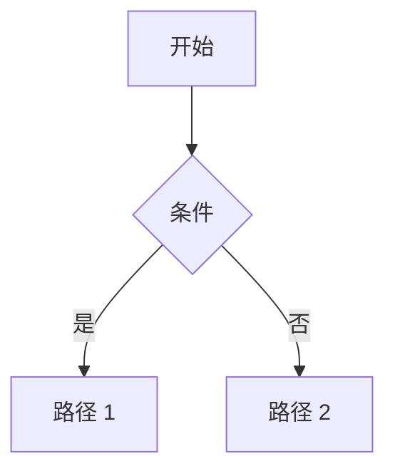

# 入门

> 基于 Nextra 4.x（2025 年发布，要求 **Next.js 15+** / **React 19+** / **Node.js 20+** / **App Router**）编写。

## 速查

- 系统要求：**Node.js 20+** / 任意包管理器（npm / pnpm / yarn / bun）
- 推荐方式：基于官方模板 `git clone https://github.com/shuding/nextra-docs-template` 或手动安装 5 个包
- 手动安装 docs theme：`pnpm add next react react-dom nextra nextra-theme-docs`
- 手动安装 blog theme：`pnpm add next react react-dom nextra nextra-theme-blog`
- 启动 dev：`pnpm dev`（默认端口 3000，可加 `--turbopack` 启用 Turbopack）
- 生产构建：`pnpm build`（输出 `.next/`；静态导出加 `output: 'export'` → 输出 `out/`）
- 启动 production：`pnpm start`（Node server 模式 / Vercel 自动）
- 必需 4 个文件：`next.config.mjs` / `mdx-components.tsx` / `app/layout.jsx` / `app/[[...mdxPath]]/page.jsx`
- 内容目录约定：`content/`（推荐）— 所有 `.mdx` 文件放这里，catch-all 路由统一渲染
- sidebar / 顺序配置：每层目录的 `_meta.ts`（或 `_meta.js` / `_meta.jsx`）
- 主版本约束：**v4.x 仅支持 App Router**（v3 之前 Pages Router 已停止演进）
- 内置搜索：**Pagefind**（构建期生成索引，零运行时 JS）

## Nextra 适合什么场景

理解 Nextra 必须先理解它的**定位边界**——它是「**Next.js + MDX 文档站框架**」，**不是通用 SSG**：

| 维度 | Nextra 4.x | VitePress 1.x | Docusaurus 3.x | Starlight (Astro) | MkDocs Material |
|---|---|---|---|---|---|
| 底层框架 | **Next.js 15 App Router** | Vite + Vue 3 | Webpack 5 + React 18 | Astro 5 Island | Python + Jinja |
| 内容格式 | **MDX 3** | Markdown + Vue | MDX 3 | Markdown + Astro/MDX | Markdown |
| 渲染范式 | **RSC + SSG / ISR / Edge** | SSG（Vue SSR） | SSG（React SSR） | SSG（Astro Island） | SSG |
| 首屏 JS | ~150-200KB gzip | ~80KB | ~200KB | ~0KB | ~30KB |
| 多版本文档 | ❌ 无 | ❌ 无 | **✅ 一等公民** | ❌ 无 | 部分（mike 插件） |
| 博客 theme | **✅ 内置 `nextra-theme-blog`** | ❌ 无 | ✅ 内置 | ✅ blog plugin | ❌ |
| 搜索 | **Pagefind 内置** | Algolia / minisearch | Algolia / local-search | Pagefind | lunr.js |
| 多语言 i18n | **✅ Next.js i18n** | ✅ 配置型 | ✅ 完整工作流 | ✅ Astro i18n | ✅ |
| 内置组件 | **Callout / Cards / Steps / FileTree / Tabs / Bleed / Table** | 较少（custom-block） | Tabs / Admonition | 较多 | 较少 |
| TypeScript | ✅ 完整 | ✅ 完整 | ✅ 完整 | ✅ 完整 | ❌ |
| 构建速度 | 中（Next.js） | **极快**（Vite） | 慢（Webpack） | 快（Vite） | 快 |
| 适合用户 | **React + Next.js 生态** | Vue + Vite 生态 | React + 多版本需求 | Astro + 极致性能 | Python + 简洁 |
| 典型用户 | SWR / Turborepo / Million.js / ESLint Next | Vue / Vite / Pinia | React Native / Jest | Tauri / Bun | FastAPI / Pydantic |

**核心适合**：

- **已经在用 Next.js / React 的项目**（自然延伸为文档站）
- **想用 Vercel 部署的 React 生态库**（Image / Link / Edge 完美匹配）
- **MDX 重度用户**（要在文档里嵌入大量交互 React demo）
- **现代视觉风格的开源项目首页 + 文档**（Docs Theme 视觉精致）
- **博客 + 文档一体的站点**（4.x 的 blog theme 已可用）

**不适合**：

- **Vue / Svelte 项目**（应选 VitePress / Sveld）
- **需要多版本文档**（应选 Docusaurus）
- **极致性能首屏**（应选 Starlight 零 JS）
- **大量内容 + 极快构建**（应选 VitePress / Hugo）
- **不想学 Next.js 心智模型**（VitePress 心智更简单）

## 创建项目

### 前置条件

```bash
node -v   # ≥ 20.0.0（推荐 22 LTS）
```

如果版本不够，用 nvm / fnm：

```bash
nvm install 22 && nvm use 22
# 或
fnm install 22 && fnm use 22
```

### 方式 A：基于官方模板（推荐）

最快方式——直接克隆模板仓库：

```bash
git clone https://github.com/shuding/nextra-docs-template.git my-docs
cd my-docs
rm -rf .git
npm install
npm run dev
```

模板自带：
- `next.config.mjs` Nextra 插件配置
- `mdx-components.tsx`
- `app/layout.jsx` + `Navbar` + `Footer` + `Search`
- `content/` 内容目录 + 第一篇示例
- `[[...mdxPath]]/page.jsx` catch-all 路由
- TypeScript + Tailwind CSS（部分模板）

博客模板：

```bash
git clone https://github.com/shuding/nextra-blog-template.git my-blog
```

### 方式 B：手动安装

如果想自己控制每个文件，按以下步骤：

#### 1. 初始化 Next.js 项目

```bash
npx create-next-app@latest my-docs --typescript --no-tailwind --no-eslint --app
cd my-docs
```

参数说明：
- `--typescript`：用 TypeScript
- `--no-tailwind`：先不装 Tailwind（后续可加）
- `--no-eslint`：跳过 ESLint（避免和 Nextra 冲突）
- `--app`：**App Router**（v4.x 必须）

#### 2. 安装 Nextra + Theme

```bash
pnpm add nextra nextra-theme-docs
```

> Nextra 4.x 把 `next`、`react`、`react-dom` 作为 peerDependencies——Next.js 项目里已经有了。

#### 3. 配置 `next.config.mjs`

```js
// next.config.mjs
import nextra from 'nextra'

const withNextra = nextra({
  // Nextra 选项（可选）
  // search: true,           // 默认开启 Pagefind 搜索
  // latex: true,            // 启用 LaTeX
  // contentDirBasePath: '/' // content/ 映射的 URL 前缀
})

export default withNextra({
  // Next.js 选项
  reactStrictMode: true,
  // 静态导出时：
  // output: 'export',
  // images: { unoptimized: true },
})
```

#### 4. 创建 `mdx-components.tsx`（必需）

这是 Nextra 4.x **强制要求**的顶层文件——Next.js MDX 通过它接管 Markdown 渲染：

```tsx
// mdx-components.tsx（项目根目录或 src/ 下）
import { useMDXComponents as getDocsMDXComponents } from 'nextra-theme-docs'

const docsComponents = getDocsMDXComponents()

export function useMDXComponents(components) {
  return {
    ...docsComponents,
    ...components,
    // 这里可以覆盖任意 HTML 标签的渲染：
    // h1: ({ children }) => <h1 className="custom">{children}</h1>,
  }
}
```

> **位置**：项目根目录或 `src/` 下都行。文件扩展名 `.js` / `.jsx` / `.ts` / `.tsx` 均可。
>
> **避免 ESLint 误报**：把 `useMDXComponents` 导入时改名为 `getDocsMDXComponents`（不在模块顶层用 hook 命名调用）。

#### 5. 配置 `app/layout.jsx`

这是 Docs Theme 的"心脏"——Banner / Navbar / Footer / Search 都从这里挂载：

```jsx
// app/layout.jsx
import { Footer, Layout, Navbar } from 'nextra-theme-docs'
import { Banner, Head, Search } from 'nextra/components'
import { getPageMap } from 'nextra/page-map'
import 'nextra-theme-docs/style.css'

export const metadata = {
  title: 'My Docs',
  description: 'Built with Nextra'
}

const banner = (
  <Banner storageKey="some-key">
    🎉 Nextra 4.0 已发布！
  </Banner>
)

const navbar = (
  <Navbar
    logo={<b>My Docs</b>}
    projectLink="https://github.com/your-org/your-repo"
  />
)

const footer = (
  <Footer>MIT {new Date().getFullYear()} © Your Name.</Footer>
)

export default async function RootLayout({ children }) {
  return (
    <html lang="zh-CN" dir="ltr" suppressHydrationWarning>
      <Head
        faviconGlyph="📘"
        backgroundColor={{ light: '#fefce8', dark: '#0f172a' }}
      />
      <body>
        <Layout
          banner={banner}
          navbar={navbar}
          footer={footer}
          pageMap={await getPageMap()}
          docsRepositoryBase="https://github.com/your-org/your-repo/tree/main"
          search={<Search />}
          sidebar={{ defaultMenuCollapseLevel: 1, autoCollapse: true }}
        >
          {children}
        </Layout>
      </body>
    </html>
  )
}
```

> **关键点**：
> - `suppressHydrationWarning`：必加——Theme 用 localStorage 切深浅模式时会做客户端 hydration mismatch
> - `await getPageMap()`：用 RSC async 拉 sidebar 树（Nextra 4.x 必须）
> - `docsRepositoryBase`：生成"Edit this page"链接的基址

#### 6. 创建 `app/[[...mdxPath]]/page.jsx` catch-all 路由

把 `content/` 目录下所有 MDX 渲染为路由：

```jsx
// app/[[...mdxPath]]/page.jsx
import { generateStaticParamsFor, importPage } from 'nextra/pages'
import { useMDXComponents } from '../../mdx-components'

// 静态参数生成器：构建期遍历 content/ 下所有 mdx 路径
export const generateStaticParams = generateStaticParamsFor('mdxPath')

export async function generateMetadata({ params }) {
  const { mdxPath = [] } = await params
  const { metadata } = await importPage(mdxPath)
  return metadata
}

const Wrapper = useMDXComponents().wrapper

export default async function Page(props) {
  const params = await props.params
  const result = await importPage(params.mdxPath)
  const { default: MDXContent, toc, metadata } = result
  return (
    <Wrapper toc={toc} metadata={metadata}>
      <MDXContent {...props} params={params} />
    </Wrapper>
  )
}
```

#### 7. 添加 `package.json` scripts

```json
{
  "scripts": {
    "dev": "next dev",
    "build": "next build",
    "start": "next start"
  }
}
```

可选启用 Turbopack：

```json
{
  "scripts": {
    "dev": "next dev --turbopack"
  }
}
```

## 第一篇 MDX

Nextra 4.x 新约定——**所有 MDX 文件放在 `content/` 目录**（默认）：

### 创建首页

```mdx
{/* content/index.mdx */}
# 欢迎来到 My Docs

这是用 Nextra 4 构建的文档站首页。

## 特性

- MDX 内容
- 自动生成 sidebar
- 内置搜索
```

### 创建子页面

```mdx
{/* content/getting-started.mdx */}
---
title: 入门
---

# 入门指引

## 安装

```bash
pnpm add my-package
```

## 基本用法

```ts
import { hello } from 'my-package'

hello('world')
```
```

启动 dev：

```bash
pnpm dev
```

打开 `http://localhost:3000/` → 看到首页；`http://localhost:3000/getting-started` → 看到第二篇。

## 第一个 `_meta.ts`（sidebar 顺序）

默认情况下，sidebar 按文件名**字母顺序**排列。要自定义顺序、显示名、隐藏页面，需要 `_meta.ts`：

```ts
// content/_meta.ts
export default {
  index: '首页',
  'getting-started': '入门',
  guide: {
    title: '指南',
    items: {
      base: '基础',
      advanced: '进阶',
    },
  },
  reference: '参考',
  '---': {
    type: 'separator',
    title: '更多',
  },
  github: {
    title: 'GitHub →',
    href: 'https://github.com/your-org/your-repo',
  },
}
```

### `_meta.ts` 主要规则

- **键 = 文件名**（不含扩展名）/ **值 = 显示标题或配置对象**
- **顺序**：按声明顺序排（不是字母序）
- **未声明的页面**：自动追加到末尾，按字母序
- **嵌套目录**：在子目录里再建 `_meta.ts`，递归生效
- **必须用字符串键**：JavaScript 对象数字键会自动前置排序，会破坏顺序
- **可选添加**：`/* eslint sort-keys: error */` 注释强制按 key 排序（团队规范）

## 第一个内置组件

Nextra 内置组件都从 `nextra/components` 导入。

### Callout（提示框）

```mdx
import { Callout } from 'nextra/components'

<Callout type="info">
  Nextra 4.x 仅支持 Next.js App Router。
</Callout>

<Callout type="warning">
  升级前请仔细阅读 migration guide。
</Callout>

<Callout type="error" emoji="⚠️">
  Pages Router 模式已停止演进。
</Callout>
```

### Cards（卡片）

```mdx
import { Cards } from 'nextra/components'

<Cards>
  <Cards.Card title="入门" href="/getting-started" />
  <Cards.Card title="指南" href="/guide" />
  <Cards.Card title="参考" href="/reference" />
</Cards>
```

### Steps（步骤）

```mdx
import { Steps } from 'nextra/components'

<Steps>

### 安装

pnpm add nextra nextra-theme-docs

### 配置

编辑 next.config.mjs。

### 创建首页

新建 content/index.mdx。

</Steps>
```

### Tabs（标签页）

```mdx
import { Tabs } from 'nextra/components'

<Tabs items={['pnpm', 'npm', 'yarn']}>
  <Tabs.Tab>pnpm add nextra</Tabs.Tab>
  <Tabs.Tab>npm install nextra</Tabs.Tab>
  <Tabs.Tab>yarn add nextra</Tabs.Tab>
</Tabs>
```

> 内层包含代码块的写法（如 Tabs.Tab 里嵌套 ```bash 命令），实际项目里直接写即可，本文档因 fenced code 嵌套限制做了简化。

> 更多组件详见 [指南](./guide-line.md) 的「内置组件」章节。

## 项目结构（推荐 4.x 模板）

```
my-docs/
├── app/
│   ├── layout.jsx                     # 👈 根 Layout（Banner / Navbar / Footer）
│   ├── globals.css                    # 全局样式
│   └── [[...mdxPath]]/
│       └── page.jsx                   # 👈 catch-all 路由（统一渲染 content/ 下所有 MDX）
├── content/                           # 👈 MDX 内容目录（4.x 推荐）
│   ├── index.mdx                      # → URL /
│   ├── _meta.ts                       # → 当前目录 sidebar 配置
│   ├── getting-started.mdx            # → URL /getting-started
│   └── guide/
│       ├── _meta.ts
│       ├── index.mdx                  # → URL /guide
│       └── advanced.mdx               # → URL /guide/advanced
├── mdx-components.tsx                 # 👈 必需文件（Nextra 4.x 强制）
├── next.config.mjs                    # 👈 Nextra 插件 + Next.js 配置
├── package.json
├── tsconfig.json
└── public/                            # 静态资源
    └── favicon.ico
```

### 4.x 两种路由模式对比

| 路由模式 | 文件路径 | URL | 适合场景 |
|---|---|---|---|
| **`content/`（推荐）** | `content/guide/advanced.mdx` | `/guide/advanced` | 4.x 默认，文件扁平、组织清爽 |
| **App Router 原生** | `app/guide/advanced/page.mdx` | `/guide/advanced` | 想精细控制路由（如配 loading.jsx） |

两种可以混用：MDX 文件放 `content/` + React 页面放 `app/` 自己的 `page.jsx`。

## 启动 dev server

```bash
pnpm dev
```

输出：

```
▲ Next.js 15.0.0
  - Local:        http://localhost:3000
  - Environments: .env.local

 ✓ Starting...
 ✓ Ready in 2.1s
```

浏览器打开 `http://localhost:3000/`。

### dev 常用 flag

```bash
pnpm dev --port 4000               # 改端口
pnpm dev --turbopack               # 启用 Turbopack（更快）
pnpm dev -H 0.0.0.0                # 监听所有网卡（局域网访问）
```

## 启用 Pagefind 搜索

Nextra 4.x **默认搜索引擎是 Pagefind**——构建期生成静态索引，零运行时 JS。需要 3 步：

### 1. 安装 Pagefind

```bash
pnpm add -D pagefind
```

### 2. 添加 postbuild 脚本

```json
{
  "scripts": {
    "dev": "next dev",
    "build": "next build",
    "postbuild": "pagefind --site .next/server/app --output-path public/_pagefind",
    "start": "next start"
  }
}
```

> 静态导出场景（`output: 'export'`）改成：
>
> ```json
> "postbuild": "pagefind --site out --output-path out/_pagefind"
> ```

### 3. 忽略生成产物

```gitignore
# .gitignore
.next/
out/
public/_pagefind/
```

启动后 `app/layout.jsx` 里挂的 `<Search />` 组件就能跑。

### 禁用搜索

```js
// next.config.mjs
const withNextra = nextra({
  search: false
})
```

或只禁用 codeblock 索引：

```js
const withNextra = nextra({
  search: { codeblocks: false }
})
```

## 生产构建

```bash
pnpm build
pnpm start    # Node 服务器模式（默认 port 3000）
```

输出会在 `.next/`。**Vercel** 部署：直接 `git push` 即可，零配置。

### 静态导出（部署到 Nginx / GitHub Pages）

```js
// next.config.mjs
import nextra from 'nextra'

const withNextra = nextra({})

export default withNextra({
  output: 'export',
  images: {
    unoptimized: true     // 静态导出必须关闭 Next.js Image 优化
  },
  // 可选：自定义输出目录
  // distDir: 'build',
})
```

```bash
pnpm build
# 输出在 out/ 下，可以直接拷贝到 Nginx / GitHub Pages
```

> **限制**：静态导出模式下 i18n middleware / ISR / API Routes 全部失效。

## 部署到 Vercel

最简单——Vercel 是 Nextra 的"亲妈"：

```bash
# 1. push 到 GitHub
git remote add origin git@github.com:you/my-docs.git
git push -u origin main

# 2. 浏览器打开 vercel.com/new → Import Project → 选你的 repo
# 3. Framework Preset 会自动检测为 Next.js
# 4. Deploy
```

无需任何 `vercel.json`。

## 部署到 Cloudflare Pages

Cloudflare Pages 2024 起原生支持 Next.js App Router。

控制台 → Create application → Pages → Connect to Git → 选 repo：

- **Framework preset**: Next.js
- **Build command**: `pnpm build`
- **Build output directory**: `.next`
- **Environment**: `NODE_VERSION = 22`

> **注意**：Cloudflare Pages 跑 Next.js 需要 `@cloudflare/next-on-pages` adapter，详见 Cloudflare 官方文档。如果想完全静态，直接走 `output: 'export'` + 把 `out/` 部署到 Cloudflare Pages 更简单。

## 部署到 GitHub Pages（静态导出）

`.github/workflows/deploy.yml`：

```yml
name: Deploy to GitHub Pages

on:
  push:
    branches: [main]

permissions:
  contents: read
  pages: write
  id-token: write

jobs:
  build:
    runs-on: ubuntu-latest
    steps:
      - uses: actions/checkout@v4
      - uses: pnpm/action-setup@v4
        with:
          version: 9
      - uses: actions/setup-node@v4
        with:
          node-version: 22
          cache: pnpm
      - run: pnpm install
      - run: pnpm build
      - uses: actions/upload-pages-artifact@v3
        with:
          path: out

  deploy:
    needs: build
    runs-on: ubuntu-latest
    environment:
      name: github-pages
      url: ${{ steps.deployment.outputs.page_url }}
    steps:
      - id: deployment
        uses: actions/deploy-pages@v4
```

> 子路径部署（`user.github.io/my-docs/`）：`next.config.mjs` 加 `basePath: '/my-docs'`。

## TypeScript 配置

Next.js + Nextra 全套支持 TypeScript：

```bash
pnpm add -D typescript @types/react @types/node
```

第一次 `pnpm dev` 时 Next.js 自动生成 `tsconfig.json`。

### Theme 配置类型

```tsx
// theme.config.tsx（自定义 theme 时）
import type { DocsThemeConfig } from 'nextra-theme-docs'

const config: DocsThemeConfig = {
  // ...
}

export default config
```

### `_meta.ts` 类型提示

```ts
// content/_meta.ts
import type { MetaRecord } from 'nextra'

export default {
  index: '首页',
  guide: '指南',
} satisfies MetaRecord
```

## Tailwind CSS 集成

按 Next.js Tailwind 官方流程装好后，把 Nextra 的 theme 样式叠加上去：

```css
/* app/globals.css */
@import 'tailwindcss';
@import 'nextra-theme-docs/style.css';
```

```jsx
// app/layout.jsx
import './globals.css'    // 👈 在最顶部 import
// ... 其他 imports
```

## 第一个 LaTeX 公式

`next.config.mjs` 启用：

```js
const withNextra = nextra({
  latex: true   // 默认 KaTeX
  // 或：latex: { renderer: 'mathjax' }
})
```

在 MDX 里：

```mdx
行内公式：$E = mc^2$

块级公式：
```math
\int_0^\infty e^{-x^2} dx = \frac{\sqrt{\pi}}{2}
```
```

## 第一个 Mermaid 图表

Nextra 4.x 内置 `@theguild/remark-mermaid`，无需任何配置：

```` mdx

````

## 第一个 GitHub Alert

不用任何 import，直接写 GitHub Markdown 风格的 blockquote：

```markdown
> [!NOTE]
> 这是一个 NOTE（信息提示）。

> [!TIP]
> 这是一个 TIP（实用建议）。

> [!IMPORTANT]
> 这是一个 IMPORTANT（重要信息）。

> [!WARNING]
> 这是一个 WARNING（警告）。

> [!CAUTION]
> 这是一个 CAUTION（风险提示）。
```

Nextra 会自动渲染为对应 Callout 样式。

## 常见陷阱

### Node 版本不对

```
error: Nextra requires Node.js 20 or higher
```

升级：`nvm install 22 && nvm use 22`。

### 必需文件缺失

```
Error: Missing required file: mdx-components.tsx
```

Nextra 4.x **强制要求**项目根有 `mdx-components.tsx`——文件名固定，不能改。

### `_meta.ts` 顺序不对

- **检查 key 是否数字**：JavaScript 对象数字 key 会自动前置——必须用字符串
- **检查是否声明顺序**：`_meta.ts` 按声明顺序，不是字母序
- **检查未声明文件**：未在 `_meta.ts` 中声明的文件追加到末尾

### `mdx-components.tsx` 不生效（Turbopack）

```js
// next.config.mjs
export default withNextra({
  turbopack: {
    resolveAlias: {
      'next-mdx-import-source-file': './src/mdx-components.tsx'
    }
  }
})
```

如果 Next.js < 15.3，路径写 `experimental.turbopack.resolveAlias`。

### 静态导出图片报错

```
Error: Image Optimization using the default loader is not compatible with `{ output: 'export' }`.
```

`output: 'export'` 时必须关闭 Next.js Image 优化：

```js
images: { unoptimized: true }
```

### Pagefind 搜索没结果

- 检查 `postbuild` 脚本是否跑了：`pnpm build && ls public/_pagefind/`
- 静态导出模式输出路径要改为 `out/_pagefind`
- `.gitignore` 别忘了加 `_pagefind/`

### `getPageMap()` 在 Client Component 里报错

```
Error: getPageMap can only be called from Server Components
```

`app/layout.jsx` 必须是 **async Server Component**（不能加 `'use client'`），`await getPageMap()` 才能跑。

### Dark Mode 闪烁（FOUC）

`<html>` 加 `suppressHydrationWarning`：

```jsx
<html lang="zh-CN" suppressHydrationWarning>
```

否则深浅模式切换时会有 hydration mismatch 警告。

### `content/` 文件夹改名后 sidebar 空

如果不用默认 `content/` 目录，要在 `next.config.mjs` 配 `contentDirBasePath`：

```js
const withNextra = nextra({
  contentDirBasePath: '/docs'   // content/foo.mdx → URL /docs/foo
})
```

### v3 升级到 v4

主要变更：
- **Pages Router → App Router**：全部 `pages/*.mdx` → `content/*.mdx` 或 `app/*/page.mdx`
- **`theme.config.tsx` 拆分**：Banner / Navbar / Footer 等移到 `app/layout.jsx`
- **FlexSearch → Pagefind**：搜索引擎变更
- **`useConfig` 大量 props 移除**：很多配置直接挂到 `<Layout>` 组件

详细迁移见 Nextra 官网的 [4.0 migration guide](https://nextra.site/docs/guide/migration-guide)。

## 接下来读什么

完成本入门后建议按顺序读：

- [指南](./guide-line.md)：三大 theme 深度（docs / blog / custom）/ `_meta.ts` 完整配置（type / display / theme）/ MDX 3 全部能力 / 7 大内置组件深度（Callout / Cards / Steps / FileTree / Tabs / Bleed / Table）/ Layout / Banner / Head / Search / Navbar / Footer / 搜索（Pagefind / Algolia）/ i18n / Theme 深度定制 / Tailwind / LaTeX / Mermaid / SEO / Vercel / Cloudflare 部署
- [参考](./reference.md)：API 速查 / `next.config.mjs` 全部选项 / `_meta.ts` 完整 schema / `DocsThemeConfig` props / `useMDXComponents` / `getPageMap` / `compileMdx` / `evaluate` / `normalizePages` / 内置组件 props 速查
