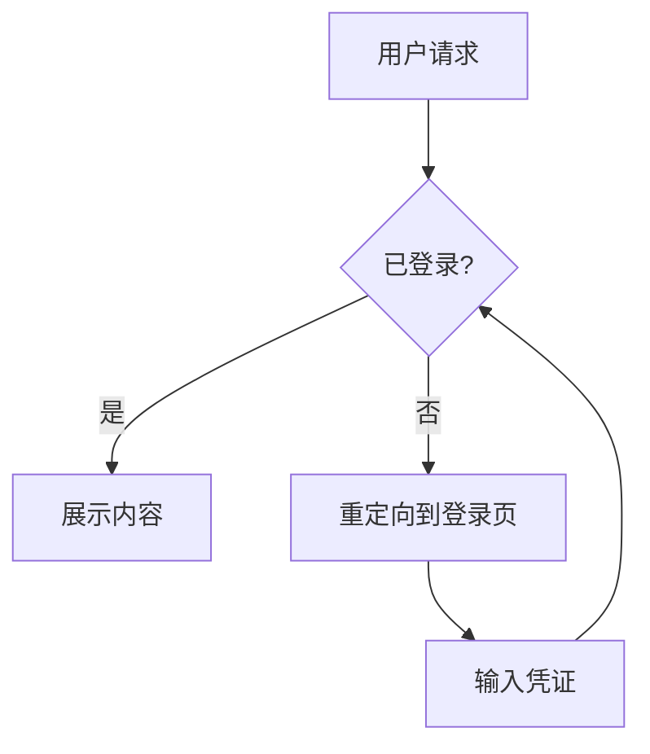
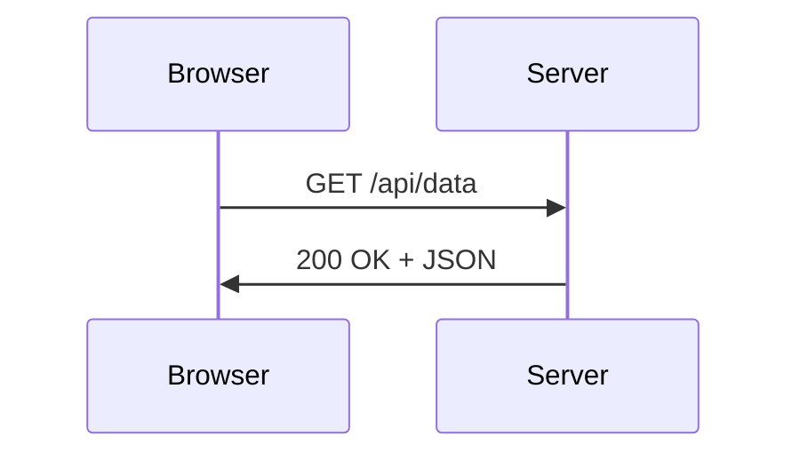
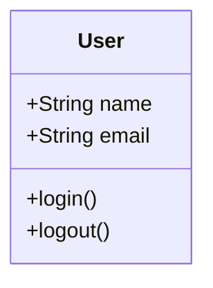

# 指南

> 基于 Nextra 4.x（Next.js 15 App Router + React 19 + MDX 3）。覆盖三大 theme、`_meta.ts` 完整配置、MDX 3 全部能力、7 大内置组件、Layout 组件深度、搜索、i18n、Theme 定制、Tailwind / LaTeX / Mermaid、Vercel / Cloudflare / GitHub Pages 部署。

## Nextra 与 Next.js 的关系

理解 Nextra 必须先理解一个核心事实——**Nextra 不是独立 SSG，它是 Next.js 的一个插件**。整套工作流分三层：

```
你写的 MDX 文件
     ↓
Nextra（remark / rehype 插件 + 路由约定 + theme 组件）
     ↓
Next.js（App Router + RSC + 构建 + 部署）
     ↓
最终 HTML / JS / CSS
```

具体职责：

| 层 | 负责 |
|---|---|
| **Nextra** | MDX 编译（remark / rehype 插件链）/ `_meta.ts` sidebar 生成 / `useMDXComponents` 接管渲染 / `getPageMap()` 等 helper / Pagefind 搜索集成 / GitHub Alert 支持 / Mermaid / LaTeX 转换 |
| **Nextra Theme** | UI 层（Navbar / Sidebar / Footer / TOC / Search 等组件）+ 样式（`nextra-theme-docs/style.css`） |
| **Next.js** | App Router 路由 / RSC 渲染 / Image / Link 优化 / 静态生成 / Edge / ISR / 部署 |

**实际意义**：

- 你**完全可以**在 Nextra 项目里混用普通 Next.js 页面（`app/(public)/landing/page.tsx`），与 MDX 文档（`content/*.mdx`）共存
- 你**完全可以**用 Next.js 的 `loading.jsx` / `error.jsx` / `not-found.jsx` 等 App Router 文件约定
- 你**可以**在 MDX 里 `import` 任意 React 组件，包括 Next.js Image、Link
- 你**必须**接受 Next.js 的心智模型（RSC / `'use client'` / 异步组件 / `await` props 等）

## 三大 Theme

Nextra 4.x 官方提供三种 theme 选择：

### 1. `nextra-theme-docs`（文档主题）

**最常用**——React 文档站的事实标准。视觉风格类似 [SWR docs](https://swr.vercel.app/) / [Turborepo docs](https://turbo.build/repo/docs)：

特点：

- **侧边栏 + 顶栏 + TOC** 三栏布局
- **深浅模式 + 系统跟随** 切换
- **Pagefind 搜索** 集成
- **Banner** 顶部公告
- **i18n 切换器**
- **Edit on GitHub / Feedback / Last updated** 链接
- **响应式**：移动端折叠 sidebar

安装：

```bash
pnpm add nextra nextra-theme-docs
```

```jsx
// app/layout.jsx
import { Layout, Navbar, Footer } from 'nextra-theme-docs'
import 'nextra-theme-docs/style.css'
```

### 2. `nextra-theme-blog`（博客主题）

**博客站点**——适合个人博客 / 团队博客：

特点：

- **文章列表 + 文章详情** 两栏布局
- **标签 / 作者 / 日期** 元数据
- **RSS Feed** 自动生成
- **MDX 全特性** + 代码高亮
- **深浅模式**

安装：

```bash
pnpm add nextra nextra-theme-blog
```

```jsx
// app/layout.jsx
import { Layout, Navbar, Footer, ThemeSwitch } from 'nextra-theme-blog'
import { Banner, Head, Search } from 'nextra/components'
import { getPageMap } from 'nextra/page-map'
import 'nextra-theme-blog/style.css'

export default async function RootLayout({ children }) {
  return (
    <html lang="zh-CN" suppressHydrationWarning>
      <Head backgroundColor={ { dark: '#0f172a', light: '#fefce8' }} />
      <body>
        <Layout>
          <Navbar pageMap={await getPageMap()}>
            <Search />
            <ThemeSwitch />
          </Navbar>
          {children}
          <Footer>
            CC BY-NC 4.0 {new Date().getFullYear()} © Your Name.
            <a href="/feed.xml" style={ { float: 'right' }}>RSS</a>
          </Footer>
        </Layout>
      </body>
    </html>
  )
}
```

### 3. 自定义 Theme

**完全自由**——不用任何官方 theme，从零写 Layout：

```jsx
// app/layout.jsx
import { getPageMap } from 'nextra/page-map'
import { MyCustomTheme } from './_components/my-theme'

export default async function RootLayout({ children }) {
  const pageMap = await getPageMap()
  return (
    <html lang="zh-CN" suppressHydrationWarning>
      <body>
        <MyCustomTheme pageMap={pageMap}>
          {children}
        </MyCustomTheme>
      </body>
    </html>
  )
}
```

```jsx
// app/_components/my-theme.jsx
'use client'

import { usePathname } from 'next/navigation'
import { normalizePages } from 'nextra/normalize-pages'

export function MyCustomTheme({ pageMap, children }) {
  const pathname = usePathname()
  const { activeIndex, docsDirectories, topLevelNavbarItems } = normalizePages({
    list: pageMap,
    route: pathname,
  })

  return (
    <div>
      <nav>
        {topLevelNavbarItems.map(item => (
          <a key={item.route} href={item.route}>{item.title}</a>
        ))}
      </nav>
      <aside>
        {docsDirectories.map(dir => (
          <details key={dir.route}>
            <summary>{dir.title}</summary>
            {dir.children?.map(child => (
              <a key={child.route} href={child.route}>{child.title}</a>
            ))}
          </details>
        ))}
      </aside>
      <main>{children}</main>
    </div>
  )
}
```

> **关键 helper**：`normalizePages` 把 `getPageMap()` 返回的扁平列表转换成 navbar / sidebar 可用的结构。

## `_meta.ts` 完整配置

`_meta.ts` 是 Nextra **最核心**的配置文件，控制每个目录的 sidebar / navbar / 顺序 / 显示。

### 文件扩展名

允许 `.js` / `.jsx` / `.ts` / `.tsx`。推荐 `.ts` 获得类型提示：

```ts
// content/_meta.ts
import type { MetaRecord } from 'nextra'

export default {
  index: '首页',
} satisfies MetaRecord
```

### 值的 4 种类型

```ts
type MetaRecordValue =
  | TitleSchema      // 字符串或 JSX —— 简单标题
  | PageItemSchema   // 完整页面配置对象
  | SeparatorSchema  // 分隔符
  | MenuSchema       // navbar 下拉菜单
```

### TitleSchema（最简单）

```ts
export default {
  index: '首页',           // 字符串
  guide: <b>📘 指南</b>,  // JSX
}
```

### PageItemSchema（完整）

```ts
type PageItemSchema = {
  type?: 'page' | 'doc'                       // 默认 'doc'
  display?: 'normal' | 'hidden' | 'children'  // 默认 'normal'
  title?: string | ReactElement
  theme?: PageThemeSchema                     // 见下文
  href?: string                               // 外部链接 / 内部跳转
}
```

完整示例：

```ts
export default {
  index: {
    type: 'page',
    title: '首页',
    display: 'hidden',     // 不在 sidebar 显示，但仍可访问
  },
  contact: {
    title: '联系我们',
    type: 'page',
    href: 'mailto:hi@example.com',
  },
  github: {
    title: 'GitHub ↗',
    href: 'https://github.com/your-org',
  },
}
```

#### `type: 'page'`（顶部 navbar 项）

把页面渲染为**顶部 navbar 链接**，而不是侧边栏：

```ts
// content/_meta.ts
export default {
  index: { title: '首页', type: 'page' },
  docs: { title: '文档', type: 'page' },
  blog: { title: '博客', type: 'page' },
  about: { title: '关于', type: 'page' },
}
```

#### `display: 'hidden'`（隐藏但可访问）

```ts
export default {
  changelog: { display: 'hidden' }   // URL /changelog 可访问，sidebar 不显示
}
```

#### `display: 'children'`（折叠展开）

`children` 用于"虚拟分组"——不创建独立目录，但 sidebar 显示子项：

```ts
export default {
  introduction: 'Introduction',
  'getting-started': {
    display: 'children'   // 这一项的 children 平铺到父目录里
  }
}
```

### SeparatorSchema（分隔符）

视觉分组——sidebar 显示为不可点击的小标题：

```ts
export default {
  index: '首页',
  '-- basics --': {
    type: 'separator',
    title: '基础'
  },
  install: '安装',
  config: '配置',
  '-- advanced --': {
    type: 'separator',
    title: '高级'
  },
  plugins: '插件',
  api: 'API',
}
```

### MenuSchema（navbar 下拉菜单）

```ts
export default {
  company: {
    type: 'menu',
    title: '公司',
    items: {
      about: { title: '关于我们', href: '/about' },
      contact: { title: '联系', href: 'mailto:hi@example.com' },
      privacy: { title: '隐私', href: '/privacy' },
    }
  }
}
```

### `theme` 主题选项

**最强大**的功能——在 `_meta.ts` 里**覆盖单页或单目录**的主题行为。完整选项：

```ts
type PageThemeSchema = {
  breadcrumb?: boolean      // 默认 true   显示面包屑
  collapsed?: boolean       // 默认 false  sidebar 项默认折叠
  copyPage?: boolean        // 默认 true   "Copy page"按钮
  footer?: boolean          // 默认 true   显示 footer
  layout?: 'default' | 'full'  // 默认 default
  navbar?: boolean          // 默认 true
  pagination?: boolean      // 默认 true   底部上下页
  sidebar?: boolean         // 默认 true
  timestamp?: boolean       // 默认 true   显示更新时间
  toc?: boolean             // 默认 true   右侧 TOC
  typesetting?: 'default' | 'article'  // 默认 default
}
```

示例——首页用全宽 + 隐藏 sidebar/toc/pagination：

```ts
export default {
  index: {
    type: 'page',
    title: '首页',
    theme: {
      layout: 'full',
      sidebar: false,
      toc: false,
      pagination: false,
      breadcrumb: false,
    }
  }
}
```

示例——博客文章用"article"排版：

```ts
export default {
  '*': {
    theme: {
      typesetting: 'article',   // 整个目录所有页应用
      breadcrumb: false,
    }
  }
}
```

### `'*'` 通配符

对当前目录所有未单独声明的页面应用默认值：

```ts
export default {
  '*': {
    type: 'page',
    theme: { breadcrumb: false }
  },
  index: '首页',
  docs: '文档',     // 自动继承上面的 type / theme
  about: '关于',
}
```

### `_meta.global.js`（全局配置）

把整站结构写在**一个文件**里，适合复杂多版本 / 跨目录的导航：

```js
// _meta.global.js（项目根目录）
export default {
  index: '首页',
  docs: {
    type: 'page',
    title: '文档',
    items: {       // 注意：全局配置必须用 items 描述子目录
      'getting-started': '入门',
      guide: {
        title: '指南',
        items: {
          base: '基础',
          advanced: '进阶',
        }
      },
      reference: '参考',
    }
  }
}
```

> **限制**：用了 `_meta.global` 后**不能再用**目录级 `_meta.ts`——两者互斥。

### `asIndexPage`（目录索引页）

front matter 加 `asIndexPage: true`，让一个目录有可点击的索引页：

```mdx
---
title: 指南
sidebarTitle: 📘 指南
asIndexPage: true
---

# 指南

这是指南目录的索引页。
```

文件路径 `content/guide.mdx`（不是 `content/guide/index.mdx`）。

### `sidebarTitle`（独立 sidebar 标题）

如果想让 sidebar 显示和页面 `<h1>` 不同的标题：

```mdx
---
title: 完整 API 参考手册   # 浏览器标签页 / SEO 用
sidebarTitle: 📚 API     # sidebar 显示
---

# 完整 API 参考手册
```

优先级（高→低）：
1. `_meta.ts` 里的非空 title
2. front matter `sidebarTitle`
3. front matter `title`
4. 文件里第一个 `<h1>`
5. 文件名（格式化）

## MDX 3 完整能力

Nextra 4.x 默认使用 **MDX 3**（基于 unified / remark / rehype）。

### Markdown 基础（GFM）

完整 GitHub Flavored Markdown：

```markdown
**粗体** / *斜体* / ~~删除线~~

- 无序列表
- 项 2

1. 有序列表
2. 项 2

- [x] 已完成任务
- [ ] 未完成任务

| 列 1 | 列 2 |
|------|------|
| A    | B    |

[链接](https://example.com)


> 引用

`行内代码`

    （三反引号代码块）
```

### 自定义 heading ID

```markdown
## 我的标题 [#custom-id]
```

链接：`[跳转](#custom-id)`。

### 自动链接

```markdown
直接写 https://example.com 自动变链接
邮箱 me@example.com 也自动识别
```

### `import` React 组件

```mdx
import { motion } from 'framer-motion'
import { MyChart } from '@/components/chart'

# 动效演示

<motion.div animate={ { x: 100 }}>移动</motion.div>

<MyChart data={[1, 2, 3]} />
```

### `export` 变量

```mdx
export const year = new Date().getFullYear()

# 文章

写于 {year} 年。
```

### JSX 表达式

```mdx
# 数据

总数：{1 + 2 + 3}

数组：{[1, 2, 3].join(', ')}
```

### Front Matter

```mdx
---
title: 文章标题
description: SEO 描述
sidebarTitle: 简短标题
asIndexPage: false
---

# 文章

内容……
```

支持字段（部分）：

| 字段 | 作用 |
|---|---|
| `title` | 浏览器 title / SEO |
| `description` | SEO description |
| `sidebarTitle` | sidebar 显示标题 |
| `asIndexPage` | 是否为目录索引页 |
| `searchable` | 是否纳入搜索索引（默认 true） |

任何额外字段可通过 `metadata` 在 `page.jsx` 中读取。

## GitHub Alert 语法

Nextra 4.x 原生支持 GitHub Markdown 的 5 种 Alert，语法与 GitHub README 完全一致：

- `[!NOTE]` 用户需要知道的信息提示
- `[!TIP]` 实用建议
- `[!IMPORTANT]` 关键信息（用户必须知道）
- `[!WARNING]` 需要立即注意的警告
- `[!CAUTION]` 风险提示

每个 Alert 都是 blockquote 开头 + `[!TYPE]` 行 + 后续 `>` 引用内容行。

渲染效果与 `<Callout>` 组件一致。如果想自定义 Alert 样式，可在 `mdx-components.tsx` 里覆盖 `blockquote`：

```tsx
import { withGitHubAlert } from 'nextra/components'
import { Callout } from 'nextra/components'

const Blockquote = withGitHubAlert(
  ({ type, children }) => <Callout type={type}>{children}</Callout>,
  ({ children }) => <blockquote>{children}</blockquote>
)

export function useMDXComponents(components) {
  return {
    ...components,
    blockquote: Blockquote,
  }
}
```

## `useMDXComponents` 自定义 HTML 标签

`mdx-components.tsx` 是**唯一**接管 MDX → HTML 渲染的入口。你可以覆盖**任意**标签：

```tsx
// mdx-components.tsx
import { useMDXComponents as getDocsMDXComponents } from 'nextra-theme-docs'
import Image from 'next/image'

const docsComponents = getDocsMDXComponents()

export function useMDXComponents(components) {
  return {
    ...docsComponents,
    ...components,

    // 覆盖 h1：加自定义类名
    h1: ({ children, ...props }) => (
      <h1 className="my-custom-h1" {...props}>
        🚀 {children}
      </h1>
    ),

    // 覆盖 img：用 Next.js Image
    img: (props) => (
      <Image
        sizes="100vw"
        style={ { width: '100%', height: 'auto' }}
        {...props}
      />
    ),

    // 覆盖 a：外部链接加图标
    a: ({ href, children, ...props }) => {
      const isExternal = href?.startsWith('http')
      return (
        <a
          href={href}
          target={isExternal ? '_blank' : undefined}
          rel={isExternal ? 'noopener noreferrer' : undefined}
          {...props}
        >
          {children}{isExternal && ' ↗'}
        </a>
      )
    },
  }
}
```

优先级（从高到低）：`components` 参数（页面级覆盖）→ 你在 `mdx-components` 返回的对象 → theme 默认。

## 内置组件速览

Nextra 自带一组从 `nextra/components` 导入的 MDX 组件（直接在 `.mdx` 里 `import` 使用即可），完整 props 请查阅[官方文档](https://nextra.site/docs/built-ins)：

- **Callout**：提示框，5 种 type（默认/info/warning/error/important），支持自定义 emoji
- **Cards / Cards.Card**：卡片网格，支持 title / href / image / icon / arrow，`num` 控制每行卡片数
- **Steps**：步骤列表，把 `### 子标题` 自动渲染为编号步骤
- **FileTree / FileTree.Folder / FileTree.File**：文件树结构展示，支持嵌套
- **Tabs / Tabs.Tab**：标签页切换，`items` 数组传 tab 名
- **Bleed**：让内容跳出 prose 边界（全宽展示）
- **Table**：响应式表格容器（横向滚动）
- **Banner**：顶部置顶横幅（dismissible）
- **Search**：站内搜索（默认 Pagefind 客户端，支持 Algolia 集成）
- **Head**：自定义 `<head>` 元素

> 这些组件都是 client-side React 组件，在 `.mdx` 中直接当作 JSX 使用即可。详细 props 见参考章节。

## Layout 组件深度（Docs Theme）

`<Layout>` 是 Docs Theme 的核心容器——挂载在 `app/layout.jsx` 里：

```jsx
import { Layout, Navbar, Footer } from 'nextra-theme-docs'
import { Banner, Head, Search } from 'nextra/components'
import { getPageMap } from 'nextra/page-map'
import 'nextra-theme-docs/style.css'

export default async function RootLayout({ children }) {
  return (
    <html lang="zh-CN" suppressHydrationWarning>
      <Head faviconGlyph="📘" />
      <body>
        <Layout
          {/* 必填 */}
          pageMap={await getPageMap()}

          {/* 顶部公告 */}
          banner={<Banner storageKey="v4">🎉 v4 已发布</Banner>}

          {/* 顶栏 */}
          navbar={
            <Navbar
              logo={<b>My Docs</b>}
              projectLink="https://github.com/your-org/repo"
            />
          }

          {/* 底栏 */}
          footer={<Footer>MIT 2026 © Your Name.</Footer>}

          {/* 搜索 */}
          search={<Search />}

          {/* sidebar 配置 */}
          sidebar={{
            defaultMenuCollapseLevel: 2,
            autoCollapse: true,
            toggleButton: true,
            defaultOpen: false,
          }}

          {/* TOC 配置 */}
          toc={{
            float: true,
            title: '本页内容',
            backToTop: '回到顶部',
            extraContent: <div>赞助商位</div>,
          }}

          {/* Edit on GitHub */}
          docsRepositoryBase="https://github.com/your-org/repo/tree/main"
          editLink="在 GitHub 上编辑此页 →"

          {/* Feedback */}
          feedback={{
            content: '反馈这一页',
            labels: 'feedback',
          }}

          {/* 上下页 */}
          navigation={ { prev: true, next: true }}

          {/* 最后更新时间 */}
          lastUpdated={<span>最后更新于</span>}

          {/* i18n 语言切换 */}
          i18n={[
            { locale: 'en', name: 'English' },
            { locale: 'zh', name: '中文' },
            { locale: 'ar', name: 'العربية', direction: 'rtl' },
          ]}

          {/* 深浅模式 */}
          darkMode={true}
          themeSwitch={{
            dark: '深色',
            light: '浅色',
            system: '跟随系统',
          }}

          {/* next-themes 配置 */}
          nextThemes={{
            defaultTheme: 'system',
            storageKey: 'theme',
          }}
        >
          {children}
        </Layout>
      </body>
    </html>
  )
}
```

### `<Layout>` 主要 props 速查

| Prop | 类型 | 作用 |
|---|---|---|
| `pageMap` | `PageMapItem[]` | **必填**——`await getPageMap()` 拿到的整站结构 |
| `banner` | `ReactNode` | 顶部公告 |
| `navbar` | `ReactNode` | 顶栏（通常是 `<Navbar />`） |
| `footer` | `ReactNode` | 底栏 |
| `search` | `ReactNode \| false` | 搜索框 |
| `sidebar` | `SidebarConfig` | sidebar 行为 |
| `toc` | `TocConfig` | 右侧 TOC |
| `docsRepositoryBase` | `string` | "Edit on GitHub" 链接基址 |
| `editLink` | `string \| ReactNode \| false` | 编辑链接文案 |
| `feedback` | `FeedbackConfig` | 反馈链接 |
| `navigation` | `boolean \| { prev, next }` | 底部上下页 |
| `lastUpdated` | `ReactNode \| false` | 最后更新时间 |
| `i18n` | `LocaleConfig[]` | 语言切换 |
| `darkMode` | `boolean` | 显示深浅切换按钮 |
| `themeSwitch` | `{ dark, light, system }` | 切换按钮文案 |
| `nextThemes` | `ThemeProviderProps` | next-themes 配置 |
| `themeSwitch` | object | 文案本地化 |

### Navbar

```jsx
import { Navbar } from 'nextra-theme-docs'

<Navbar
  logo={<b>My Docs</b>}
  logoLink="/"                  // 默认 true（链接到首页）
  projectLink="https://github.com/your-org/repo"
  projectIcon={<GitHubIcon />}  // 默认 GitHub icon
  chatLink="https://discord.gg/xxx"
  chatIcon={<DiscordIcon />}    // 默认 Discord icon
  align="right"                 // 'left' | 'right'
>
  {/* 自定义额外内容，如自定义按钮 */}
  <a href="/sponsor">赞助</a>
</Navbar>
```

### Footer

```jsx
import { Footer } from 'nextra-theme-docs'

<Footer>
  <div>
    MIT {new Date().getFullYear()} © <a href="https://your-site.com">Your Name</a>
  </div>
</Footer>
```

### NotFoundPage（自定义 404）

```jsx
// app/not-found.jsx
import { NotFoundPage } from 'nextra-theme-docs'

export default function NotFound() {
  return (
    <NotFoundPage
      content="提交一个 issue 报告失效链接"
      labels="broken-link"
    >
      <h1>404 - 页面未找到</h1>
    </NotFoundPage>
  )
}
```

## 搜索

### Pagefind（默认）

Nextra 4.x 默认搜索引擎。零运行时 JS，构建期生成 `_pagefind/`，毫秒级响应。

**安装与配置见入门页**。

#### 高级配置

```js
// next.config.mjs
const withNextra = nextra({
  search: {
    codeblocks: false,   // 不索引代码块（搜索结果更聚焦）
  }
})
```

#### Pagefind UI Options

Search 组件透传 PagefindSearchOptions：

```jsx
<Search
  searchOptions={{
    filters: { category: 'guide' },   // 过滤
    sort: { weight: 'desc' },          // 排序
  }}
/>
```

### Algolia DocSearch

对开源项目免费——申请后获得 `apiKey` / `appId` / `indexName`。

替换默认 Search：

```jsx
// app/layout.jsx
'use client'
import { DocSearch } from '@docsearch/react'
import '@docsearch/css'

<Layout
  search={
    <DocSearch
      apiKey="YOUR_API_KEY"
      indexName="YOUR_INDEX_NAME"
      appId="YOUR_APP_ID"
    />
  }
>
```

> 申请 Algolia DocSearch：https://docsearch.algolia.com/apply/

### 禁用搜索

```js
// next.config.mjs
const withNextra = nextra({
  search: false
})
```

## i18n 国际化

### 配置 i18n

```js
// next.config.mjs
import nextra from 'nextra'

const withNextra = nextra({})

export default withNextra({
  i18n: {
    locales: ['en', 'zh', 'de', 'ar'],
    defaultLocale: 'en',
  }
})
```

### 添加语言切换

```jsx
// app/layout.jsx
<Layout
  i18n={[
    { locale: 'en', name: 'English' },
    { locale: 'zh', name: '中文' },
    { locale: 'de', name: 'Deutsch' },
    { locale: 'ar', name: 'العربية', direction: 'rtl' },   // RTL 支持
  ]}
>
```

### 目录结构（content/）

```
content/
├── en/
│   ├── _meta.ts
│   └── index.mdx
├── zh/
│   ├── _meta.ts
│   └── index.mdx
└── de/
    ├── _meta.ts
    └── index.mdx
```

URL 自动加 locale 前缀：`/en/...` / `/zh/...` / `/de/...`。

### 自动语言检测中间件

创建项目根目录 `middleware.ts`（或 `proxy.ts`）：

```ts
// middleware.ts
export { middleware } from 'nextra/locales'

export const config = {
  matcher: [
    '/((?!api|_next/static|_next/image|favicon.ico|sitemap.xml|robots.txt|_pagefind).*)',
  ],
}
```

根据 `Accept-Language` header 自动重定向到对应语言。

### 限制

- **静态导出 (`output: 'export'`) 不支持 middleware**——只能用纯路径前缀方案
- **默认 locale 不加前缀**：`/en/foo` 与 `/foo` 一致；其他 locale 加前缀

## Theme 深度定制

### 修改主题色（Head color）

```jsx
import { Head } from 'nextra/components'

<Head
  color={{
    hue: { dark: 290, light: 270 },        // 紫色调
    saturation: 100,
    lightness: { dark: 60, light: 50 },
  }}
/>
```

### 自定义 CSS

`app/globals.css`：

```css
/* 覆盖 Nextra 内部 CSS 变量 */
:root {
  --nextra-primary-hue: 290;
  --nextra-primary-saturation: 100%;
  --nextra-content-width: 1200px;
}

.dark {
  --nextra-primary-hue: 290;
}

/* 自定义代码块字体 */
.nextra-code {
  font-family: 'JetBrains Mono', monospace;
}
```

记得在 `app/layout.jsx` import：

```jsx
import './globals.css'
import 'nextra-theme-docs/style.css'   // 顺序：先 Nextra 再覆盖
```

### Swizzle 替换（自定义组件）

Nextra **没有 Docusaurus 那种 `swizzle` CLI**——但可以通过 `mdx-components.tsx` 覆盖任意 HTML 标签，通过 Layout props 替换 navbar/footer/search 区块，通过自定义 theme 完全控制布局。

### 完全自定义 Theme（不用 docs theme）

最大自由度——丢掉 `nextra-theme-docs`，直接用 `nextra/page-map` + `nextra/normalize-pages`：

```jsx
// app/layout.jsx（自定义 theme 入口）
import { getPageMap } from 'nextra/page-map'
import { Layout } from './_components/layout'

export default async function RootLayout({ children }) {
  const pageMap = await getPageMap()
  return (
    <html lang="zh-CN" suppressHydrationWarning>
      <body>
        <Layout pageMap={pageMap}>{children}</Layout>
      </body>
    </html>
  )
}
```

```jsx
// app/_components/layout.jsx
'use client'

import { usePathname } from 'next/navigation'
import { normalizePages } from 'nextra/normalize-pages'
import { Anchor } from 'nextra/components'

export function Layout({ pageMap, children }) {
  const pathname = usePathname()
  const { activeIndex, docsDirectories, topLevelNavbarItems } = normalizePages({
    list: pageMap,
    route: pathname,
  })

  return (
    <div className="layout">
      <header>
        <nav>
          {topLevelNavbarItems.map(item => (
            <Anchor key={item.route} href={item.href || item.route}>
              {item.title}
            </Anchor>
          ))}
        </nav>
      </header>

      <div className="container">
        <aside className="sidebar">
          {docsDirectories.map(dir =>
            dir.kind === 'Folder' ? (
              <details key={dir.route} open={dir.isUnderCurrentDocsTree}>
                <summary>{dir.title}</summary>
                {dir.children?.map(child => (
                  <Anchor key={child.route} href={child.route}>
                    {child.title}
                  </Anchor>
                ))}
              </details>
            ) : (
              <Anchor key={dir.route} href={dir.route}>
                {dir.title}
              </Anchor>
            )
          )}
        </aside>

        <main>{children}</main>
      </div>
    </div>
  )
}
```

```jsx
// mdx-components.jsx
import { useMDXComponents as getDefaultComponents } from 'nextra/mdx-components'

const defaultComponents = getDefaultComponents()

export function useMDXComponents(components) {
  return {
    ...defaultComponents,
    ...components,
    wrapper({ children, toc, metadata }) {
      return (
        <article>
          {children}
        </article>
      )
    },
  }
}
```

## 静态资源

### Next.js Image 自动优化

```mdx

```

Nextra 自动转换为 `<Image>` 组件，构建期生成 srcset，懒加载，零 CLS。

### 静态图片导入

```mdx
import logo from '../assets/logo.png'

<Image src={logo} alt="Logo" />
```

### 图片缩放（Image Zoom）

Docs Theme 默认开启 zoom。禁用全局缩放：

```jsx
// mdx-components.tsx
import Image from 'next/image'

export function useMDXComponents(components) {
  return {
    ...components,
    img: Image,   // 用 Next.js Image 替代默认 ImageZoom
  }
}
```

按需启用：

```mdx
import { ImageZoom } from 'nextra/components'

<ImageZoom src="/special.png" alt="可缩放" />
```

## Next.js Link 自动转换

Markdown 里写相对路径链接：

```markdown
查看[入门指引](/getting-started)了解更多。
```

Nextra 自动转为 `<Link href="/getting-started">入门指引</Link>`——client-side 导航 + prefetch。

外部链接 `[GitHub](https://github.com)` 保持 `<a>`。

## Syntax Highlighting（Shiki）

Nextra 4.x 用 **Shiki** 构建期高亮（与 VitePress 同款）。

### 行号

````mdx
```ts showLineNumbers
const a = 1
const b = 2
const c = a + b
```
````

### 高亮行

````mdx
```ts {1,3-5}
const a = 1           // 高亮
const b = 2
const c = a + b       // 高亮
console.log(c)        // 高亮
const d = 4           // 高亮
```
````

### 高亮词

````mdx
```ts /useState/
import { useState } from 'react'

const [count, setCount] = useState(0)
```
````

### 文件名

````mdx
```ts filename="src/index.ts"
export default function App() {
  return <h1>Hello</h1>
}
```
````

### Copy 按钮

````mdx
```bash copy
pnpm add nextra
```
````

全局启用：

```js
// next.config.mjs
const withNextra = nextra({
  defaultShowCopyCode: true
})
```

### 行内代码高亮

```mdx
使用 `let x = 1{:ts}` 声明变量。

数组方法 `.map(){:js}` 是常用的。
```

### Dual Theme（深浅色双主题）

```js
// next.config.mjs
const withNextra = nextra({
  mdxOptions: {
    rehypePrettyCodeOptions: {
      theme: {
        dark: 'github-dark',
        light: 'github-light',
      }
    }
  }
})
```

### 禁用高亮

```js
const withNextra = nextra({
  codeHighlight: false
})
```

## LaTeX

```js
// next.config.mjs
const withNextra = nextra({
  latex: true   // 默认 KaTeX
})

// 或：
const withNextra = nextra({
  latex: {
    renderer: 'katex',
    options: {
      macros: {
        '\\RR': '\\mathbb{R}',
        '\\NN': '\\mathbb{N}',
      }
    }
  }
})

// MathJax 渲染器：
const withNextra = nextra({
  latex: { renderer: 'mathjax' }
})
```

### MDX 用法

````mdx
行内公式：$E = mc^2$ / $a = \sqrt{b^2 + c^2}$

块级公式：
```math
\int_0^\infty e^{-x^2} dx = \frac{\sqrt{\pi}}{2}
```

矩阵：
```math
A = \begin{pmatrix}
  a & b \\
  c & d
\end{pmatrix}
```
````

### KaTeX vs MathJax

| 维度 | KaTeX | MathJax |
|---|---|---|
| 渲染方式 | 构建期 | 浏览器运行时 |
| 速度 | 极快、无闪烁 | 较慢、有 FOUC |
| 可访问性 | 一般 | 优秀（屏幕阅读器） |
| 语法覆盖 | 90% | 100% |
| 包体积 | 小 | 大（CDN 加载） |
| 推荐 | **默认选这个** | 需要 a11y 时选 |

## Mermaid 图表

Nextra 4.x 内置 `@theguild/remark-mermaid`——开箱即用：

````mdx





````

## Tailwind CSS

### 安装 Tailwind

按 Next.js 官方 Tailwind 流程：

```bash
pnpm add -D tailwindcss postcss autoprefixer
pnpm dlx tailwindcss init -p
```

### 配置 `app/globals.css`

```css
@import 'tailwindcss';

/* 可选：叠加 Nextra theme 样式 */
@import 'nextra-theme-docs/style.css';
```

### 配置 `tailwind.config.js`

```js
/** @type {import('tailwindcss').Config} */
export default {
  content: [
    './app/**/*.{js,jsx,ts,tsx}',
    './content/**/*.{md,mdx}',         // 👈 扫 MDX
    './components/**/*.{js,jsx,ts,tsx}',
    './mdx-components.tsx',
  ],
  theme: {
    extend: {},
  },
  plugins: [],
}
```

### 在 MDX 里用 Tailwind

```mdx
<div className="bg-blue-100 p-4 rounded-lg dark:bg-blue-900">
  Tailwind 工具类
</div>
```

## RSC（React Server Components）

Nextra 4.x 默认所有 MDX 渲染为 **async Server Component**——可以直接在 MDX 里 fetch 数据：

```mdx
{/* content/stars.mdx */}
# GitHub Stars

我们项目当前有 <Stars /> stars。

export async function Stars() {
  const res = await fetch('https://api.github.com/repos/shuding/nextra', {
    next: { revalidate: 3600 }   // ISR 缓存 1 小时
  })
  const repo = await res.json()
  return <b>{repo.stargazers_count}</b>
}
```

> **限制**：使用 `'use client'` 标记或客户端 hook（useState / useEffect）时不能 fetch 在组件里。

## SEO + Open Graph

### 页面级 metadata

```mdx
---
title: 入门 - My Docs
description: Nextra 4.x 入门指引
openGraph:
  title: 入门 - My Docs
  description: Nextra 4.x 入门指引
  images: ['/og/getting-started.png']
twitter:
  card: summary_large_image
  title: 入门 - My Docs
---
```

### 全局 metadata

```jsx
// app/layout.jsx
export const metadata = {
  title: {
    template: '%s - My Docs',
    default: 'My Docs',
  },
  description: 'Built with Nextra 4.x',
  openGraph: {
    type: 'website',
    locale: 'zh_CN',
    url: 'https://my-docs.com',
    siteName: 'My Docs',
  },
  twitter: {
    card: 'summary_large_image',
    site: '@yourhandle',
  },
}
```

### 动态 OG Image

利用 Next.js 内置 OG Image 生成：

```tsx
// app/opengraph-image.tsx
import { ImageResponse } from 'next/og'

export const runtime = 'edge'
export const size = { width: 1200, height: 630 }
export const contentType = 'image/png'

export default function Image() {
  return new ImageResponse(
    (
      <div style={ { fontSize: 128, background: 'white', width: '100%', height: '100%', display: 'flex', alignItems: 'center', justifyContent: 'center' }}>
        My Docs
      </div>
    ),
    { ...size }
  )
}
```

## Turbopack

Next.js 15 默认稳定 Turbopack——`pnpm dev --turbopack` 即可启用：

```json
{
  "scripts": {
    "dev": "next dev --turbopack"
  }
}
```

### Turbopack 限制

**只支持 JSON-serializable 配置**——以下 Nextra 选项不能用：

- `mdxOptions.remarkPlugins`（函数形式）
- `mdxOptions.rehypePlugins`
- `mdxOptions.recmaPlugins`

如果要用自定义插件，开发期不能用 Turbopack（但 `next build` 仍然走 Webpack，没问题）。

### `mdx-components.tsx` 路径解析

如果在 Turbopack 下报 `Module not found`：

```js
// next.config.mjs
export default withNextra({
  turbopack: {
    resolveAlias: {
      'next-mdx-import-source-file': './src/mdx-components.tsx'
    }
  }
})
```

## Remote MDX（远程内容）

从 GitHub 或其他源远程获取 MDX：

```tsx
// app/remote/[[...slug]]/page.tsx
import { compileMdx } from 'nextra/compile'
import { evaluate } from 'nextra/evaluate'
import { useMDXComponents } from '../../../mdx-components'

const REPO = 'graphql-eslint'
const BRANCH = 'master'
const DOCS_PATH = 'website/src/pages/docs/'

const filePaths = {
  '/index': 'index.mdx',
  '/getting-started': 'getting-started.mdx',
}

export async function generateStaticParams() {
  return Object.keys(filePaths).map(slug => ({ slug: slug.split('/').filter(Boolean) }))
}

export default async function Page({ params }) {
  const { slug } = await params
  const path = filePaths['/' + (slug?.join('/') || 'index')]
  const url = `https://raw.githubusercontent.com/dimaMachina/${REPO}/${BRANCH}/${DOCS_PATH}${path}`

  const md = await (await fetch(url)).text()
  const compiled = await compileMdx(md, { mdxOptions: {} })
  const { default: MDXContent } = evaluate(compiled, useMDXComponents())

  return <MDXContent />
}
```

## 部署

### Vercel（最优）

零配置——直接 `git push` 到 GitHub，Vercel 自动检测 Next.js 部署。

特性：
- 自动 ISR
- 边缘函数
- Image CDN
- Analytics
- 预览 deploy（PR 自动部署预览）

### Cloudflare Pages

需要 `@cloudflare/next-on-pages` adapter（动态 Next.js）或 `output: 'export'`（静态）。

### Netlify

需要 `@netlify/plugin-nextjs`。

### GitHub Pages（静态）

`next.config.mjs` 配 `output: 'export'` + `basePath: '/repo-name'`。详见入门页 GitHub Actions 配置。

### 自托管 Node Server

```bash
pnpm build
pnpm start    # 默认 port 3000
```

可用 PM2 / systemd 守护，前面挂 Nginx 反代。

### Docker

```dockerfile
FROM node:22-alpine AS base

FROM base AS deps
WORKDIR /app
COPY package.json pnpm-lock.yaml ./
RUN npm install -g pnpm && pnpm install --frozen-lockfile

FROM base AS builder
WORKDIR /app
COPY --from=deps /app/node_modules ./node_modules
COPY . .
RUN npm install -g pnpm && pnpm build

FROM base AS runner
WORKDIR /app
COPY --from=builder /app/public ./public
COPY --from=builder /app/.next ./.next
COPY --from=builder /app/node_modules ./node_modules
COPY --from=builder /app/package.json ./package.json
EXPOSE 3000
CMD ["npm", "start"]
```

## Pages Router 模式（v3 兼容，不推荐）

如果你必须维护 v3 项目，简要回顾 Pages Router 模式：

- 配置文件 `theme.config.tsx`（不是 `app/layout.jsx`）
- 所有页面在 `pages/` 而不是 `content/`
- 用 `getStaticProps` 不是 RSC async
- 搜索引擎是 FlexSearch（客户端 JS）

**强烈建议**：新项目直接用 v4 App Router，v3 仅用于现有项目维护。

## 接下来读什么

- [参考](./reference.md)：API 速查 / `next.config.mjs` 完整选项 / `_meta.ts` 完整 schema / `DocsThemeConfig` props / `useMDXComponents` / `getPageMap` / `compileMdx` / `evaluate` / 内置组件 props 速查表
