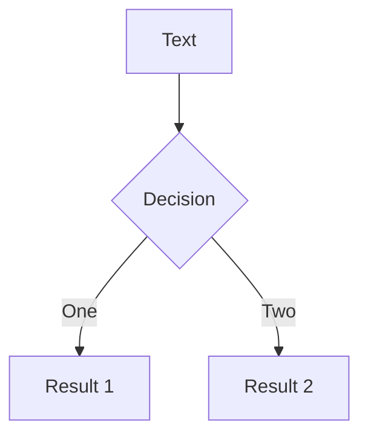
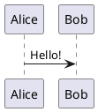

# 基础

## 语法

采用 Markdown 作为基底语言，另外 Slidev 还扩展了 `md` 的语法。默认入口文件为 `./slides.md` ，默认所有幻灯片页面都在此文件中编写。

### 分隔符

使用在上下留有空行的 `---` 来分隔幻灯片

示例：

````markdown
# Title

Hello, **Slidev**!

--- 

# Slide 2

使用代码块来高亮代码：

```ts
console.log('Hello, World!')
```

--- 

# Slide 3

使用 UnoCSS 类和 Vue 组件来为你的幻灯片添加样式和丰富内容：

<div class="p-3">
  <Tweet id="..." />
</div>
````

### **Frontmatter 和 Headmatter**

在每张幻灯片的开头，可以添加一个  [frontmatter](https://jekyllrb.com/docs/front-matter/) 。其中第一页的叫做 headmatter

```markdown
---
theme: seriph
title: Welcome to Slidev
---

# 第一页

第一页的 frontmatter 也是整个演示文稿的 headmatter

---
layout: center
background: /background-1.png
class: text-white
---

# 第二页

本页的布局是 `center`，背景是一张图片

---

# 第三页

本页没有 frontmatter

---
src: ./pages/4.md  # 本页只包含 frontmatter
---

---

# 第五页
```

另一种形式，使用 `yaml` 代码块在每页开头定义 `frontmatter`，好处是可以获得语法高亮和格式化支持：

````markdown
---
theme: default
---

# Slide 1

---

```yaml
layout: quote
```

# Slide 2

---

# Slide 3
````

### 备注

每张幻灯片的末尾的注释块，将被视为幻灯片的备注。

可以再 `演讲者模式` 和 `幻灯片列表` 中查看

:::tip **幻灯片列表**
幻灯片列表可以直接编辑注释，开发模式中编辑结果直接反馈回源文件
:::

```markdown
---
layout: cover
---

# 第一页

封面页

<!-- 这是一段 **备注** -->

---

# 第二页

<!-- 这不是备注，因为它不在幻灯片末尾 -->

第二页的内容

<!--
这是另一段备注
-->
```

:::tip **备注中的标记**

备注中可以放置 `[click]` 标记，用来同步高亮显示备注片段（根据我的测试这个功能暂时有 bug）

```markdown
<!--
Notes can also sync with clicks

[click] This will be highlighted after the first click

[click] Highlighted with `count = ref(0)`

[click:3] Last click (skip two clicks)
-->
```

:::

### 代码块

在 Slidev 中，你可以使用 Markdown 风格的代码块来高亮你的代码

````markdown
```ts
console.log('Hello, World!')
```
````

代码块主要依赖包括：[Shiki](https://github.com/shikijs/shiki) ，[monaco-editor](https://github.com/Microsoft/monaco-editor) ，[TwoSlash](https://twoslash.netlify.app/)

:::tip **Shiki**

包含最基础的代码格式化和语法高亮功能，此外还有设置行号，行高亮，添加删除标记，焦点，动画效果等等功能。

````markdown
```ts {2,3}
function add(
  a: Ref<number> | number,
  b: Ref<number> | number
) {
  return computed(() => unref(a) + unref(b))
}
```
````

````markdown
```ts {*}{maxHeight:'100px'}
function add(
  a: Ref<number> | number,
  b: Ref<number> | number
) {
  return computed(() => unref(a) + unref(b))
}
/// ...很多行代码
const c = add(1, 2)
```
````

:::

:::tip **Monaco**

微软的编辑器插件，让你的代码块变得可编辑，并且可以运行查看结果。

````markdown
```ts {monaco}
console.log('HelloWorld')
```
````

````markdown
```ts {monaco-run}
function distance(x: number, y: number) {
  return Math.sqrt(x ** 2 + y ** 2)
}
console.log(distance(3, 4))
```
````

你甚至可以直接编辑本地文件

```markdown
<<< ./some-file.ts {monaco-write}
```

:::

:::tip **TwoSlash**

可以为你的代码添加鼠标悬浮显示类型信息功能。

````markdown
```ts twoslash
import { ref } from 'vue'

const count = ref(0)
```
````

:::

### 引入代码片段

你还可以将现有文件直接导入作为代码块内容

```markdown
<<< @/snippets/snippet.js
```

:::warning

为了与 Monaco 编辑器兼容，建议将代码段放在 `@/snippets` 中

:::

可以通过 `vscode的代码折叠语法` 选定特定代码片段展示

```tsx
// #region snippet
// Inside ./snippets/external.ts
export function emptyArray<T>(length: number) {
  return Array.from<T>({ length })
}
// #endregion snippet
```

```markdown
<<< @/snippets/external.ts#snippet
```

其他对于 Shiki 的配置都可以追加在后面

```markdown
<<< @/snippets/snippet.js {2,3|5}{lines:true}
<<< @/snippets/snippet.js ts {monaco}{height:200px}
<<< @/snippets/snippet.js {*}{lines:true}
```

### Latex 公式块

Slidev 开箱即用地支持 LaTeX，基于 [KaTeX](https://katex.org/)

行内公式：`$` 

```markdown
$\sqrt{3x-1}+(1+x)^2$
```

块级公式：`$$`

```markdown
$$
\begin{aligned}
\nabla \cdot \vec{E} &= \frac{\rho}{\varepsilon_0} \\
\nabla \cdot \vec{B} &= 0 \\
\nabla \times \vec{E} &= -\frac{\partial\vec{B}}{\partial t} \\
\nabla \times \vec{B} &= \mu_0\vec{J} + \mu_0\varepsilon_0\frac{\partial\vec{E}}{\partial t}
\end{aligned}
$$
```

逐行高亮：参考代码块设置，使用 `{}`

```markdown
$$ {1|3|all}
\begin{aligned}
\nabla \cdot \vec{E} &= \frac{\rho}{\varepsilon_0} \\
\nabla \cdot \vec{B} &= 0 \\
\nabla \times \vec{E} &= -\frac{\partial\vec{B}}{\partial t} \\
\nabla \times \vec{B} &= \mu_0\vec{J} + \mu_0\varepsilon_0\frac{\partial\vec{E}}{\partial t}
\end{aligned}
$$
```

化学方程式：

先加载插件

```tsx
// vite.config.ts
import 'katex/contrib/mhchem'

export default {}
```

```markdown
$$
\displaystyle{\ce{B(OH)3 + H2O <--> B(OH)4^- + H+}}
$$
```

### 图表

支持使用 [**Mermaid.js**](http://mermaid.js.org/) 和 [**PlantUML**](https://plantuml.com/)，以文本形式创建图表

`Mermaid`

````markdown

````

`PlantUML`

````markdown

````

### MDC 语法

MDC 语法是将样式和类应用于元素的最简单方法

```markdown
---
mdc: true
---

这是一个 [红色的文本]{style="color:red"} :inline-component{prop="value"}

{width=500px lazy}

::block-component{prop="value"}
**default** 插槽的内容
::
```

### Scoped CSS

Scoped CSS 可以用来为你的幻灯片添加样式

```markdown
# 这是红色的

<style>
h1 {
  color: red;
}
</style>

---

# 其他幻灯片不会受到影响
```

基于 UnoCSS 支持嵌套 CSS 及 指令

```markdown
# Slidev

> Hello **world**

<style>
blockquote {
  strong {
    --uno: 'text-teal-500 dark:text-teal-400';
  }
}
</style>
```

### 导入幻灯片

你可以将`slides.md`拆分为多个文件，以提高可复用性和组织性。为此，你可以使用 frontmatter 中的 `src` 选项指定外部 Markdown 文件的路径。

```markdown
# 标题

这是一个普通的页面

---
src: ./pages/toc.md
---

<!-- 此页面将从 '/pages/toc.md' 加载 -->

这里的内容将被忽略

---

# 第四页

另一个正常的页面

---
src: ./pages/toc.md   # Reuse the same file
---
```

导入特定页

```markdown
---
src: ./another-presentation.md#2,5-7
---
```

:::tip **合并 Frontmatter**

主入口点的 key 拥有更高的优先级

:::

::: code-group

```markdown [slidev.md]
---
src: ./cover.md
background: https://sli.dev/bar.png
class: text-center
---
```

```markdown [cover.md]
---
layout: cover
background: https://sli.dev/foo.png
---

# 封面

这是一个封面页
```
:::

合并后

```markdown
---
layout: cover
background: https://sli.dev/bar.png
class: text-center
---

# 封面

这是一个封面页
```

## 用户界面

### 导航栏

在播放模式下，导航栏在页面的左下角。可能需要将鼠标移动到页面的左下角才能看到导航栏

### 快捷操作

| **快捷键** | **说明** |
| --- | --- |
| f | 切换全屏模式 |
| right / space | 下一个动画或幻灯片 |
| left | 上一个动画或幻灯片 |
| up | 上一页幻灯片 |
| down | 下一页幻灯片 |
| o | 打开 幻灯片总览 |
| d | 切换暗色模式 |

### **幻灯片总览**

通过点击 `o` 键或界面上对应按钮查看幻灯片的总览，以便快速地跳转至某幻灯片。

### **演讲者模式**

访问 `http://localhost:<port>/presenter` 或界面上对应按钮来进入演讲者模式。

演讲中，建议打开两个浏览器窗口，一个在播放模式用于观众，另一个在演讲者模式用于你。每当你在演讲者模式中导航或进行动画或者标注时，观众的屏幕也会同步更新。

### **幻灯片列表**

直接访问 `http://localhost:<port>/overview` 或界面上对应按钮来，即可进入幻灯片列表页面

你可以双击注释来直接编辑，也可以拖动点击滑块来预览幻灯片的步骤

### 绘图

基于 [**drauu**](https://github.com/antfu/drauu) 实现了绘图和批注的功能

对绘图进行持久化，把你的绘图作为 SVG 保存在 `.slidev/drawings` 目录下，并把它们放入你导出的 pdf 或者部署的网站中：

```markdown
---
drawings:
  persist: true
---
```

完全禁用绘图和批注功能：

```markdown
---
drawings:
  enabled: false
---
```

仅在开发环境可用:

```markdown
---
drawings:
  enabled: dev
---
```

仅在演讲者模式可用:

```markdown
---
drawings:
  presenterOnly: true
---
```

默认所有实例同步绘图，也就是你开了若干个窗口展示幻灯片，你在其中一个上面进行绘图，其他也会显示，你可以禁用这个行为：

```markdown
---
drawings:
  syncAll: false
---
```

通过这个配置，只有来自演讲者实例的绘图会和其他实例同步。

### 录制工具

Slidev 具有内置的摄像头视图和录制功能，依赖  [**RecordRTC**](https://github.com/muaz-khan/RecordRTC) 与 [**WebRTC API**](https://webrtc.org/)

**摄像头视图**

点击导航栏上对应按钮，并调整摄像头视图的位置和大小。

**开始录制**

点击导航栏上对应按钮，将会弹出一个对话框。在此对话框中，你可以选择将你的摄像头视图嵌入到幻灯片中进行录制，也可以将它们分成两个视频文件。

### 全局图层

在 z 轴上，从上到下排序：

- 导航栏
    - 自定义导航栏控制 (`custom-nav-controls.vue`)
- 全局顶层 (`global-top.vue`) - 单个实例
- 幻灯片顶层 (`slide-top.vue`) - 每页间独立实例
- 幻灯片内容
- 幻灯片底层 (`slide-bottom.vue`) - 每页间独立实例
- 全局底层 (`global-bottom.vue`) - 单个实例

`global` 图层示例：

```markdown
<template>
  <footer class="absolute bottom-0 left-0 right-0 p-2">
    我的名字
  </footer>
</template>
```

`slide` 图层示例：

```markdown
<template>
  <div class="absolute bottom-5 left-5">
    当前页: {{ $nav.currentPage }}
  </div>
</template>
```

:::tip

导出时，应使用 `--per-slide` 选项以确保全局层正确应用于每张幻灯片。

:::

## 动画

通过按下 `space` 键或 `→` 键来触发一步点击动画

### v-click

使用 `<v-click>` 组件或 `v-click` 指令控制元素显示/隐藏

```markdown
<!-- 组件用法:
     以下内容在第一步动画后才可见 -->
<v-click> Hello World! </v-click>

<!-- 指令用法:
     以下内容在第二步动画后才可见 -->
<div v-click class="text-xl"> Hey! </div>
```

### v-after

`v-after` 用于在前一个 `v-click` 触发时显示元素。

```markdown
<div v-click> Hello </div>
<div v-after> World </div>  <!-- 或 <v-after> World </v-after> -->
```

### **点击后隐藏**

使用 `.hide` 修饰符或 `hide` prop 来隐藏元素

```markdown
<div v-click> 一步动画后可见 </div>
<div v-click.hide> 两步动画后隐藏 </div>
<div v-after.hide> 两步动画后隐藏 </div>
```

或

```markdown
<v-click> 一步动画后可见 </v-click>
<v-click hide> 两步动画后隐藏 </v-click>
<v-after hide> 两步动画后隐藏 </v-after>
```

### v-clicks

`v-clicks` 只能作为组件使用。它是将 `v-click` 指令应用于其所有子元素的简写。

```markdown
<v-clicks>

- Item 1
- Item 2
- Item 3

</v-clicks>
```

它还接受 `depth` prop 用于嵌套列表：

```markdown
<v-clicks depth="2">

- Item 1
  - Item 1.1
  - Item 1.2
- Item 2
  - Item 2.1
  - Item 2.2

</v-clicks>
```

加了 `depth` 后分五次显示，不加就是两次。

你可以使用 `every` prop 来指定每次点击后显示的项目数：

```markdown
<v-clicks every="2">

- Item 1.1
- Item 1.2
- Item 2.1
- Item 2.2

</v-clicks>
```

### 动画时机

默认情况下，点击动画是依次触发的。你可以通过使用 `at` prop 或带有值的 `v-click` 指令来自定义的动画发生时机。

**相对的时机**

只有以 `'+'` 或 `'-'` 开头的字符串值，如 `'+1'`，才会被视为相对位置：

| **Value** | **Kind** |
| --- | --- |
| `'-1'`, `'+1'` | 相对时机 |
| `+1` === `1` | 绝对时机 |
| `'1'` | 绝对时机 |

````markdown
<div v-click> 1 步动画后显示 </div>
<v-click at="+2"><div> 3 步动画后显示 </div></v-click>
<div v-click.hide="'-1'"> 2 步动画后隐藏 </div>

```js {none|1|2}{at:'+5'}
1  // 第 7 步时高亮
2  // 第 8 步时高亮
```
````

:::tip

当没有给 `v-click` 传入参数时，将使用默认值 `'+1'`，即动画发生在上一个动画的后一步。

:::

```markdown
<!-- 以下两种写法等价 -->


<!-- 以下三种写法等价 -->


<v-click-gap size="1" />
```

**绝对时机**

````markdown
<div v-click="3"> 3 步动画后显示 </div>
<v-click at="2"><div> 2 步动画后显示 </div></v-click>
<div v-click.hide="1"> 1 步动画后隐藏 </div>

```js {none|1|2}{at:3}
1  // 3 步动画后高亮
2  // 4 步动画后高亮
```
````

**混合情况**

```markdown
<div v-click> 1 步点击后显示 </div>
<div v-click="3"> 3 步点击后显示 </div>
<div v-click> 2 步点击后显示 </div>
<div v-click="'-1'"> 1 步点击后显示 </div>
<div v-click="4"> 4 步点击后显示 </div>
```

### 显示后隐藏

通过传递一个数组来为 `v-click` 指令指定显示的时机和隐藏的时机

```markdown
<div v-click.hide="[2, 4]">
  在第 2 和 3 步时动画显示，之后隐藏。
</div>
<div v-click />
<div v-click="'[+1, +1]'">
  这将在第 3 步动画后显示，之后在第 4 步动画后隐藏。
</div>
```

:::tip **v-switch 组件**

```markdown
<v-switch>
  <template #1> 在第 1 步动画显示 </template>
  <template #2> 在第 2,3,4 步动画显示 </template>
  <template #5-7>  在第 5,6 步动画显示 </template>
</v-switch>
```

:::

### 自定义步骤总数

默认情况下自动计算，也可以手动设置

```markdown
---
# 10 步动画后进入下一张幻灯片
clicks: 10
---
```

### 过渡效果

当 `v-click` 指令应用于元素时，元素会拥有 `slidev-vclick-target` 类名。当元素被隐藏时，还会附加类名 `slidev-vclick-hidden`

隐藏时：

```markdown
<div class="slidev-vclick-target slidev-vclick-hidden">Text</div>
```

显示时：

```markdown
<div class="slidev-vclick-target">Text</div>
```

默认样式

```css
.slidev-vclick-target {
  transition: opacity 100ms ease;
}

.slidev-vclick-hidden {
  opacity: 0;
  pointer-events: none;
}
```

全局覆盖

```css
/* styles.css */

.slidev-vclick-target {
  transition: all 500ms ease;
}

.slidev-vclick-hidden {
  transform: scale(0);
}
```

指定页面和布局覆盖

```css
.slidev-page-7,
.slidev-layout.my-custom-layout {
  .slidev-vclick-target {
    transition: all 500ms ease;
  }

  .slidev-vclick-hidden {
    transform: scale(0);
  }
}
```

### Motion 动画

Slidev 内置了 [**@vueuse/motion**](https://motion.vueuse.org/)。

```markdown
<div
  v-motion
  :initial="{ x: -80 }"
  :enter="{ x: 0 }"
  :leave="{ x: 80 }"
>
  Slidev
</div>
```

也可以通过点击动画来触发 Motion

```markdown
<div
  v-motion
  :initial="{ x: -80 }"
  :enter="{ x: 0, y: 0 }"
  :click-1="{ x: 0, y: 30 }"
  :click-2="{ y: 60 }"
  :click-2-4="{ x: 40 }"
  :leave="{ y: 0, x: 80 }"
>
  Slidev
</div>
```

单独这样写不行，因为你至少要有 `4` 次 `click` 才可以完整播放动画，你可以在 `frontmatter` 中添加 `clicks: 4`。

或者组合 `v-click` 和 `v-motion` 

```markdown
<div v-click="[2, 4]" v-motion
  :initial="{ x: -50 }"
  :enter="{ x: 0 }"
  :leave="{ x: 50 }"
>
  在第 2 步动画后显示，在第 4 步动画后隐藏。
</div>
```

- `initial`: 当 `currentPage < thisPage` 或 `v-click` 因为 `$clicks` 太小而隐藏了该元素。
- `enter`: 当 `currentPage === thisPage` 且 `v-click` 显示元素时。*优先级：最低*
- `click-x`: `x` 是一个表示 **绝对** 点击数的数字。如果 `$clicks >= x`，则变体将生效。*优先级：`x`*
- `click-x-y`: 如果 `x <= $clicks < y`，则变体将生效。*优先级：`x`*
- `leave`: `currentPage > thisPage`，或 `v-click` 隐藏当前元素，因为 `$clicks` 太大。

:::warning **注意事项**

`click-x` 中的 `x` 代表本页总点击次数，和何时 `v-motion` 元素出现没关系

另外 `v-click` 必须和 `v-motion` 应用于相同元素时，起始动画才会被渲染。

:::

### 幻灯片过渡

你可以在 frontmatter 中设置 `transition` 来启用过渡效果

```markdown
---
transition: slide-left
---
```

内置效果：

- `fade` - 淡入淡出
- `fade-out` - 淡出再淡入
- `slide-left` - 向左滑动（向右滑动时后退）
- `slide-right` - 向右滑动（向左滑动时后退）
- `slide-up` - 向上滑动（向下滑动时后退）
- `slide-down` - 向下滑动（向上滑动时后退）
- `view-transition` - 使用 View Transitions API 过渡

### 使用 View Transition API

```markdown
---
transition: view-transition
mdc: true
---

# View Transition {.inline-block.view-transition-title}

---

# View Transition {.inline-block.view-transition-title}
```

### 自定义过渡效果

```markdown
---
transition: my-transition
---
```

```markdown
.my-transition-enter-active,
.my-transition-leave-active {
  transition: opacity 0.5s ease;
}

.my-transition-enter-from,
.my-transition-leave-to {
  opacity: 0;
}
```

### 区分前进和后退过渡

```markdown
---
transition: go-forward | go-backward
---
```

这里  `go-forward` 和 `go-backward` 是示例，你可以换成子自己想用的过渡效果

### 高级过渡选项

`transition` 字段接受一个选项对象，该选项对象将传递给 [**`<TransitionGroup>`**](https://vuejs.org/api/built-in-components.html#transition) 组件

```markdown
---
transition:
  name: my-transition
  enterFromClass: custom-enter-from
  enterActiveClass: custom-enter-active
---
```

## 主题和插件

### 使用主题

在 **headmatter** 中添加 `theme` 选项

```markdown
---
theme: seriph
---

# The first slide
```

:::tip

如果主题是官方主题或者命名为 `slidev-theme-name`，你可以省略 `slidev-theme-` 前缀，也可以使用相对或绝对路径指定本地主题文件夹，例如 `../my-theme` 。对于作用域包，如 `@org/slidev-theme-name`，需要使用完整的包名

:::

:::tip **弹出主题**

将当前的主题弹出到 `./theme` 目录下，然后自动将你的 frontmatter 修改为

```markdown
slidev theme eject
```

之后你就可以自由修改主题了

:::

### 使用插件

插件和主题类似，但更加灵活，可以用来为你的幻灯片项目添加额外的功能。

```markdown
---
addons:
  - excalidraw
  - '@slidev/plugin-notes'
---
```

## 组件

### 使用组件

```markdown
# My Slide

<MyComponent :count="4"/>
```

### 编写组件

```markdown
your-slidev/
  ├── ...
  ├── slides.md
  └── components/
      ├── ...
      └── MyComponent.vue
```

## 幻灯片布局

### 使用布局

```markdown
---
layout: quote
---

A quote from someone
```

第一张幻灯片的默认布局是 `cover`，其余的是 `default`。

根据名称查找顺序，越靠后优先级越高：

1. 默认布局。
2. 主题提供的布局
3. 插件提供的布局
4. `layouts` 目录中的自定义布局

:::tip **布局插槽语法糖**

在多插槽布局中可以使用传统方式

```markdown
---
layout: two-cols
---

<template v-slot:default>

# 左

这会在左边显示

</template>
<template v-slot:right>

# 右

这会在右边显示

</template>
```

也可以使用 `::name::` 语法糖

```markdown
---
layout: two-cols
---

# 左

这会在左边显示

::right::

# 右

这会在右边显示
```

:::

### 编写布局

只需在 `layouts` 目录中创建一个新的 Vue 文件即可创建自定义布局：

```markdown
your-slidev/
  ├── ...
  ├── slides.md
  └── layouts/
      ├── ...
      └── MyLayout.vue
```

```markdown
<!-- default.vue -->
<template>
  <div class="slidev-layout default">
    <slot />
  </div>
</template>
```

多插槽

```markdown
<!-- split.vue -->
<template>
  <div class="slidev-layout split">
    <div class="left">
      <slot name="left" />
    </div>
    <div class="right">
      <slot name="right" />
    </div>
  </div>
</template>
```

## 导出幻灯片

可以导出为  PDF、PPTX、PNG 或 Markdown 文件以便分享或打印。该功能依赖于 [**Playwright**](https://playwright.dev/) 来渲染幻灯片。

```bash
pnpm add -D playwright-chromium
```

### 支持的格式

- PDF：`slidev export` PDF 文件会被导出到 `./slides-export.pdf`。
- PPTX：`slidev export --format pptx` 在此模式下，默认启用了 `--with-clicks` 选项。要禁用它，请传递 `--with-clicks false`
- PNG：`slidev export --format png`
- Markdown：`slidev export --format md`

### 选项

`--with-clicks`

将幻灯片的多个步骤导出为多个页面

```bash
slidev export --with-clicks
```

`--output`

指定导出文件名

```bash
slidev export --output my-pdf-export
```

或在 headmatter 中指定

```bash
---
exportFilename: my-pdf-export
---
```

**`多个幻灯片`**

```bash
slidev export slides1.md slides2.md
```

`--dark`

暗色模式

```bash
slidev export --dark
```

`--timeout`

修改 Playwright 的超时时间

```bash
slidev export --timeout 60000
```

`--wait`

等待渲染

```bash
slidev export --wait 10000
```

`--wait-until`

用于在导出每张幻灯片之前等待一个状态。如果你一直遇到超时问题，可以尝试设置此选项

```bash
slidev export --wait-until none
```

该选项接受以下值之一：

- `'networkidle'` - （*默认*）当没有网络连接至少 `500` 毫秒时，认为操作已完成。这是最安全的，但可能会导致超时。
- `'domcontentloaded'` - 当 `DOMContentLoaded` 事件被触发时，认为操作已完成。
- `'load'` - 当 `load` 事件被触发时，认为操作已完成。
- `'none'` - 不等待任何事件。

`--executable-path`

将 Playwright 的浏览器可执行文件路径设置为 Chrome 或 Edge

```bash
slidev export --executable-path [path_to_chromium]
```

`--with-toc`

生成 PDF 大纲

```bash
slidev export --with-toc
```

`--omit-background`

去除默认的浏览器背景

```bash
slidev export --omit-background
```

## 部署

### 编译为静态网页

```bash
slidev build
```

### 基础路径

修改路由的 `baseurl`

```bash
slidev build --base /talks/my-cool-talk/
```

### 多个幻灯片

```bash
slidev build slides1.md slides2.md
```

### 在构建时生成 PDF

```yaml
---
download: true
---
```

Slidev 将在构建时生成一个 PDF 文件，并在构建的输出中显示一个下载按钮。

也可以提前渲染好指定下载地址

```yaml
---
download: 'https://myslide.com/my-talk.pdf'
---
```

也可以通过CLI Flag

```bash
slidev build --download
```

### 打包远程资源

```bash

```

本地资源放在 `public` 目录中

```bash

```

也可以使用 `img` 标签

```html

```

### 静态部署

**GitHub Pages**

```yaml
name: Deploy pages

on:
  workflow_dispatch:
  push:
    branches: [main]

permissions:
  contents: read
  pages: write
  id-token: write

concurrency:
  group: pages
  cancel-in-progress: false

jobs:
  build:
    runs-on: ubuntu-latest

    steps:
      - uses: actions/checkout@v4

      - uses: actions/setup-node@v4
        with:
          node-version: 'lts/*'

      - name: Setup @antfu/ni
        run: npm i -g @antfu/ni

      - name: Install dependencies
        run: nci

      - name: Build
        run: nr build --base /${{github.event.repository.name}}/

      - name: Setup Pages
        uses: actions/configure-pages@v4

      - uses: actions/upload-pages-artifact@v3
        with:
          path: dist

  deploy:
    environment:
      name: github-pages
      url: ${{ steps.deployment.outputs.page_url }}
    needs: build
    runs-on: ubuntu-latest
    name: Deploy
    steps:
      - name: Deploy to GitHub Pages
        id: deployment
        uses: actions/deploy-pages@v4
```

## 常见问题

### 处理静态资源

正常情况

```markdown


```

URL 将在构建时被解析为 `/BASE_URL/assets/image.png`

:::warning **frontmatter 和其他组件中的相对路径在构建后将会失效**

```markdown
---
background: ./image.png  # 构建后可能会失效
---

<Comp src="./image.png" />
```

要解决这个问题，你可以将这些资源放在 public 文件夹 中，并使用绝对路径导入它们

```markdown
---
background: /image.png
---

<Comp src="/image.png" />
```

:::

### 定位元素

**常见布局**

- 多列
    
    ```markdown
    <div class="grid grid-cols-2 gap-4">
      <div>
        第一列
      </div>
      <div>
        第二列
      </div>
    </div>
    ```
    
- 复杂多列
    
    ```markdown
    <div class="grid grid-cols-[200px_1fr_10%] gap-4">
      <div>
        第一列 (200px)
      </div>
      <div>
        第二列 (auto fit)
      </div>
      <div>
        第三列 (10% width to parent container)
      </div>
    </div>
    ```
    
- 水平居中
    
    ```markdown
    <div class="flex items-center">
      <div>
        第一块
      </div>
      <div>
        第二块
      </div>
    </div>
    ```
    
- 垂直居中
    
    ```markdown
    <div class="flex flex-col items-center">
      <div>
        居中的内容
      </div>
    </div>
    ```
    

**绝对定位**

```markdown
<div class="absolute left-30px bottom-30px">
  这是一个在左下角的页脚
</div>
```

### 可拖拽元素

**指令式用法**

```markdown
---
dragPos:
  square: Left,Top,Width,Height,Rotate
---


```

**组件式用法**

```markdown
---
dragPos:
  foo: Left,Top,Width,Height,Rotate
---

<v-drag pos="foo" text-3xl>
  <carbon:arrow-up />
  使用`v-drag`组件来创建一个可拖动的容器！
</v-drag>
```

**控制**

- 双击可拖动元素以开始拖动。
- 你还可以使用箭头键移动元素。
- 拖动时按住 `Shift` 键以保持其纵横比。
- 单击可拖动元素以外区域以停止拖动。

**可拖动剪头**

```markdown
<v-drag-arrow />
```

### 调整大小

通过 headmatter 设置

```markdown
---
# 幻灯片的宽高比
aspectRatio: 16/9
# 幻灯片的实际宽度，以 px 为单位
canvasWidth: 980
---

# 以下为 slide 内容
```

缩放

```markdown
---
zoom: 0.8
---

# 一张有很多内容的幻灯片，该幻灯片的内容会被缩小为 80%

---

# 其他幻灯片不会受到影响
```

**`Transform`** 组件用来缩放元素

```markdown
<Transform :scale="0.5">
  <YourElements />
</Transform>
```