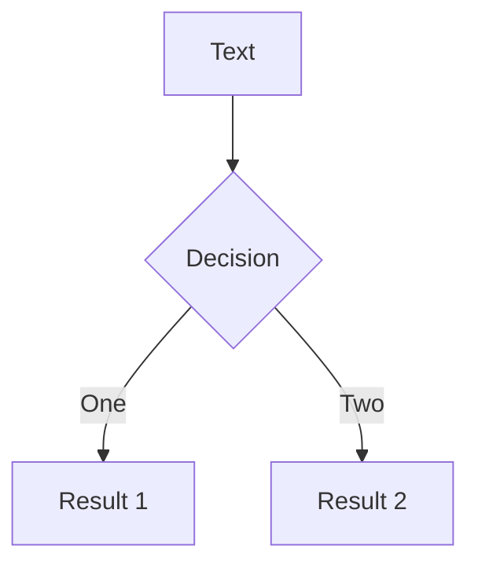
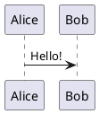

# 基础

## 语法

采用 Markdown 作为基底语言，另外 Slidev 还扩展了 `md` 的语法。默认入口文件为 `./slides.md` ，默认所有幻灯片页面都在此文件中编写。

### 分隔符

使用在上下留有空行的 `---` 来分隔幻灯片

示例：

````markdown
# Title

Hello, **Slidev**!

--- 

# Slide 2

使用代码块来高亮代码：

```ts
console.log('Hello, World!')
```

--- 

# Slide 3

使用 UnoCSS 类和 Vue 组件来为你的幻灯片添加样式和丰富内容：

<div class="p-3">
  <Tweet id="..." />
</div>
````

### **Frontmatter 和 Headmatter**

在每张幻灯片的开头，可以添加一个  [frontmatter](https://jekyllrb.com/docs/front-matter/) 。其中第一页的叫做 headmatter

```markdown
---
theme: seriph
title: Welcome to Slidev
---

# 第一页

第一页的 frontmatter 也是整个演示文稿的 headmatter

---
layout: center
background: /background-1.png
class: text-white
---

# 第二页

本页的布局是 `center`，背景是一张图片

---

# 第三页

本页没有 frontmatter

---
src: ./pages/4.md  # 本页只包含 frontmatter
---

---

# 第五页
```

另一种形式，使用 `yaml` 代码块在每页开头定义 `frontmatter`，好处是可以获得语法高亮和格式化支持：

````markdown
---
theme: default
---

# Slide 1

---

```yaml
layout: quote
```

# Slide 2

---

# Slide 3
````

### 备注

每张幻灯片的末尾的注释块，将被视为幻灯片的备注。

可以再 `演讲者模式` 和 `幻灯片列表` 中查看

:::tip **幻灯片列表**
幻灯片列表可以直接编辑注释，开发模式中编辑结果直接反馈回源文件
:::

```markdown
---
layout: cover
---

# 第一页

封面页

<!-- 这是一段 **备注** -->

---

# 第二页

<!-- 这不是备注，因为它不在幻灯片末尾 -->

第二页的内容

<!--
这是另一段备注
-->
```

:::tip **备注中的标记**

备注中可以放置 `[click]` 标记，用来同步高亮显示备注片段（根据我的测试这个功能暂时有 bug）

```markdown
<!--
Notes can also sync with clicks

[click] This will be highlighted after the first click

[click] Highlighted with `count = ref(0)`

[click:3] Last click (skip two clicks)
-->
```

:::

### 代码块

在 Slidev 中，你可以使用 Markdown 风格的代码块来高亮你的代码

````markdown
```ts
console.log('Hello, World!')
```
````

代码块主要依赖包括：[Shiki](https://github.com/shikijs/shiki) ，[monaco-editor](https://github.com/Microsoft/monaco-editor) ，[TwoSlash](https://twoslash.netlify.app/)

:::tip **Shiki**

包含最基础的代码格式化和语法高亮功能，此外还有设置行号，行高亮，添加删除标记，焦点，动画效果等等功能。

````markdown
```ts {2,3}
function add(
  a: Ref<number> | number,
  b: Ref<number> | number
) {
  return computed(() => unref(a) + unref(b))
}
```
````

````markdown
```ts {*}{maxHeight:'100px'}
function add(
  a: Ref<number> | number,
  b: Ref<number> | number
) {
  return computed(() => unref(a) + unref(b))
}
/// ...很多行代码
const c = add(1, 2)
```
````

:::

:::tip **Monaco**

微软的编辑器插件，让你的代码块变得可编辑，并且可以运行查看结果。

````markdown
```ts {monaco}
console.log('HelloWorld')
```
````

````markdown
```ts {monaco-run}
function distance(x: number, y: number) {
  return Math.sqrt(x ** 2 + y ** 2)
}
console.log(distance(3, 4))
```
````

你甚至可以直接编辑本地文件

```markdown
<<< ./some-file.ts {monaco-write}
```

:::

:::tip **TwoSlash**

可以为你的代码添加鼠标悬浮显示类型信息功能。

````markdown
```ts twoslash
import { ref } from 'vue'

const count = ref(0)
```
````

:::

### 引入代码片段

你还可以将现有文件直接导入作为代码块内容

```markdown
<<< @/snippets/snippet.js
```

:::warning

为了与 Monaco 编辑器兼容，建议将代码段放在 `@/snippets` 中

:::

可以通过 `vscode的代码折叠语法` 选定特定代码片段展示

```tsx
// #region snippet
// Inside ./snippets/external.ts
export function emptyArray<T>(length: number) {
  return Array.from<T>({ length })
}
// #endregion snippet
```

```markdown
<<< @/snippets/external.ts#snippet
```

其他对于 Shiki 的配置都可以追加在后面

```markdown
<<< @/snippets/snippet.js {2,3|5}{lines:true}
<<< @/snippets/snippet.js ts {monaco}{height:200px}
<<< @/snippets/snippet.js {*}{lines:true}
```

### Latex 公式块

Slidev 开箱即用地支持 LaTeX，基于 [KaTeX](https://katex.org/)

行内公式：`$` 

```markdown
$\sqrt{3x-1}+(1+x)^2$
```

块级公式：`$$`

```markdown
$$
\begin{aligned}
\nabla \cdot \vec{E} &= \frac{\rho}{\varepsilon_0} \\
\nabla \cdot \vec{B} &= 0 \\
\nabla \times \vec{E} &= -\frac{\partial\vec{B}}{\partial t} \\
\nabla \times \vec{B} &= \mu_0\vec{J} + \mu_0\varepsilon_0\frac{\partial\vec{E}}{\partial t}
\end{aligned}
$$
```

逐行高亮：参考代码块设置，使用 `{}`

```markdown
$$ {1|3|all}
\begin{aligned}
\nabla \cdot \vec{E} &= \frac{\rho}{\varepsilon_0} \\
\nabla \cdot \vec{B} &= 0 \\
\nabla \times \vec{E} &= -\frac{\partial\vec{B}}{\partial t} \\
\nabla \times \vec{B} &= \mu_0\vec{J} + \mu_0\varepsilon_0\frac{\partial\vec{E}}{\partial t}
\end{aligned}
$$
```

化学方程式：

先加载插件

```tsx
// vite.config.ts
import 'katex/contrib/mhchem'

export default {}
```

```markdown
$$
\displaystyle{\ce{B(OH)3 + H2O <--> B(OH)4^- + H+}}
$$
```

### 图表

支持使用 [**Mermaid.js**](http://mermaid.js.org/) 和 [**PlantUML**](https://plantuml.com/)，以文本形式创建图表

`Mermaid`

````markdown

````

`PlantUML`

````markdown

````

### MDC 语法

MDC 语法是将样式和类应用于元素的最简单方法

```markdown
---
mdc: true
---

这是一个 [红色的文本]{style="color:red"} :inline-component{prop="value"}

{width=500px lazy}

::block-component{prop="value"}
**default** 插槽的内容
::
```

### Scoped CSS

Scoped CSS 可以用来为你的幻灯片添加样式

```markdown
# 这是红色的

<style>
h1 {
  color: red;
}
</style>

---

# 其他幻灯片不会受到影响
```

基于 UnoCSS 支持嵌套 CSS 及 指令

```markdown
# Slidev

> Hello **world**

<style>
blockquote {
  strong {
    --uno: 'text-teal-500 dark:text-teal-400';
  }
}
</style>
```

### 导入幻灯片

你可以将`slides.md`拆分为多个文件，以提高可复用性和组织性。为此，你可以使用 frontmatter 中的 `src` 选项指定外部 Markdown 文件的路径。

```markdown
# 标题

这是一个普通的页面

---
src: ./pages/toc.md
---

<!-- 此页面将从 '/pages/toc.md' 加载 -->

这里的内容将被忽略

---

# 第四页

另一个正常的页面

---
src: ./pages/toc.md   # Reuse the same file
---
```

导入特定页

```markdown
---
src: ./another-presentation.md#2,5-7
---
```

:::tip **合并 Frontmatter**

主入口点的 key 拥有更高的优先级

:::

::: code-group

```markdown [slidev.md]
---
src: ./cover.md
background: https://sli.dev/bar.png
class: text-center
---
```

```markdown [cover.md]
---
layout: cover
background: https://sli.dev/foo.png
---

# 封面

这是一个封面页
```
:::

合并后

```markdown
---
layout: cover
background: https://sli.dev/bar.png
class: text-center
---

# 封面

这是一个封面页
```

