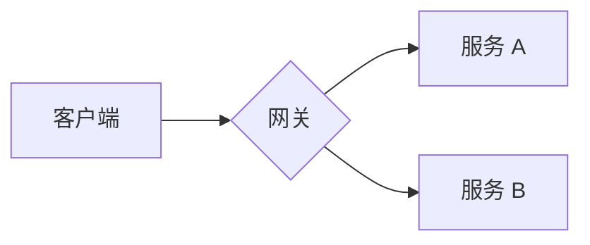
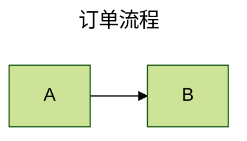
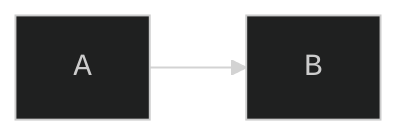

# 入门：文本即图、引入方式与第一个图

> 基于 **Mermaid v11.16.0**（npm latest 实测，MIT）· 核于 2026-07

## 速查

- **定位**：Markdown 风格 DSL 描述图 → 浏览器端解析渲染成 **SVG**——diagram-as-code，图跟文档一起进版本库、可 diff、可 review，专治「Doc-Rot」（文档腐烂）
- **渲染管线**：DSL 文本 → **detector 按首行关键字识别图类型** → 各图专属 parser 解析 → d3/dagre 布局 → 生成 SVG 插入 DOM
- **全程浏览器端**：依赖真实 DOM（测量文本尺寸），**Node 端不能直接跑**；SSR/无头出图走 mermaid-cli（puppeteer 方案）
- **四类使用方式**：
  - ① **Live Editor**（mermaid.live）——零安装，分享链接把图定义压缩进 URL
  - ② **平台原生 / 插件集成**——GitHub、VS Code 等
  - ③ **script/CDN 引入 + `startOnLoad`** 自动渲染
  - ④ **npm 依赖 + JS API** 手动渲染
- **CDN（ESM）**：`https://cdn.jsdelivr.net/npm/mermaid@11/dist/mermaid.esm.min.mjs`
- **`startOnLoad: true` 扫描目标**：**`<pre class="mermaid">`** 标签（每个图一个独立 pre），把其中文本渲染为 SVG
- **首行 = 图类型声明**：`flowchart` / `sequenceDiagram` / `classDiagram` …；旧关键字 `graph` 等价于 `flowchart`
- **注释**：`%%` 整行注释；**注释里别写花括号**——会被误认成 directive 而搞坏渲染
- **图级配置两条路**：
  - frontmatter `config:`（v10.5+，**官方推荐**）——图顶部 YAML 块，可设 `title` / `config`
  - directive `%%{init: ...}%%`——v10.5.0 起**官方标注 deprecated** 但仍可用、生态里大量存在
- **无障碍**：所有图支持 `accTitle:` / `accDescr:`（多行用 `accDescr { }`），渲染为 SVG `<title>`/`<desc>` + `aria-labelledby`/`aria-describedby`
- **核心依赖**：d3（渲染基座）、dagre-d3-es（flowchart 布局）、cytoscape（mindmap 等布局）、dompurify（XSS 净化）、katex（数学公式）、roughjs（v11 手绘风）、@mermaid-js/parser（新 Langium 解析器）
- **环境要求**：Node v16+；MIT 协议
- **v11 关键增量**：`look: handDrawn` 手绘风、`layout: elk` 备选布局、flowchart 30+ 新形状 `@{ shape: ... }`（v11.3+）、sequence 双向箭头（v11.0+）、edge 动画（v11.10+）
- **原生渲染平台**（围栏代码块直接出图）：GitHub、GitLab、Gitea、Azure DevOps、Notion、Joplin、**Obsidian**、**Typora**
- **文档生成器**：**VitePress 无内置**（需 `vitepress-plugin-mermaid`）；Docusaurus 官方内置开关（`markdown.mermaid: true`）；**Slidev 内置**；MkDocs（material 支持）；Hugo/Jekyll/Sphinx/mdBook 各有插件
- **编辑器**：VS Code 多款扩展（预览/导出）、JetBrains 插件
- **CLI**：`@mermaid-js/mermaid-cli`，命令 **`mmdc`**，puppeteer 无头渲染，输出 svg/png/pdf；Docker 镜像 `minlag/mermaid-cli`
- **选型一句话**：要进版本库、跟着代码活的图 → **Mermaid**；像素级掌控的一次性图 → draw.io；重 UML 语义 → PlantUML；白板涂鸦 → Excalidraw
- **进阶顺序**：[流程图与时序图](./guide-line/flowchart-and-sequence) → [类图/状态图/ER 图](./guide-line/class-state-er) → [甘特/gitGraph/更多图](./guide-line/gantt-git-and-more) → [配置/API/安全](./guide-line/config-api-security)

## 一、要解决什么问题：Doc-Rot 与 diagram-as-code

传统画图工具的产物是二进制文件或 XML + 导出图片：图的源文件游离在版本库之外、diff 不可读、评审靠肉眼；代码改了图没人改，文档慢慢腐烂——这就是「Doc-Rot」。Mermaid 的答案是**把图变成几行文本**：

- 图定义跟代码**同库同 PR**，一起被 Review、一起演进；
- 改一行文字，布局引擎自动重排全图，不用手工挪框拉线；
- GitHub / GitLab 等平台对围栏 mermaid 代码块**原生渲染**，README 里的图永远是「活」的。

代价也来自同一设计：布局由引擎自动决定，像素级排版做不到——这是与拖拽工具的本质分工：

- **vs draw.io**：「代码 vs 画布」。技术文档/README/设计评审选 Mermaid；营销图、需要精确排版的一次性架构大图选 draw.io（但其 XML 产物 diff 不可读、嵌图片易腐）。
- **vs PlantUML**：同为 diagram-as-code。PlantUML 图类型更全、UML 细节更强，但依赖 **Java + Graphviz 服务端渲染**；Mermaid 纯 JS 零服务依赖，平台原生支持面碾压（GitHub 原生渲 Mermaid、不渲 PlantUML）。
- **vs Excalidraw**：白板涂鸦头脑风暴用 Excalidraw；沉淀进文档用 Mermaid（v11 的 `look: handDrawn` 也能出手绘风且保持文本可维护）。

## 二、渲染管线：从文本到 SVG

```text
DSL 文本 → detector（按首行关键字识别图类型）→ 各图专属 parser
        → d3 / dagre 布局 → 生成 SVG 插入 DOM
```

两个由此而来的关键事实：

- **首行决定一切**：detector 按首行正则匹配图类型，所以每个图的第一行必须是 `flowchart LR`、`sequenceDiagram` 这样的类型声明。
- **必须有真实 DOM**：渲染过程要测量文本尺寸，**Node 端不能直接跑**——SSR、CI 里出静态图要走 mermaid-cli 的 puppeteer 无头浏览器方案（详见[配置 / API / 安全](./guide-line/config-api-security)）。

## 三、第一个图：CDN + startOnLoad

最小可用页面——ESM 方式引入，`startOnLoad: true` 让 Mermaid 在页面加载后自动扫描 **`<pre class="mermaid">`** 标签（每个图一个独立 pre），把其中文本渲染为 SVG：

```html
<pre class="mermaid">
  graph TD
  A[Client] --> B[Load Balancer]
</pre>
<script type="module">
  import mermaid from 'https://cdn.jsdelivr.net/npm/mermaid@11/dist/mermaid.esm.min.mjs';
  mermaid.initialize({ startOnLoad: true });
</script>
```

图定义本身就是这样几行文本，例如一个分叉的流程：



## 四、npm 引入与手动渲染一瞥

工程里更常见的是 npm 依赖 + 手动控制渲染时机（SPA 里内容异步出现，自动扫描时机不可控）：

```js
import mermaid from 'mermaid';

// 关掉自动扫描，自己决定何时渲染
mermaid.initialize({ startOnLoad: false });

// v10+ API 全面 async：批量渲染 DOM 中已有的图
await mermaid.run({ querySelector: '.mermaid' });
```

`mermaid.render`（动态文本 → SVG 字符串）、`mermaid.parse`（仅校验语法）等完整 API、以及 render 的 id 唯一性坑，见[配置 / API / 安全](./guide-line/config-api-security)。

## 五、通用语法骨架

所有图共享一套骨架：**首行类型声明 + 图内容 + 可选的图级配置与注释**。

**frontmatter（v10.5+，官方推荐的图级配置）**——图顶部 YAML 块：



**directive `%%{init: ...}%%`**——放在图定义前的 JSON 配置，v10.5.0 起官方标注 **deprecated**（被 frontmatter 取代）但仍可用、存量教程里大量存在；多个 directive 会合并、同键后者覆盖前者，`init` 与 `initialize` 两个关键字都行：



**注释与无障碍**——`%%` 整行注释（注意注释里别写花括号，会被误认成 directive）；`accTitle:` / `accDescr:` 为所有图生成 SVG 的 `<title>`/`<desc>` 与 aria 属性：


## 六、集成生态现状

| 类别 | 代表 | 说明 |
| --- | --- | --- |
| 原生渲染平台 | GitHub、GitLab、Gitea、Azure DevOps、Notion、Joplin、Obsidian、Typora | 围栏 mermaid 代码块直接出图 |
| 文档生成器 | Docusaurus（内置开关）、**VitePress（需插件）**、MkDocs-material、Hugo/Jekyll/Sphinx/mdBook（插件） | 见下方 VitePress 说明 |
| 幻灯片 | **Slidev（内置）** | 围栏直接渲染 |
| 编辑器 | VS Code 扩展（预览/导出）、JetBrains 插件 | 本地预览 |
| 在线 | mermaid.live | 零安装、URL 即分享 |
| CLI | `@mermaid-js/mermaid-cli`（`mmdc`） | CI/无头出 svg/png/pdf |

两个高频注意点：

- **VitePress 默认不渲染**：围栏 mermaid 在 VitePress 里只会被当代码块高亮——Mermaid 是浏览器端渲染，必须装 `vitepress-plugin-mermaid`（把围栏转成客户端组件）；Docusaurus 则官方内置开关，Slidev 内置支持。
- **Vue 系文档的老坑与 Mermaid 无关但常一起踩**：VitePress/Slidev 底层是 Vue，正文里的双花括号插值（如 <code v-pre>{{ }}</code>）与裸角括号会崩 build——围栏代码块内是安全的，Mermaid 图定义都写在围栏里即可。

---

下一页：[流程图与时序图](./guide-line/flowchart-and-sequence) —— 最高频的两种图，方向/形状/连线/子图/样式与消息箭头/激活/控制块全语法。
