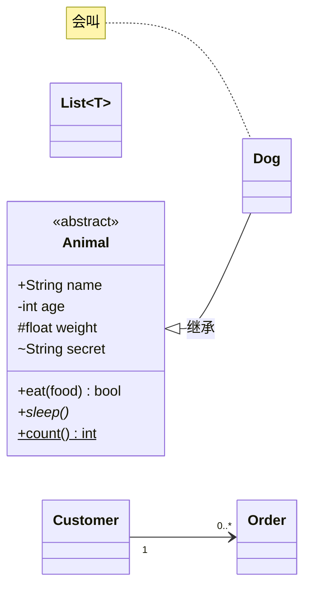
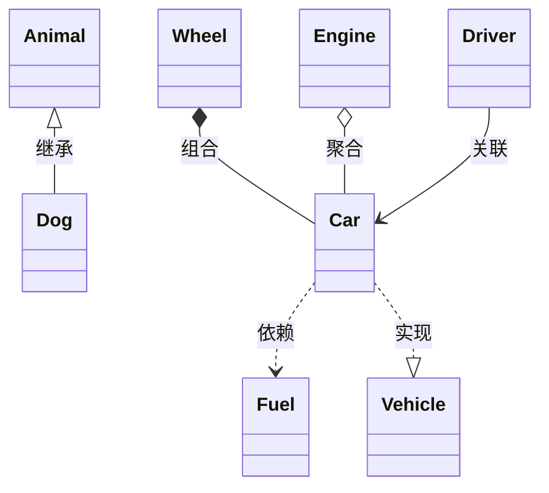
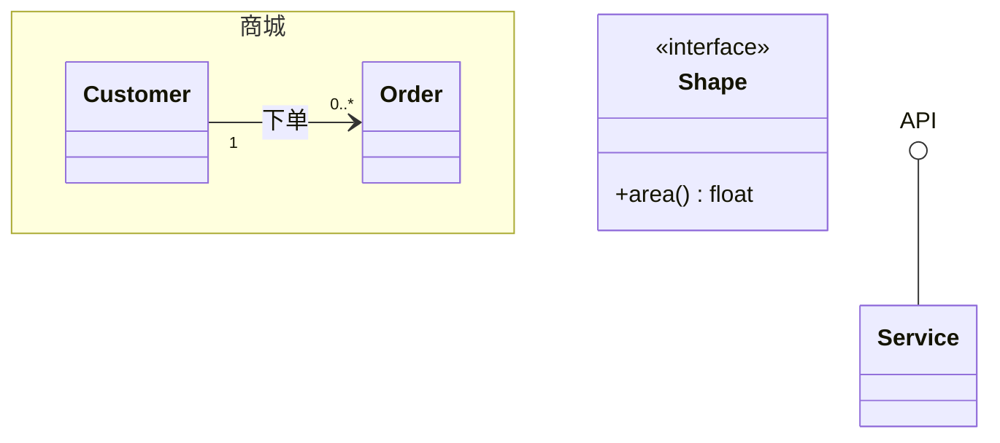
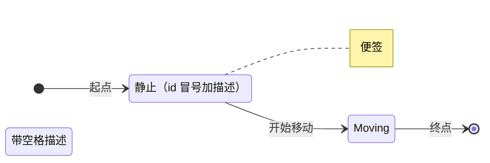
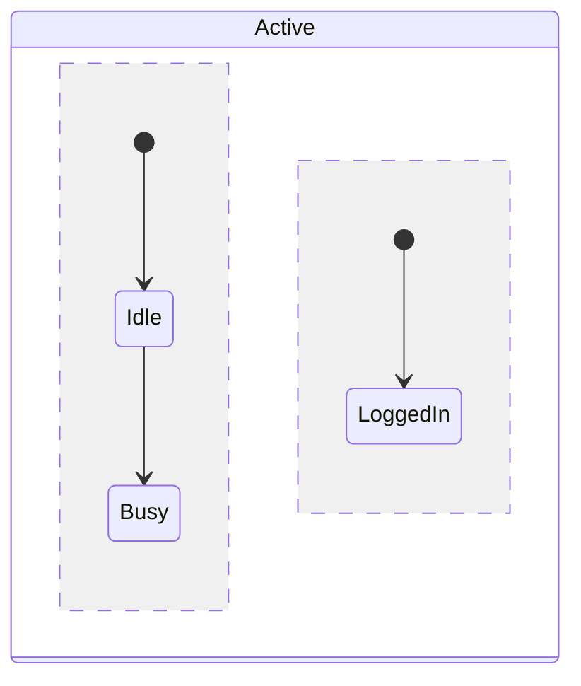
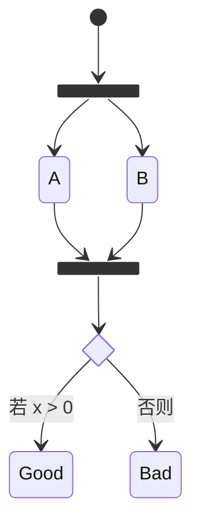
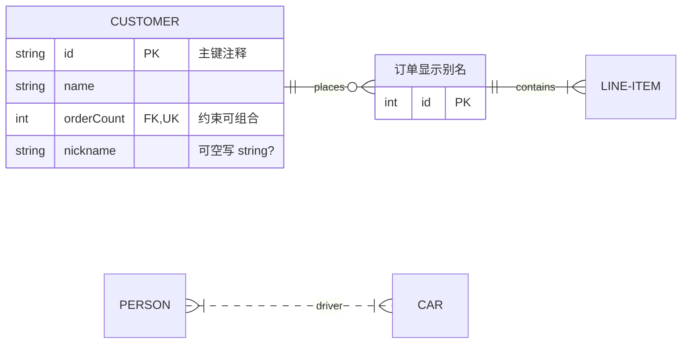

# 类图 / 状态图 / ER 图：关系与基数语义

> 基于 **Mermaid v11.16.0**（npm latest 实测）· 核于 2026-07

## 速查

- **classDiagram 成员**：**有 `()` 是方法、没有是属性**；返回类型跟在 `()` 后（空格分隔）
- **泛型**：`List~T~`、嵌套 `List~List~int~~`；**不支持带逗号的多参**（`~K, V~` 不行）
- **可见性前缀**：`+` public、`-` private、`#` protected、`~` package/internal
- **后缀修饰**：`*` 抽象方法、`$` 静态（方法/字段都可）
- **关系箭头八件套（高频考点）**：
  - `<|--` 继承（空心三角指父类）、`..|>` 实现（虚线空心三角指接口）
  - `*--` 组合（实心菱形在整体侧，部分**不可**独立存活）
  - `o--` 聚合（空心菱形在整体侧，部分**可**独立）
  - `-->` 关联、`..>` 依赖（虚线）、`--` 实线连接、`..` 虚线连接
- **基数写引号里**：`"1"`、`"0..1"`、`"1..*"`、`"*"`、`"n"`；关系标签 `: 文本`
- **注解**：`<<interface>>`、`<<abstract>>`、`<<Service>>`、`<<enumeration>>`（行内或类体第一行）
- **lollipop 接口**：`API ()-- Service`；`namespace 名 { ... }` 命名空间（v11.15+ 支持点号嵌套与标签）
- **note**：`note for 类名 "文本"`；样式/click 同 flowchart（`style`/`classDef`/`:::`/`cssClass`）
- **stateDiagram-v2**：新渲染器（推荐）；旧 `stateDiagram` 仍在
- **`[*]` 语义由箭头方向决定**：从 `[*]` 出发 = 初始态，指向 `[*]` = 终止态
- **状态描述**：`Still : 描述文本`（id 冒号加描述）；`state "带空格描述" as s2`
- **复合状态**：`state X { ... }` 可多层嵌套；**坑：不能在分属不同复合状态的内部状态之间直接连转移**
- **并发**：复合状态体内用 `--` 分隔并发区域
- **特殊节点**：`<<fork>>` 分叉、`<<join>>` 汇合、`<<choice>>` 条件分支
- **状态图便签**：`note left of / right of X : 文本`
- **状态图样式限制**：`classDef` + `class X 样式名` 或 `X:::样式名`；**不能应用到 `[*]` 起止态和复合状态**
- **erDiagram 关系行**：`实体A 基数--基数 实体B : 标签`
- **四对基数符号（必背；符号靠近哪个实体就说明该侧数量）**：
  - `|o`（左）/ `o|`（右）= 零或一
  - `||` = 恰好一
  - `}o`（左）/ `o{`（右）= 零或多
  - `}|`（左）/ `|{`（右）= 一或多
- **经典读法**：`CUSTOMER ||--o{ ORDER : places` = 一个 CUSTOMER 下单**零或多**个 ORDER，每个 ORDER 属于**恰好一个** CUSTOMER
- **文字别名可代替符号**：`one or zero` / `zero or more` / `one or many` / `only one` / `many(0)` / `1+` 等
- **关系线语义**：`--` 实线 = **identifying**（子实体依赖父实体存在）；`..` 虚线 = **non-identifying**（两实体可独立）
- **属性块**：`{ 类型 名字 [PK|FK|UK] "注释" }`，约束可组合；类型加 `?` 表可空；实体别名 `ENTITY ["别名"]`

## 一、classDiagram：类与成员

成员写在类体里，**有无 `()` 区分属性/方法**，返回类型空格跟在 `()` 后；可见性用前缀符、抽象/静态用后缀符：

- 可见性：`+` public、`-` private、`#` protected、`~` package/internal。
- 后缀：`*` 抽象方法（`+sleep()*`）、`$` 静态方法或字段（`+count()$`）。
- 泛型用波浪号：`List~int~`，嵌套 `List~List~int~~`；**不支持带逗号的 `~K, V~`**。

## 二、关系箭头八件套

| 箭头 | 语义 | 记忆 |
| --- | --- | --- |
| `<\|--` | 继承 Inheritance | 空心三角指父类 |
| `*--` | 组合 Composition | 实心菱形在整体侧，部分不可独立存活 |
| `o--` | 聚合 Aggregation | 空心菱形在整体侧，部分可独立 |
| `-->` | 关联 Association | 实线箭头 |
| `--` | 实线连接 Link | 无方向 |
| `..>` | 依赖 Dependency | 虚线箭头 |
| `..\|>` | 实现 Realization | 虚线空心三角指接口 |
| `..` | 虚线连接 | 无方向 |

**组合 vs 聚合**是最常混的一对：都画菱形、都在「整体」一侧——**实心菱形（组合）表示部分随整体生灭、不可独立存活**（轮子之于某辆车的建模）；**空心菱形（聚合）表示部分可以独立存在**（引擎可拆下单独存在）。

## 三、基数、注解与命名空间

- **基数写在引号里**、贴在关系两端：`"1"`、`"0..1"`、`"1..*"`、`"*"`、`"n"`；关系标签用 `: 文本`。
- **注解**（`<<interface>>`、`<<abstract>>`、`<<Service>>`、`<<enumeration>>`）写在行内或类体第一行。
- **lollipop 接口**：`API ()-- Service`；**namespace** 命名空间 v11.15+ 支持点号嵌套与标签。
- 样式与交互同 flowchart：`style` / `classDef` / `:::` / `cssClass`，`click 类名 href "url"`。

## 四、stateDiagram-v2：转移与起止

声明 `stateDiagram-v2`（新渲染器，推荐；旧 `stateDiagram` 仍在）。`[*]` 是起止两用记号，**语义由箭头方向决定**——从 `[*]` 出发 = 初始态，指向 `[*]` = 终止态：

状态描述两种写法：`id : 描述文本`，或 `state "带空格描述" as 别名`。

## 五、复合状态、并发与分支节点

复合状态 `state X { }` 可多层嵌套；体内的 `--` 分隔**并发区域**（两条独立推进的子状态机）。分叉/汇合/条件分支用注解式特殊节点：

## 六、状态图的两条限制

- **不能跨复合状态直连**：分属不同复合状态的内部状态之间不能直接连转移——只能经由复合状态边界中转。
- **样式盲区**：`classDef` + `class X 样式名`（或 `X:::样式名`）可用，但**不能应用到 `[*]` 起止态和复合状态**。

## 七、erDiagram：基数符号语义

关系行格式 `实体A 基数--基数 实体B : 标签`。**四对基数符号必背，读法要点：符号靠近哪个实体，就说明该侧实体的数量**：

| 左侧 | 右侧 | 含义 |
| --- | --- | --- |
| `\|o` | `o\|` | 零或一 |
| `\|\|` | `\|\|` | 恰好一 |
| `}o` | `o{` | 零或多 |
| `}\|` | `\|{` | 一或多 |

读法示例：`CUSTOMER ||--o{ ORDER : places` —— 靠近 ORDER 的是 `o{`（零或多）、靠近 CUSTOMER 的是 `||`（恰好一），所以读作：一个 CUSTOMER 下单**零或多**个 ORDER，每个 ORDER 属于**恰好一个** CUSTOMER。不想背符号也可用文字别名：`one or zero`、`zero or more`、`one or many`、`only one`、`many(0)`、`1+` 等。

## 八、identifying 关系与属性块

- **关系线本身有语义**：`--` 实线 = **identifying**（子实体依赖父实体存在，如 LINE-ITEM 离开 ORDER 无意义）；`..` 虚线 = **non-identifying**（两实体可独立，如 PERSON 与 CAR）。
- **属性块**：每行 `类型 名字 [约束] "注释"`；约束 `PK` / `FK` / `UK` 可组合（逗号分隔）；类型加 `?` 表可空；实体名后 `["别名"]` 设显示别名。

---

下一页：[甘特 / gitGraph / 更多图](./gantt-git-and-more) —— 甘特任务与时间轴、饼图、Git 分支图与新图类型速览。
