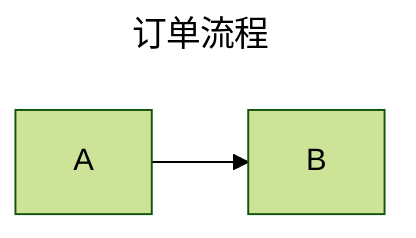
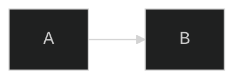
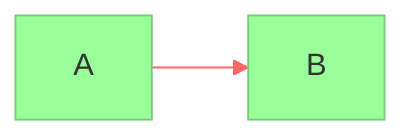

# 配置 / API / 安全：三层配置、主题、render 与 securityLevel

> 基于 **Mermaid v11.16.0**（npm latest 实测）· 核于 2026-07

## 速查

- **三层配置，优先级低→高**：默认配置 → 站点级 `mermaid.initialize({...})`（siteConfig，全站生效）→ 图级 frontmatter `config:`（v10.5+ 推荐）/ directive `%%{init: ...}%%`（deprecated 仍可用）
- **`secure` 数组**：默认含 `secure`、`securityLevel`、`startOnLoad`、`maxTextSize` 等——列入的键**只能由站点 owner 在 initialize 设置，图作者的 directive/frontmatter 改不动**（防不可信图文本自行放开安全级别）
- **initialize 关键项**：`startOnLoad`、`theme`、`securityLevel`、`fontFamily`、`logLevel`、`maxTextSize`（默认 50000，超长熔断）、`maxEdges`（500）、`flowchart.curve/htmlLabels/useMaxWidth`、`look: 'handDrawn'`（v11 手绘风）、`layout: 'elk'`（v11 备选布局引擎）
- **五个内置主题**：`default`（默认）、`neutral`（黑白打印友好）、`dark`、`forest`（绿系）、**`base`（唯一可定制）**
- **themeVariables 必须配 `theme: 'base'`** 才生效；**只认十六进制色值**（颜色名 `red` 不认）
- **派生机制**：大量变量由 `primaryColor` 等基色**计算派生**（如 primaryBorderColor），改基色即联动全套
- **主要变量**：`primaryColor` / `primaryTextColor` / `primaryBorderColor`、`secondaryColor`、`tertiaryColor`、`lineColor`、`background`、`fontFamily`、`fontSize`、`darkMode`、`noteBkgColor`
- **flowchart 曲线**：`curve: basis | linear | cardinal | monotoneX | step | stepBefore | stepAfter`
- **v10 破坏性变化**：`init()` 废弃改 **`run()`**；`render` / `parse` **全部 async 返回 Promise**；`mermaidAPI.render` 被 `mermaid.render` 取代
- **`mermaid.run({ querySelector | nodes, suppressErrors })`**：`startOnLoad: false` 时手动批量渲染；已处理节点标记 `data-processed`，重复 run 不会重复渲染
- **`mermaid.render('uniqueId', text)`** → `{ svg, bindFunctions }`：拿 SVG 字符串自己插 DOM；**id 是渲染期临时元素的 DOM id，必须页面唯一**（SPA 重复渲染/热更新用递增或随机 id）
- **`bindFunctions?.(el)`**：有 click 等交互时才存在，**要手动调用**交互才生效
- **`mermaid.parse(text)`**：仅校验不渲染——合法返回 `{ diagramType }`、非法抛错；`{ suppressErrors: true }` 时返回 false；`mermaid.parseError` 全局解析错误钩子
- **字体坑**：字体未加载完就渲染会标签溢出/错位——等 `window.load` 或显式指定 CSS 字体
- **securityLevel 四值**：`strict`（默认：HTML 转义、click callback 禁用）/ `antiscript`（留 HTML 剥 script）/ `loose`（全开，仅完全可信来源）/ `sandbox`（iframe 渲染、JS 全禁，beta）
- **XSS 攻击面**：渲染用户提交的图文本 = 渲染不可信输入；内部有 DOMPurify 净化兜底，但放 `loose` 等于自开后门——不可信来源保持 `strict` 或用 `sandbox`
- **mermaid-cli**：包 `@mermaid-js/mermaid-cli`、命令 **`mmdc`**，底层 puppeteer 无头浏览器；`-i in.mmd -o out.svg`（svg/png/pdf）、`-t dark -b transparent`、可扫 md 批量转换；Docker 镜像 `minlag/mermaid-cli`（Linux/Docker 有 sandbox 权限坑）
- **SSR**：Node 侧渲染因无 DOM 报错——VitePress/Nuxt 确保仅客户端执行（`onMounted` / `<ClientOnly>` / vitepress-plugin-mermaid）；构建期出静态图用 mermaid-cli
- **转义与解析坑**：
  - 全小写 `end` 节点撞块结束符；节点名 `o`/`x` 开头被解析成圆头/叉头边
  - 特殊字符引号包裹 `A["文本"]`，实体 `#35;`（#）、`#59;`（;）、`&#9829;`（♥）
  - `%%` 注释里别放花括号（被当 directive 解析，图直接崩）
  - directive 里是 JSON（键最好双引号），单引号/尾逗号部分解析路径会失败；frontmatter 是 YAML，缩进、大小写敏感

## 一、三层配置与 secure 数组

配置从站点到单图分三层，**优先级从低到高**：

1. **默认配置**；
2. **站点级** `mermaid.initialize({...})`——siteConfig，全站生效；
3. **图级** frontmatter `config:`（v10.5+ 官方推荐）或 directive `%%{init: ...}%%`（v10.5.0 起 deprecated 但仍可用）。

安全阀门是 **`secure` 数组**（默认含 `secure`、`securityLevel`、`startOnLoad`、`maxTextSize` 等）：列入其中的键**只能由站点 owner 在 initialize 里设置**，图作者写在 directive/frontmatter 里也改不动——防止不可信的图文本自行把安全级别放开。

## 二、initialize 关键项

```js
mermaid.initialize({
  startOnLoad: true,        // 加载后自动扫 <pre class="mermaid">
  theme: 'default',         // default | neutral | dark | forest | base
  securityLevel: 'strict',  // strict | loose | antiscript | sandbox
  fontFamily: 'trebuchet ms',
  logLevel: 5,
  maxTextSize: 50000,       // 超长图文本熔断
  maxEdges: 500,
  flowchart: { curve: 'basis', htmlLabels: true, useMaxWidth: true },
  sequence: { mirrorActors: false, showSequenceNumbers: false },
  look: 'handDrawn',        // v11：手绘风（roughjs）
  layout: 'elk',            // v11：ELK 布局引擎（复杂大图更整齐，flowchart/state 等）
});
```

- `maxTextSize`（默认 50000 字符）超出报 "Maximum text size in diagram exceeded"；巨型 flowchart 还可能撞 `maxEdges`（500）。
- `look: 'handDrawn'` 用 roughjs 出手绘风；`layout: 'elk'` 对复杂大图布局更整齐（flowchart/state 等支持）。

## 三、图级配置：frontmatter vs directive

**关系必考**：directive `%%{init: {...}}%%` 自 v10.5.0 起**官方标注 deprecated**、被 frontmatter 取代，但**仍可用**且生态里大量存在。



directive 写法（存量教程常见）——多个 directive 会合并、同键后者覆盖前者；`init` 与 `initialize` 两个关键字都行：



格式细节：directive 里是 **JSON**（键最好双引号——单引号/尾逗号在部分解析路径下会失败）；frontmatter 是 **YAML**（缩进敏感、大小写敏感）。

## 四、主题与 themeVariables

五个内置主题：`default`（默认）、`neutral`（黑白打印友好）、`dark`（深色页面）、`forest`（绿系）、`base`。**自定义只能从 `theme: 'base'` 出发改 `themeVariables`**——base 是唯一可定制主题，这是「themeVariables 不生效」的头号原因：



- 主要变量：`primaryColor` / `primaryTextColor` / `primaryBorderColor`、`secondaryColor`、`tertiaryColor`、`lineColor`、`background`、`fontFamily`、`fontSize`、`darkMode`、`noteBkgColor` 等。
- **派生机制**：大量变量由 `primaryColor` 等基色**计算派生**（如 primaryBorderColor）——改基色即联动全套，通常只需给两三个基色。
- **只认十六进制色值**：`red` 这类颜色名不认。
- flowchart 曲线全集：`curve: basis`（默认曲线）`| linear | cardinal | monotoneX | step | stepBefore | stepAfter`。
- SVG 内联样式优先级高，**外部 CSS 覆盖常失败**——正确通道是 classDef / themeVariables / themeCSS。

## 五、JS API：run / render / parse（v10+ 全面 async）

```js
import mermaid from 'mermaid';
mermaid.initialize({ startOnLoad: false });

// ① 批量渲染 DOM 中已有的图（startOnLoad:false 时手动触发）
await mermaid.run({ querySelector: '.mermaid' });   // 或 nodes: [el1, el2]、suppressErrors: true

// ② 动态渲染任意文本 → 拿 SVG 字符串自己插 DOM
const { svg, bindFunctions } = await mermaid.render('uniqueId', 'graph TB\na-->b');
element.innerHTML = svg;
bindFunctions?.(element);   // 绑定 click 等交互（有交互才存在）

// ③ 仅校验语法，不渲染
const ok = await mermaid.parse(text);   // 合法返回 { diagramType }，非法抛错；{ suppressErrors: true } 时返回 false
mermaid.parseError = (err, hash) => showInGui(err);   // 全局解析错误钩子
```

- **v10 破坏性变化**：`init()` 废弃改 `run()`；`render`/`parse` 全部 async 返回 Promise（v9 的同步回调式 `mermaid.render(id, txt, cb)` 不再是主形态）；旧 `mermaidAPI.render` 亦被 `mermaid.render` 取代。
- **render 的 id 必须页面唯一**：它是渲染期临时元素的 DOM id——SPA 重复渲染/热更新场景用递增或随机 id，避免残留元素 id 冲突报错。
- **`run()` 的幂等**：处理过的节点标记 `data-processed`，重复 run 不会重复渲染（想重渲染需还原原始文本）。
- **`parse` + `parseError`** 是编辑器实时报错的标准组合。
- **字体坑**：字体未加载完就渲染会导致标签溢出/错位——等 `window.load` 或显式指定 CSS 字体。

## 六、securityLevel 四值（必考）

| 值 | HTML 标签 | click 交互 | script | 说明 |
| --- | --- | --- | --- | --- |
| **strict**（默认） | 编码转义 | **禁用**（callback/js href 不生效） | 禁用 | 最安全，默认值 |
| **antiscript** | 允许 | 启用 | **剥离 script** | 折中：留 HTML 去脚本 |
| **loose** | 允许 | 启用 | 允许 | 仅用于**完全可信**的图来源 |
| **sandbox** | 允许 | 受限 | 禁用 | 整图渲染进 **sandbox iframe**，JS 全禁；交互/链接受限，beta 品质 |

- 渲染**用户提交的图文本**（评论区、协作平台）= 渲染不可信输入，是 XSS 攻击面：内部虽有 DOMPurify 净化，但把 securityLevel 放 `loose` 等于自开后门——不可信来源保持 `strict` 或用 `sandbox`。
- click href/callback 等交互特性文档明确「strict 下禁用、loose 下可用」；`secure` 数组保证图作者不能用 directive 把 securityLevel 改弱。
- **「click 不响应」排查**：默认 strict 禁 callback → 需 loose（并确认图源可信）；render API 场景还要记得手动调 `bindFunctions(el)`。

## 七、mermaid-cli 与 SSR

Mermaid 渲染依赖真实 DOM，**Node 端不能直接跑**。CI/构建期出静态图靠 **mermaid-cli**（底层 puppeteer 无头浏览器）：

```bash
npm install -g @mermaid-js/mermaid-cli
mmdc -i input.mmd -o output.svg          # 输出 svg/png/pdf
mmdc -i input.mmd -o output.png -t dark -b transparent   # 主题/背景
mmdc -i readme.template.md -o readme.md  # 扫描 md 中 mermaid 块 → 生成图文件并替换引用
docker run --rm -u `id -u`:`id -g` -v /path:/data minlag/mermaid-cli -i diagram.mmd
```

- 第三条是批量模式：扫描 Markdown 里的 mermaid 围栏，生成图文件并替换为引用。
- Docker 镜像 `minlag/mermaid-cli`；**Linux/Docker 下有 puppeteer sandbox 权限坑**，注意以对应 uid 运行。
- **SSR 崩溃**：`import mermaid` 后在 Node 侧执行渲染会因无 DOM 报错——VitePress/Nuxt 中确保仅客户端执行（`onMounted` / `<ClientOnly>` / vitepress-plugin-mermaid）。

## 八、转义与易错清单（收口）

- **`end` 小写坑**：flowchart/sequence 里节点或参与者叫全小写 `end` 撞块结束符——写 `End`/`END` 或加引号。
- **`o`/`x` 开头节点坑**：`A---oB` 被解析成圆头边、`A---xB` 成叉头边——加空格或用大写。
- **特殊字符**：文本含 `#`、分号、括号、中文标点混排时用双引号包裹 `A["文本"]`；实体写法 `#35;`（#）、`#59;`（;）、`&#9829;`（♥）。
- **`%%` 注释里别放花括号**：会被当成 directive 尝试解析，图直接崩。
- **themeVariables 不生效**：忘了 `theme: 'base'`，或用了颜色名而非 hex。
- **样式改不动**：外部 CSS 干不过内联样式——走 classDef / themeVariables / themeCSS。
- **重复渲染报错**：`mermaid.render` 同 id 二次调用、组件热更新残留元素——每次生成唯一 id。
- **图文本超长熔断**：默认 `maxTextSize` 50000 字符，超出报 "Maximum text size in diagram exceeded"；巨图还可能撞 `maxEdges`。
- **directive JSON / frontmatter YAML 格式**：前者键用双引号防解析失败，后者缩进与大小写敏感。

---

下一页：[参考](../reference) —— 图类型/形状/箭头/基数/配置全速查表与资源链接。
