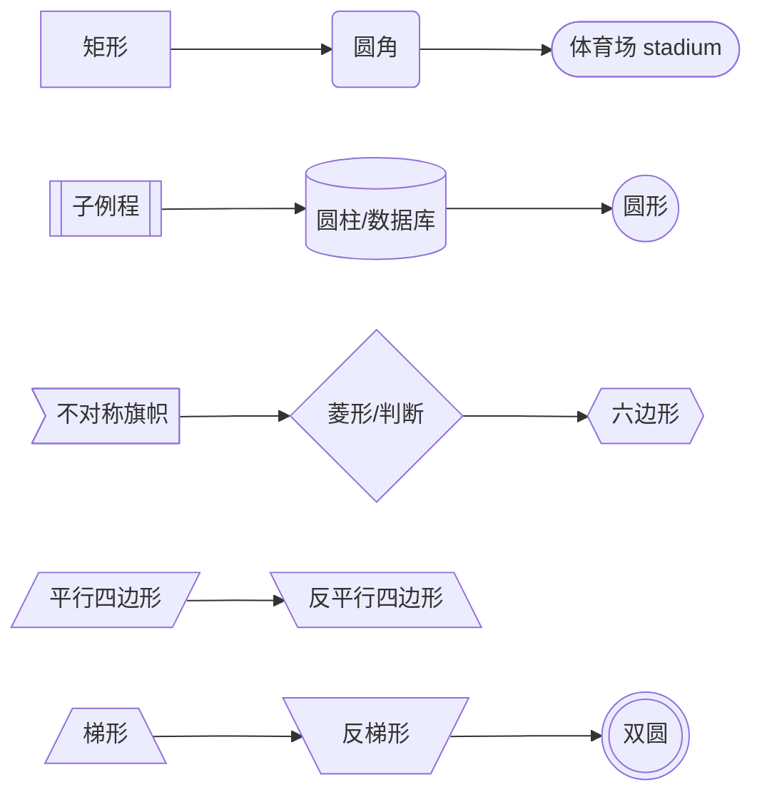
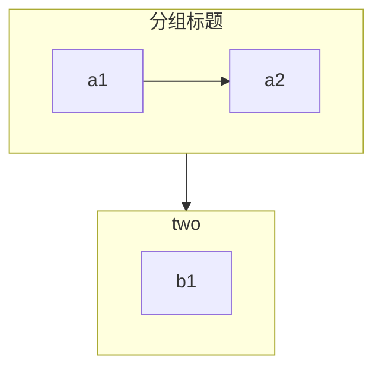
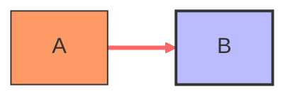
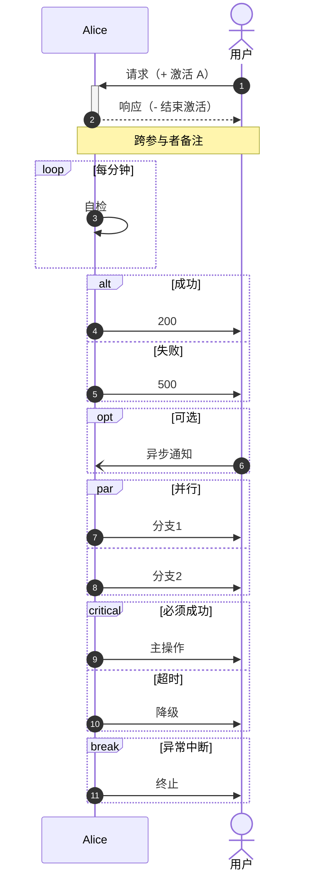

# 流程图与时序图：flowchart / sequenceDiagram 全语法

> 基于 **Mermaid v11.16.0**（npm latest 实测）· 核于 2026-07

## 速查

- **flowchart 声明与方向**：`flowchart TB`（=TD，上→下）/ `BT` / `LR`（左→右）/ `RL`；`graph` 是旧写法
- **基础形状**（id + 包裹符决定形状，文本只需声明一次、id 可复用）：
  - `A[矩形]`、`B(圆角)`、`C([体育场])`、`D[[子例程]]`
  - `E[(圆柱/数据库)]`、`F((圆形))`、`G>不对称旗帜]`、`H{菱形/判断}`
  - 六边形用双层花括号包裹（见下文围栏示例）、`J[/平行四边形/]`、`L[/梯形\]`、`N(((双圆)))`
- **v11.3+ 统一形状语法**：`@{ shape: rect / diamond / cyl / doc / stadium / hourglass / bolt ... }`，一举扩到 30+ 形状、带语义化别名；另有 `@{ icon: "fa:bell" }` 图标节点、`@{ img: "url" }` 图片节点
- **连线**：`-->` 实箭、`---` 实线、`-.->` 虚箭（`-.-` 虚线无箭）、`==>` 粗箭、`~~~` 隐形（只参与布局）、`--o` 圆头、`--x` 叉头、`<-->` 双向
- **连线文字**：`-->|文字|` 或 `-- 文字 -->`
- **`&` 并联**：`U --> V & W` 一对多/多对多展开
- **连线加长**：多写 dash（`---` < `----` < `-----`），布局引擎据此拉长 rank 距离
- **边 ID 与动画（v11.10+）**：`e1@A --> B` 命名边，再 `e1@{ animate: true }`
- **subgraph**：可嵌套、可 `direction` 设内部方向、可整体连线；**坑：子图内节点与外部有连线时，子图自身 direction 失效**（随父图）
- **样式**：`classDef` 定义类 → `class A,B 类名` 或 `:::` 快捷附加；`classDef default` 改全部默认；`linkStyle n` 按**边定义顺序下标**选边；外部 CSS 难覆盖（内联样式）
- **click 交互**：`click A href "url" "提示" _blank` / `click B callback`；受 securityLevel 管控，**strict（默认）下 callback 禁用**
- **sequence 参与者**：`participant`（方框）/ `actor`（人形），`as` 起别名，按声明顺序排列；`create participant X` / `destroy X`（v10.3+）动态创建销毁
- **消息箭头**：
  - `->` / `-->` 实线 / 虚线无箭头
  - `->>` / `-->>` 实心箭头（请求 / 响应惯用）
  - `<<->>` / `<<-->>` 双向（v11.0+）
  - `-x` / `--x` 带 ×（失败/丢失）；`-)` / `--)` 开箭头（**异步**）
- **激活**：`activate A` / `deactivate A`，或消息后缀 `+` / `-` 简写，可堆叠
- **Note**：`Note left of / right of / over A,B: 文本`
- **控制块**：`loop`、`alt`+`else`、`opt`、`par`+`and`、`critical`+`option`、`break`——都以 `end` 收尾
- **autonumber** 消息自动编号；`box 颜色 名称 ... end` 参与者分组框；`rect rgb(...) ... end` 背景高亮块
- **特殊字符走 HTML 实体**：`#59;` 分号、`#35;` 井号
- **`link A: 名称 @ URL`** 给参与者挂菜单链接
- **共通命名坑**：节点/子图里全小写 `end` 会撞块结束符（写 `End`/`END` 或加引号）；flowchart 节点名以 `o`/`x` 开头会被解析成圆头/叉头边

## 一、flowchart：方向与基础形状

首行 `flowchart 方向`，方向五值：`TB`（=`TD`，上→下）、`BT`、`LR`（左→右）、`RL`。节点 = **id + 包裹符号**，包裹符决定形状；同一 id 可复用，文本只需声明一次：



文本含 `#`、分号、括号或与语法冲突的标点时，用双引号包裹：`A["带(括号)的文本"]`；实体写法 `#35;`（#）、`#59;`（;）。中文标签本身没问题，但建议引号包裹防标点撞语法。

## 二、v11.3+ `@{ shape }` 统一形状语法

包裹符组合难记且形状有限，v11.3 起提供统一的 `@{ shape: ... }` 语法，一举扩到 **30+ 形状**，命名语义化且带别名：

```mermaid
flowchart TD
  A@{ shape: rect, label: "处理" }
  B@{ shape: diamond, label: "判断" }
  C@{ shape: cyl, label: "库" }
  D@{ shape: doc, label: "文档" }
  E@{ shape: stadium, label: "终点" }
  F@{ shape: hourglass }
  G@{ shape: bolt }
  H@{ icon: "fa:bell", form: "circle", label: "图标节点", pos: "t" }
  I@{ img: "https://x/y.png", label: "图片节点", w: 60, h: 60 }
```

常用别名：`diamond` 亦作 `decision`/`question`，`cyl` 亦作 `database`/`db`，`stadium` 亦作 `pill`/`terminal`，`hourglass` 即 collate，`bolt` 即 com-link（闪电）。同一语法还支持 `@{ icon: }`（iconify 图标节点，`form`/`pos` 控制形态与文本位）与 `@{ img: }`（图片节点，`w`/`h` 定尺寸）。

## 三、连线全表

| 语法 | 含义 |
| --- | --- |
| `-->` | 实线箭头 |
| `---` | 实线无箭头 |
| `-.->` | 虚线箭头（`-.-` 虚线无箭头） |
| `==>` | 粗线箭头 |
| `~~~` | 隐形连线（不可见，只参与布局） |
| `--o` / `--x` | 圆头 / 叉头 |
| `<-->` | 双向箭头 |
| `-->\|文字\|` 或 `-- 文字 -->` | 带文字连线的两种写法 |
| `U --> V & W` | `&` 并联：一对多/多对多展开 |

补充两个机制：

- **加长**：多写 dash（`---` < `----` < `-----`），布局引擎据此拉长 rank 距离，用于手动微调层次。
- **边 ID 与动画（v11.10+）**：先命名边再单独配置：

```mermaid
flowchart LR
  A -->|带文字| B
  B -.-> C
  C ==> D & E
  e1@D --> F
  e1@{ animate: true }
```

## 四、subgraph：分组与方向坑



- subgraph 可嵌套，可用 `direction` 设内部方向。
- **坑（文档明载行为，不是 bug）**：一旦子图内节点与外部有连线，该子图自身的 `direction` 会被忽略，改随父图方向。

## 五、样式与交互



- `classDef` 定义样式类 → `class A,B 类名` 批量附加，或节点后 `:::` 快捷附加；`classDef default` 改所有节点默认样式。
- `linkStyle n` 按**边定义顺序的下标**选边（第 0 条边即第一条连线）。
- SVG 内联样式带高优先级，**外部 CSS 覆盖常失败**——正确通道是 classDef / themeVariables。
- click 交互受 securityLevel 管控（strict 下 callback 禁用，详见[配置 / API / 安全](./config-api-security)）：


## 六、时序图：参与者与消息箭头

参与者两种形态：`participant`（方框）、`actor`（人形），`as` 起别名；**按声明顺序从左到右排列**；`create participant X` / `destroy X`（v10.3+）表达生命周期。消息箭头全表：

| 语法 | 含义 |
| --- | --- |
| `->` / `-->` | 实线 / 虚线，无箭头 |
| `->>` / `-->>` | 实线 / 虚线，实心箭头（请求 / 响应惯用） |
| `<<->>` / `<<-->>` | 双向实线 / 虚线（v11.0+） |
| `-x` / `--x` | 实线 / 虚线带 ×（常表失败/丢失） |
| `-)` / `--)` | 实线 / 虚线开箭头（**异步消息**） |

消息文本里的特殊字符用 HTML 实体：`#59;`（分号）、`#35;`（井号）。`link A: 名称 @ URL` 可给参与者挂菜单链接。

## 七、激活、Note、编号与分组

- **激活条**：`activate A` / `deactivate A`，或直接在消息箭头后缀 `+`（激活对方）/ `-`（结束激活），可堆叠。
- **备注**：`Note left of A:` / `Note right of A:` / `Note over A,B:`（可跨多个参与者）。
- **autonumber**：消息自动编号。
- **box 颜色 名称 ... end**：给参与者画分组框（如 `box transparent Aqua`）。
- **rect rgb(200,255,200) ... end**：一段消息的背景高亮块。

## 八、控制块全家福

六种控制块覆盖循环、分支、并行、降级与中断，全部以 `end` 收尾、可嵌套：



语义速记：`loop` 循环、`alt`+`else` 二选一、`opt` 可选段、`par`+`and` 并行分支、`critical`+`option` 关键操作与备选情形、`break` 中断流程。

## 九、两图共通的命名坑

```text
flowchart LR
  A --> end    %% ✗ 全小写 end 撞上 subgraph 的结束符，破坏图
  B ---oC      %% ✗ 被解析成「圆头边连到 C」，不是连到节点 oC
  D ---xE      %% ✗ 同理被解析成叉头边
```

- **`end` 关键字坑**：flowchart 里节点叫 `end`（全小写）会撞 subgraph 的 `end` 结束符——写 `End`/`END` 或加引号；sequence 的控制块同理。
- **`o`/`x` 开头节点坑**：节点名以 `o` 或 `x` 开头时紧贴连线会被解析成圆头/叉头边——加空格（`B --- oC`）或用大写开头。

---

下一页：[类图 / 状态图 / ER 图](./class-state-er) —— 关系箭头八件套、状态机复合与并发、ER 基数符号语义。
