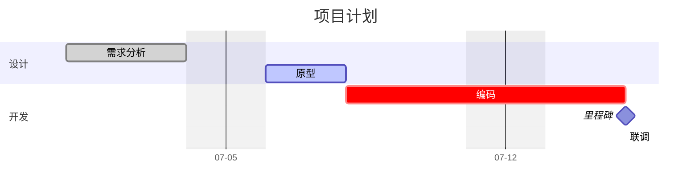
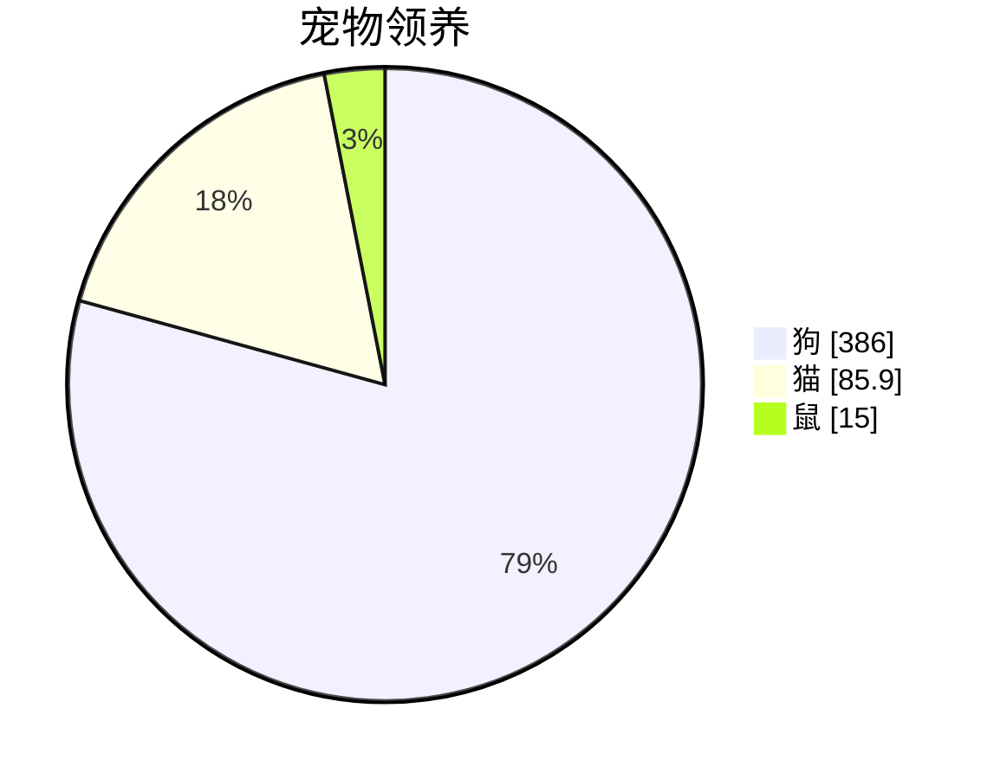
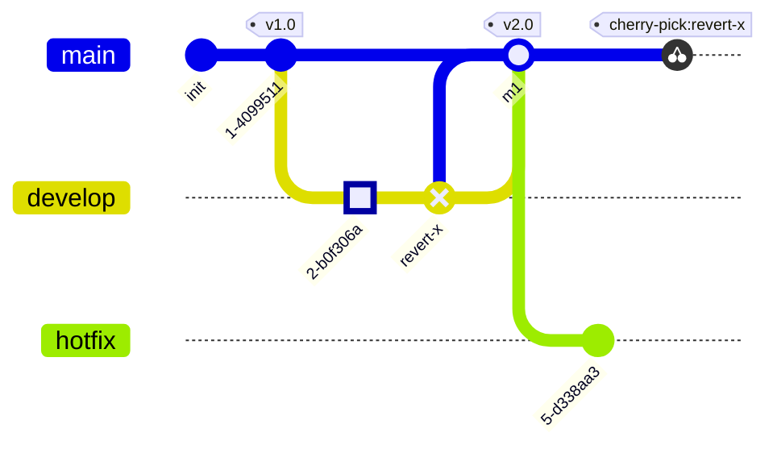
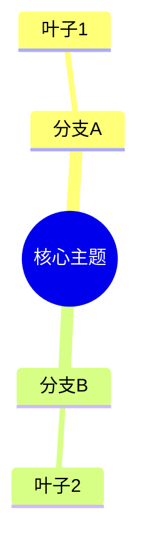

# 甘特 / gitGraph / 更多图：项目时间线与 Git 分支

> 基于 **Mermaid v11.16.0**（npm latest 实测）· 核于 2026-07

## 速查

- **gantt 任务行**：`任务名 : [标签...], [id], 开始, 结束或时长`；**标签必须写在最前**
- **四种标签可组合**：`done` 完成、`active` 进行中、`crit` 关键路径、`milestone` 里程碑
- **时长单位**：`ms/s/m/h/d/w/M/y`，支持小数；依赖写 `after id1 [id2...]`、`until id`
- **`dateFormat` 定义输入格式**（`YYYY-MM-DD`、`X` unix 等 token）；**`axisFormat` 定义坐标轴输出格式**（strftime 风格 `%Y-%m-%d`）——一进一出别混
- **`tickInterval`**：`1day` / `1week` / `1month`
- **`excludes weekends`**（或具体日期）从时长计算中剔除；`weekend friday` 改周末起始日
- **milestone 渲染为单点**：位置 = 开始时间 + 时长/2
- **`todayMarker`**：`off` 隐藏今日线，或直接写样式；`vert` 竖直标记线；紧凑模式 `displayMode: compact`（frontmatter）
- **gantt 交互**：`click 任务id href/call ...`（需 securityLevel loose）
- **pie**：`pie showData` 在图例后显示数值；`title` 标题
- **pie 数值约束**：必须为**正数**、最多两位小数；`textPosition`（0~1，标签径向位置，默认 0.75）
- **gitGraph 默认从 main 开始**；`branch X` **创建即自动切换**到新分支；`checkout` 与 `switch` 等价
- **commit 属性**：`id:`、`tag:`、`type:`（`NORMAL` 实心圆 / `REVERSE` 叉圆 / `HIGHLIGHT` 高亮方块）
- **`merge 分支`** 产生**双圈 merge commit**，也可带 id/tag/type
- **`branch X order: n`** 控制泳道顺序（main 固定 order 0）
- **cherry-pick 三前提（易错）**：`id:` 必填且指向**已存在、不在当前分支**的 commit；当前分支需至少一个 commit；拣选 merge commit 必须给 `parent:`
- **gitGraph 方向**：`LR:`（默认）、`TB:`、`BT:`（v11.0+）——**注意带冒号**
- **gitGraph 专属 themeVariables**：`git0..git7` 分支色（8 色循环）、`gitBranchLabel0..7`、`commitLabelColor/Background/FontSize`、`tagLabelColor` 等
- **gitGraph 配置**：`showBranches`、`showCommitLabel`、`mainBranchName`、`rotateCommitLabel`、`parallelCommits`
- **新图类型一句话**：
  - `mindmap` 思维导图：**缩进定层级**，`::icon()` 加图标
  - `timeline` 时间线：`时期 : 事件 : 事件`，`section` 分段共享配色（实验态）
  - `quadrantChart` 象限图：`x-axis` / `y-axis` / `quadrant-1..4`，点坐标 0~1
  - `sankey-beta` 桑基图：CSV 三列 `源,目标,数值`
  - `xychart` XY 图：`bar` + `line` 可叠加，`horizontal` 横排
  - `block-beta` 块图：`columns n` 网格 + `space` 占位 + 复用 flowchart 形状
  - `architecture-beta` 架构图：group/service/junction，边带 L/R/T/B 接口方位
  - `packet-beta` 报文图：网络包位域（v11.7+ 可写 `packet` + 相对位 `+16`）
  - `kanban` 看板、`radar-beta` 雷达图、`journey` 用户旅程、`requirementDiagram`、`C4Context` 系、`zenuml`、`treemap`
- **`-beta` 后缀现状**：sankey/xychart/block/packet 的后缀已可选；radar 仍仅 `radar-beta`

## 一、gantt：任务行与标签

任务行格式 `任务名 : [标签...], [id], 开始, 结束或时长`，**标签必须在最前**（这是高频解析报错点：`crit, done, 2026-01-01, 3d` 合法，把日期写在标签前会解析失败——元数据顺序是 tags → id → 起 → 止）：

- 标签四种可组合：`done`（完成）、`active`（进行中）、`crit`（关键路径）、`milestone`（里程碑）。
- 时长单位 `ms/s/m/h/d/w/M/y`，支持小数；结束可写日期或时长。
- 依赖：`after id1 [id2...]`（多前置取最晚）、`until id`（持续到某任务开始）。
- `click 任务id href/call ...` 可加交互（需 securityLevel loose）。

## 二、gantt：时间轴、排除与标记

- **`dateFormat` 是输入格式**（你在任务行里写日期的格式，`YYYY-MM-DD`、`X` unix 等 token）；**`axisFormat` 是坐标轴的输出格式**（strftime 风格，如 `%m-%d`）——一个管解析、一个管显示，别混。
- `tickInterval 1day|1week|1month` 控制刻度密度。
- `excludes weekends`（或列具体日期）把周末/假日从**时长计算**中剔除；`weekend friday` 可改周末起始日（中东地区习惯）。
- **milestone 渲染为单点**，位置 = 开始时间 + 时长/2（所以常写 `0d` 或极短时长定位）。
- `todayMarker off` 隐藏今日线，或直接给样式（如 `stroke-width:3px,stroke:#0f0`）；`vert` 画竖直标记线；frontmatter 里 `displayMode: compact` 开紧凑模式。

## 三、pie：饼图

- `showData` 让图例后显示数值。
- 数值必须为**正数**，最多两位小数。
- 配置项 `textPosition`（0~1）控制标签的径向位置，默认 0.75。

## 四、gitGraph：分支、提交与合并

- 默认从 **main** 分支开始；`branch X` **创建即自动切换**到新分支（不需要再 checkout）；`checkout` 与 `switch` 等价。
- `commit` 三个属性：`id:` 自定义提交名、`tag:` 打标签、`type:` 三种形态——`NORMAL`（实心圆，默认）、`REVERSE`（叉圆，常表回滚）、`HIGHLIGHT`（高亮方块）。
- `merge 分支` 产生**双圈 merge commit**，同样可带 id/tag/type。
- `branch X order: n` 控制泳道顺序（main 固定 order 0）。
- 方向：`LR:`（默认）、`TB:`、`BT:`（v11.0+）——**关键字后带冒号**。

## 五、cherry-pick 前提与专属主题变量

**cherry-pick 三前提**，少一个就报错（高频坑）：

1. `id:` 必填，且指向**已存在、不在当前分支**的 commit；
2. 当前分支需至少有一个 commit；
3. 拣选的是 merge commit 时必须给 `parent:` 指明主线。

**专属 themeVariables 通道**：分支色 `git0..git7`（8 色循环，分支多于 8 个复用）、分支标签色 `gitBranchLabel0..7`、`commitLabelColor` / `commitLabelBackground` / `commitLabelFontSize`、`tagLabelColor` 系列；常用配置 `showBranches`、`showCommitLabel`、`mainBranchName`、`rotateCommitLabel`、`parallelCommits`。

## 六、新图类型速览

| 图 | 声明关键字 | 一句话 |
| --- | --- | --- |
| 思维导图 | `mindmap` | **缩进定层级**；形状有方/圆角/圆/bang/cloud/六边形等；`::icon()` 加图标 |
| 时间线 | `timeline` | `时期 : 事件 : 事件`，`section` 分段共享配色，实验态 |
| 象限图 | `quadrantChart` | `x-axis 左 --> 右`、`y-axis`、`quadrant-1..4` 标签、`点: [0.75, 0.8]`（0~1） |
| 桑基图 | `sankey-beta` | CSV 三列 `源,目标,数值` 描述流量 |
| XY 图 | `xychart`（旧 `xychart-beta` 也可） | `x-axis [分类...]`、`y-axis 标题 min --> max`、`bar [..]`、`line [..]`；`xychart horizontal` 横排 |
| 块图 | `block-beta`（新版 `block` 也可） | `columns n` 网格布局 + `space` 占位 + 复用 flowchart 形状 + 块间连线 |
| 架构图 | `architecture-beta` | `group` / `service id(icon)[label] in 组` / `junction`；边 `db:R --> L:server`（L/R/T/B 接口方位）；内置 cloud/database/disk/internet/server 图标，可 `registerIconPacks` 接 iconify |
| 报文图 | `packet-beta`（v11.7+ 可 `packet` + 相对位 `+16`） | 网络包位域：`0-15: "Source Port"` |
| 看板 | `kanban` | 列 + 缩进卡片，`@{ ticket:, assigned:, priority: }` 元数据 |
| 雷达图 | `radar-beta` | `axis A, B, C` + `curve c1{1,2,3}` |
| 其他 | `journey` / `requirementDiagram` / `C4Context` 等 C4 系 / `zenuml` / `treemap` | 用户旅程 / 需求图 / C4 架构 / 另一种时序 DSL / 树图 |

以 mindmap 为例感受「缩进定层级」：

> detector 源码显示：sankey / xychart / block / packet 的 `-beta` 后缀在新版本已可选；radar 仍仅接受 `radar-beta`。

---

下一页：[配置 / API / 安全](./config-api-security) —— 三层配置、主题定制、run/render/parse API、securityLevel 与 mermaid-cli。
