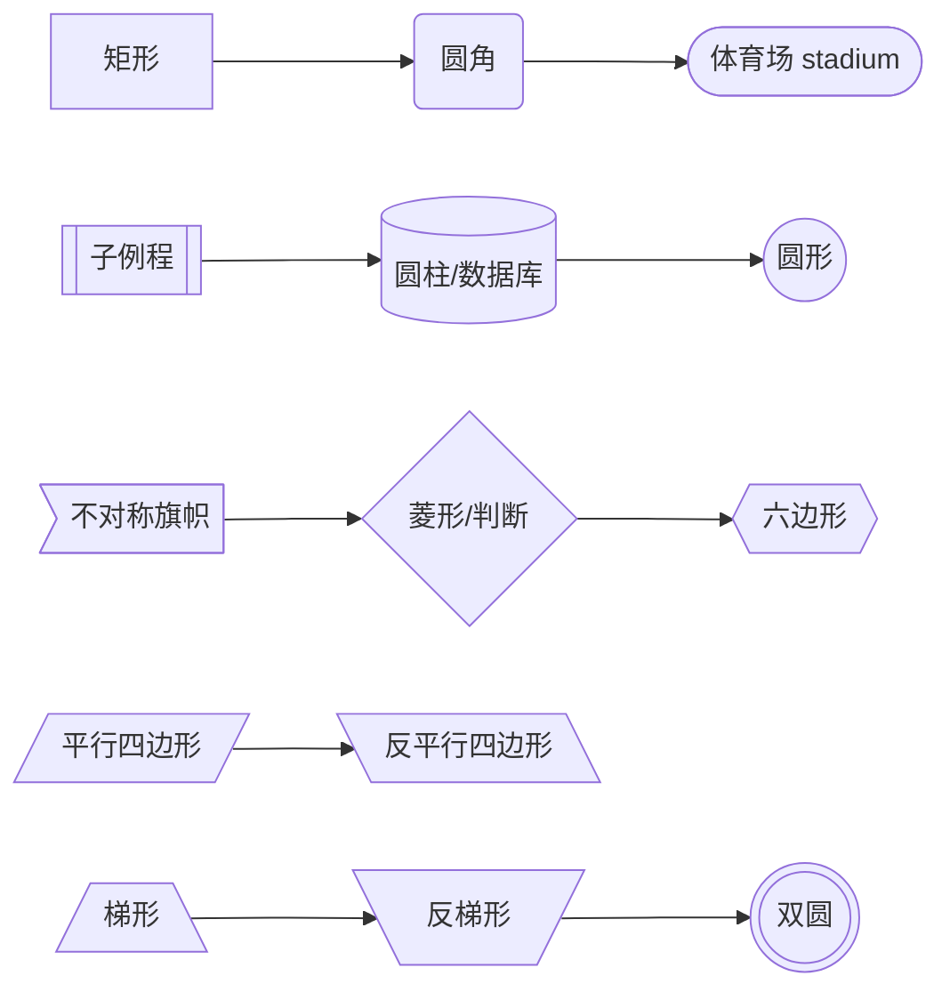

# 参考：图类型 / 形状 / 箭头 / 基数 / 配置速查

> 基于 **Mermaid v11.16.0**（npm latest 实测）· 核于 2026-07

## 速查

- **图类型声明关键字（首行决定一切）**：
  - 八大常用图：`flowchart`（旧 `graph`）/ `sequenceDiagram` / `classDiagram` / `stateDiagram-v2` / `erDiagram` / `gantt` / `pie` / `gitGraph`
  - 更多图类型：`mindmap` / `timeline` / `quadrantChart` / `sankey-beta` / `xychart` / `block-beta` / `architecture-beta` / `packet-beta` / `kanban` / `radar-beta` / `journey` / `requirementDiagram` / `C4Context` / `zenuml` / `treemap`
- **flowchart 方向**：`TB`（=`TD`）/ `BT` / `LR` / `RL`；节点 = id + 包裹符号定形状，同 id 可复用、文本只需声明一次
- **flowchart 连线速记**：`-->` 实箭、`---` 实线、`-.->` 虚箭、`==>` 粗箭、`~~~` 隐形（只参与布局）、`--o`/`--x` 圆头/叉头、`<-->` 双向、`&` 并联展开一对多
- **v11.3+ 统一形状语法**：`@{ shape: rect | diamond | cyl | doc | stadium | hourglass | bolt | ... }` 一举扩到 30+ 形状；另有 `@{ icon: "fa:..." }` / `@{ img: "url" }` 节点
- **flowchart 曲线**：`curve: basis | linear | cardinal | monotoneX | step | stepBefore | stepAfter`
- **sequence 消息箭头**：`->`/`-->` 无箭头、`->>`/`-->>` 实心箭头（请求/响应惯用）、`<<->>`/`<<-->>` 双向（v11.0+）、`-x`/`--x` 失败带叉、`-)`/`--)` 异步开箭头
- **sequence 控制块**：`loop` / `alt`+`else` / `opt` / `par`+`and` / `critical`+`option` / `break`，全部以 `end` 收尾、可嵌套
- **class 关系箭头八件套**：
  - `<|--` 继承（空心三角指父类）、`..|>` 实现（虚线空心三角指接口）
  - `*--` 组合（实心菱形在整体侧，部分不可独立存活）、`o--` 聚合（空心菱形在整体侧，部分可独立）
  - `-->` 关联、`..>` 依赖（虚线）、`--`/`..` 无方向连接线（实/虚）
- **class 可见性/修饰**：`+`/`-`/`#`/`~` 分别对应 public/private/protected/package；`*` 抽象方法、`$` 静态方法或字段
- **er 基数四对（符号靠近哪侧就说明哪侧数量）**：`|o`/`o|` 零或一、`||`/`||` 恰好一、`}o`/`o{` 零或多、`}|`/`|{` 一或多
- **er 关系线语义**：`--` 实线 = identifying（子实体依赖父实体存在）；`..` 虚线 = non-identifying（两实体可独立）
- **gantt 任务行**：`任务名 : [标签...], [id], 开始, 结束或时长`，**标签必须写最前**；四种标签 `done`/`active`/`crit`/`milestone` 可组合
- **gantt 时间格式**：`dateFormat` 管**输入**解析格式，`axisFormat` 管**坐标轴输出**格式（strftime 风格）——一进一出别混
- **gitGraph**：默认从 **main** 开始；`branch X` 创建即自动切换；`merge` 产生双圈 commit；方向 `LR:`/`TB:`/`BT:`（注意带冒号）
- **cherry-pick 三前提（易错）**：`id:` 指向已存在且不在当前分支的 commit；当前分支需至少一个 commit；拣选 merge commit 必须给 `parent:`
- **三层配置，优先级低到高**：默认配置 → 站点级 `mermaid.initialize({...})` → 图级 frontmatter `config:`（v10.5+ 推荐）/ directive `%%{init: ...}%%`（deprecated 仍可用）
- **图级配置两种写法**：frontmatter 用 YAML `config:` 键（推荐）；directive 是图定义前的 JSON `%%{init}%%`（deprecated 仍广泛可用，多个会合并、同键后者覆盖前者）
- **initialize 关键项**：`startOnLoad` / `theme` / `securityLevel` / `maxTextSize`（默认 `50000` 熔断）/ `maxEdges`（默认 `500`）/ `look: 'handDrawn'`（v11 手绘）/ `layout: 'elk'`（v11 布局引擎）
- **五个内置主题**：`default` / `neutral`（打印友好）/ `dark` / `forest` / **`base`（唯一可定制 themeVariables）**；themeVariables 只认十六进制色值
- **securityLevel 四值**：`strict`（默认，click callback 禁用）/ `antiscript`（留 HTML 剥 script）/ `loose`（全开，仅完全可信来源）/ `sandbox`（iframe 隔离，beta）
- **JS API（v10+ 全 async）**：`mermaid.run()` 批量渲染 / `mermaid.render(id, text)` 返回 `{ svg, bindFunctions }`（id 须全页唯一）/ `mermaid.parse(text)` 仅校验语法
- **mermaid-cli**：包 `@mermaid-js/mermaid-cli`，命令 **`mmdc`**，底层 puppeteer 无头浏览器；`-i in.mmd -o out.svg|png|pdf`
- **无障碍**：所有图支持 `accTitle:` / `accDescr:`，渲染为 SVG `<title>`/`<desc>` + aria 属性
- **原生渲染与集成**：GitHub/GitLab/Gitea/Azure DevOps/Notion/Joplin/Obsidian/Typora 围栏直接出图；**VitePress 需装 `vitepress-plugin-mermaid`**、Slidev 内置
- 图类型全表、形状/连线全表、三套箭头语义表、配置与安全表见下方各章节；易错点清单见本页收尾

## 一、图类型总览：22+ 种图速查

**核心图（有专属指南页）**

| 图类型 | 关键字 | 一句话 | 详见 |
| --- | --- | --- | --- |
| 流程图 | `flowchart`（旧 `graph`） | 方向 + 节点形状 + 连线 + 子图 + 样式 | [流程图与时序图](./guide-line/flowchart-and-sequence) |
| 时序图 | `sequenceDiagram` | 参与者 + 消息箭头 + 激活 + 控制块 | [流程图与时序图](./guide-line/flowchart-and-sequence) |
| 类图 | `classDiagram` | 成员/可见性 + 关系箭头八件套 | [类图 / 状态图 / ER 图](./guide-line/class-state-er) |
| 状态图 | `stateDiagram-v2` | 起止 `[*]` + 复合状态 + fork/join/choice | [类图 / 状态图 / ER 图](./guide-line/class-state-er) |
| ER 图 | `erDiagram` | 基数符号 + identifying 关系 + 属性块 | [类图 / 状态图 / ER 图](./guide-line/class-state-er) |
| 甘特图 | `gantt` | 任务标签 + 依赖 + dateFormat/axisFormat | [甘特 / gitGraph / 更多图](./guide-line/gantt-git-and-more) |
| 饼图 | `pie` | `showData` 显示数值，最多两位小数 | [甘特 / gitGraph / 更多图](./guide-line/gantt-git-and-more) |
| Git 图 | `gitGraph` | branch/commit/merge/cherry-pick | [甘特 / gitGraph / 更多图](./guide-line/gantt-git-and-more) |

**更多图类型（一句话速览）**

| 图类型 | 关键字 | 一句话 |
| --- | --- | --- |
| 思维导图 | `mindmap` | 缩进定层级，`::icon()` 加图标 |
| 时间线 | `timeline` | `时期 : 事件 : 事件`，`section` 分段共享配色，实验态 |
| 象限图 | `quadrantChart` | `x-axis`/`y-axis`/`quadrant-1..4` 标签，点坐标 0~1 |
| 桑基图 | `sankey-beta` | CSV 三列「源,目标,数值」描述流量 |
| XY 图 | `xychart`（旧 `xychart-beta` 也可） | `bar`/`line` 可叠加，`horizontal` 横排 |
| 块图 | `block-beta`（新版 `block` 也可） | `columns n` 网格 + 复用 flowchart 形状 + 块间连线 |
| 架构图 | `architecture-beta` | group/service/junction，边用 `db:R --> L:server` 式表达接口方位 |
| 报文图 | `packet-beta` | v11.7+ 可用 `packet` + 相对位 `+16`，位域如 `0-15: "Source Port"` |
| 看板 | `kanban` | 列 + 缩进卡片，`@{ ticket:, assigned:, priority: }` 元数据 |
| 雷达图 | `radar-beta` | `axis A, B, C` + 曲线数据 |
| 用户旅程 | `journey` | 阶段 + 任务 + 满意度评分 |
| 需求图 | `requirementDiagram` | 需求元素 + 关系（satisfies/traces 等） |
| C4 架构 | `C4Context`（及 Container/Component/Dynamic） | 系统上下文/容器/组件分层架构图 |
| 另一种时序 | `zenuml` | 另一套时序图 DSL |
| 树图 | `treemap` | 矩形嵌套面积图 |

> `-beta` 后缀现状（detector 源码可见）：sankey / xychart / block / packet 已可省略；radar 仍仅接受 `radar-beta`。

## 二、flowchart：形状与连线速查

**节点形状**（id + 包裹符号决定形状）：

| 形状 | 语法 | 备注 |
| --- | --- | --- |
| 矩形 | `[文本]` | 默认形状 |
| 圆角矩形 | `(文本)` | |
| 体育场形 | `([文本])` | stadium |
| 子例程 | `[[文本]]` | |
| 圆柱/数据库 | `[(文本)]` | |
| 圆形 | `((文本))` | |
| 不对称旗帜 | `>文本]` | |
| 菱形/判断 | `{文本}` | decision |
| 六边形 | 双大括号包裹文本 | 写法见下方围栏示例 |
| 平行四边形 | `[/文本/]` | |
| 反平行四边形 | `[\文本\]` | |
| 梯形 | `[/文本\]` | |
| 反梯形 | `[\文本/]` | |
| 双圆 | `(((文本)))` | |



v11.3+ 起还有统一的 `@{ shape: ... }` 语法（30+ 形状，语义化命名 + 别名，如 `diamond`=`decision`/`question`、`cyl`=`database`/`db`），以及 `@{ icon: "fa:bell" }` 图标节点、`@{ img: "url" }` 图片节点。

**连线全表**：

| 语法 | 含义 |
| --- | --- |
| `-->` | 实线箭头 |
| `---` | 实线无箭头 |
| `-.->` | 虚线箭头（`-.-` 虚线无箭头） |
| `==>` | 粗线箭头 |
| `~~~` | 隐形连线（只参与布局） |
| `--o` / `--x` | 圆头 / 叉头 |
| `<-->` | 双向箭头 |
| `-->\|文字\|` 或 `-- 文字 -->` | 带文字连线的两种写法 |
| `U --> V & W` | `&` 并联：一对多/多对多展开 |

**其余速记**：

- 连线加长：多写 dash（`---` < `----` < `-----`），拉长布局层级距离；边 ID 动画（v11.10+）：`e1@A --> B` 命名边，再 `e1@{ animate: true }`
- subgraph 可嵌套、可 `direction` 设内部方向；**坑**：子图内节点与外部有连线时，该子图 direction 会被忽略、改随父图
- 样式：`classDef` 定义类 → `class A,B 类名` 或 `:::` 快捷附加；`linkStyle n` 按**边定义顺序下标**选边；外部 CSS 难覆盖内联样式
- click 交互：`click A href "url" "提示" _blank` / `click B callback`；受 securityLevel 管控，strict 下 callback 禁用

## 三、箭头与基数符号语义表

**sequence 消息箭头**：

| 语法 | 含义 |
| --- | --- |
| `->` / `-->` | 实线 / 虚线，无箭头 |
| `->>` / `-->>` | 实线 / 虚线，实心箭头（请求 / 响应惯用） |
| `<<->>` / `<<-->>` | 双向实线 / 虚线（v11.0+） |
| `-x` / `--x` | 实线 / 虚线带 ×（常表失败/丢失） |
| `-)` / `--)` | 实线 / 虚线开箭头（**异步消息**） |

**class 关系箭头八件套**：

| 箭头 | 语义 | 记忆 |
| --- | --- | --- |
| `<\|--` | 继承 Inheritance | 空心三角指父类 |
| `*--` | 组合 Composition | 实心菱形在整体侧，部分不可独立存活 |
| `o--` | 聚合 Aggregation | 空心菱形在整体侧，部分可独立 |
| `-->` | 关联 Association | 实线箭头 |
| `--` | 实线连接 Link | 无方向 |
| `..>` | 依赖 Dependency | 虚线箭头 |
| `..\|>` | 实现 Realization | 虚线空心三角指接口 |
| `..` | 虚线连接 | 无方向 |

**er 基数四对**（符号靠近哪个实体，就说明该侧实体的数量）：

| 左侧 | 右侧 | 含义 |
| --- | --- | --- |
| `\|o` | `o\|` | 零或一 |
| `\|\|` | `\|\|` | 恰好一 |
| `}o` | `o{` | 零或多 |
| `}\|` | `\|{` | 一或多 |

读法示例：`CUSTOMER ||--o{ ORDER : places` = 一个 CUSTOMER 下单**零或多**个 ORDER，每个 ORDER 属于**恰好一个** CUSTOMER；关系线本身也有语义——`--` 实线 = identifying、`..` 虚线 = non-identifying。

## 四、gantt 与 gitGraph 速查

**gantt 任务标签**（必须写在任务行最前）：

| 标签 | 含义 |
| --- | --- |
| `done` | 已完成 |
| `active` | 进行中 |
| `crit` | 关键路径 |
| `milestone` | 里程碑，渲染为单点（位置 = 开始时间 + 时长/2） |

任务行格式：`任务名 : [标签...], [id], 开始, 结束或时长`。

**gantt 时间与依赖指令**：

| 指令 | 作用 |
| --- | --- |
| `dateFormat` | 定义**输入**日期格式（`YYYY-MM-DD`、`X` unix 等 token） |
| `axisFormat` | 定义**坐标轴输出**格式（strftime 风格，如 `%m-%d`） |
| `tickInterval` | 刻度密度：`1day` / `1week` / `1month` |
| `excludes` | 从时长计算剔除（`weekends` 或具体日期） |
| `todayMarker` | `off` 隐藏今日线，或直接给样式 |
| `after id1 [id2...]` | 依赖，多前置取最晚 |
| `until id` | 持续到某任务开始 |

**gitGraph commit 属性**：

| 属性 | 取值 | 说明 |
| --- | --- | --- |
| `id:` | 自定义字符串 | 供 merge/cherry-pick 引用 |
| `tag:` | 自定义字符串 | 打标签 |
| `type:` | `NORMAL` / `REVERSE` / `HIGHLIGHT` | 实心圆（默认）/ 叉圆（回滚）/ 高亮方块 |

- 默认从 **main** 分支开始；`branch X` **创建即自动切换**；`checkout`/`switch` 等价；`merge 分支` 产生**双圈 merge commit**；方向 `LR:`（默认）/ `TB:` / `BT:`（v11.0+，注意带冒号）；`branch X order: n` 控制泳道顺序
- **cherry-pick 三前提**：`id:` 必填且指向已存在、不在当前分支的 commit；当前分支需至少一个 commit；拣选 merge commit 必须给 `parent:`
- 专属 themeVariables：`git0..git7` 分支色（8 色循环）、`gitBranchLabel0..7`、`commitLabelColor/Background/FontSize`、`tagLabelColor` 等

## 五、配置与安全速查

**三层配置，优先级从低到高**：默认配置 → 站点级 `mermaid.initialize({...})` → 图级 frontmatter `config:`（v10.5+ 推荐）/ directive `%%{init: ...}%%`（deprecated 仍可用）。`secure` 数组内的键（`securityLevel`/`startOnLoad`/`maxTextSize` 等）只能由站点 owner 在 initialize 设置，图作者改不动。

```js
mermaid.initialize({
  startOnLoad: true,
  theme: 'default',         // default | neutral | dark | forest | base
  securityLevel: 'strict',  // strict | loose | antiscript | sandbox
  maxTextSize: 50000,       // 超长图文本熔断
  maxEdges: 500,
  look: 'handDrawn',        // v11：手绘风（roughjs）
  layout: 'elk',            // v11：ELK 布局引擎
});
```

**主题**：`default`（默认）/ `neutral`（黑白打印友好）/ `dark` / `forest` / **`base`（唯一可定制，配合 themeVariables）**；themeVariables 只认十六进制色值，大量变量由 `primaryColor` 等基色派生。

**securityLevel 四值**：

| 值 | HTML 标签 | click 交互 | script | 说明 |
| --- | --- | --- | --- | --- |
| **strict**（默认） | 编码转义 | **禁用**（callback/js href 不生效） | 禁用 | 最安全，默认值 |
| **antiscript** | 允许 | 启用 | **剥离 script** | 折中：留 HTML 去脚本 |
| **loose** | 允许 | 启用 | 允许 | 仅用于**完全可信**的图来源 |
| **sandbox** | 允许 | 受限 | 禁用 | 整图渲染进 **sandbox iframe**，JS 全禁；交互/链接受限，beta 品质 |

**JS API（v10+ 全面 async）**：

| 方法 | 用途 | 返回 |
| --- | --- | --- |
| `mermaid.run({ querySelector \| nodes, suppressErrors })` | 批量渲染 DOM 中已有的图 | `Promise<void>` |
| `mermaid.render(id, text)` | 动态文本 → SVG 字符串，含 `bindFunctions` | `Promise<{ svg, bindFunctions }>` |
| `mermaid.parse(text)` | 仅校验语法，不渲染 | 合法 `Promise<{ diagramType }>`，非法抛错 |

**mermaid-cli**：

```bash
npm install -g @mermaid-js/mermaid-cli
mmdc -i input.mmd -o output.svg          # 输出 svg/png/pdf
mmdc -i input.mmd -o output.png -t dark -b transparent
```

## 六、易错点清单

- **`end` 小写坑**：flowchart 节点或 sequence 控制块里全小写 `end` 会撞结束符——写 `End`/`END` 或加引号
- **`o`/`x` 开头节点坑**：`A---oB` 被解析成圆头边、`A---xB` 成叉头边——加空格或用大写开头
- **`%%` 注释里别放花括号**：会被误认成 directive 解析，图直接崩
- **themeVariables 不生效**：忘了 `theme: 'base'`，或用了颜色名而非十六进制色值
- **样式改不动**：SVG 内联样式优先级高，外部 CSS 常覆盖失败——走 classDef / themeVariables / themeCSS
- **click 不响应**：securityLevel 默认 strict 禁 callback；render API 场景还要手动调 `bindFunctions(el)`
- **`mermaid.render` 重复渲染报错**：同 id 二次调用、组件热更新残留元素——每次生成唯一 id
- **SSR 崩溃**：Node 端渲染因无 DOM 报错——VitePress/Nuxt 确保仅客户端执行（`onMounted`/`<ClientOnly>`/vitepress-plugin-mermaid），构建期出图走 mermaid-cli
- **gantt 标签顺序错**：日期写在标签前会解析失败——元数据顺序须 tags → id → 起 → 止
- **cherry-pick 报错**：忘写 `id:`、目标 commit 在当前分支、或拣选 merge commit 没给 `parent:`
- **图文本超长熔断**：默认 `maxTextSize` 50000 字符，超出报错；巨型 flowchart 还可能撞 `maxEdges`
- **directive/frontmatter 格式混淆**：directive 是 JSON（键最好双引号），frontmatter 是 YAML（缩进、大小写敏感）
- **VitePress 默认不渲染**：围栏 mermaid 只会被当代码高亮——需装 `vitepress-plugin-mermaid`；Slidev 内置

## 七、资源链接

- [Mermaid 官网](https://mermaid.js.org) —— 首页与图类型导航
- [Getting Started](https://mermaid.js.org/intro/getting-started.html)
- [语法总述](https://mermaid.js.org/intro/syntax-reference.html) —— 注释、frontmatter、破坏性字符
- [flowchart 语法](https://mermaid.js.org/syntax/flowchart.html)
- [sequenceDiagram 语法](https://mermaid.js.org/syntax/sequenceDiagram.html)
- [classDiagram 语法](https://mermaid.js.org/syntax/classDiagram.html)
- [stateDiagram-v2 语法](https://mermaid.js.org/syntax/stateDiagram.html)
- [erDiagram 语法](https://mermaid.js.org/syntax/entityRelationshipDiagram.html)
- [gantt 语法](https://mermaid.js.org/syntax/gantt.html)
- [gitGraph 语法](https://mermaid.js.org/syntax/gitgraph.html)
- [Configuration](https://mermaid.js.org/config/configuration.html) —— 三层配置与 frontmatter
- [Theming](https://mermaid.js.org/config/theming.html) —— base 主题与 themeVariables
- [Usage/API](https://mermaid.js.org/config/usage.html) —— initialize/run/render/parse/securityLevel
- [mermaid-cli](https://github.com/mermaid-js/mermaid-cli) —— `mmdc` 命令行渲染
- [Live Editor](https://mermaid.live) —— 在线编辑、URL 分享图定义
- [mermaid-js/mermaid GitHub](https://github.com/mermaid-js/mermaid) —— 源码与 issue
