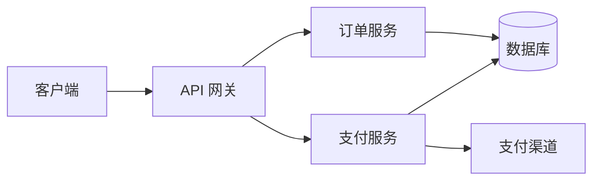

# 指南

> 基于 writethedocs.org 与 keepachangelog.com 编写 —— 架构文档 / Docs as Code 实战 / Diagrams as Code 选型 / 写作原则 / SemVer / 质量保障

## 架构文档与 ADR

### 架构文档结构

完整架构文档（如 Google's design docs）：

```
1. 目标与非目标（明确边界——不做什么同样重要）
2. 背景与上下文（现状、约束、历史）
3. 设计概述（含架构图、模块划分）
4. 详细设计
   - 数据模型
   - API 设计
   - 关键流程（时序图/状态图）
5. 权衡分析（备选方案 + 为何不选）
6. 风险与缓解
7. 里程碑与回滚方案
```

### ADR（Architecture Decision Record）

ADR 是轻量级决策记录，与架构文档互补——架构文档描述「整体」，ADR 记录「单个关键决策」：

```markdown
# ADR-007: 订单服务采用事件溯源（Event Sourcing）

## 状态
已接受（2026-06-20）

## 背景
- 订单状态变更需完整审计轨迹
- 传统 CRUD 难以回放历史
- 财务对账要求可重建任意时间点状态

## 决策
采用事件溯源：所有状态变更存为不可变事件，当前状态由事件回放得出。

## 后果
- 正面：完整审计、可回放、可重建任意状态
- 负面：复杂度上升、最终一致、需快照优化性能
- 缓解：定期快照、CQRS 读写分离

## 备选（未选）
- 传统 CRUD + 审计日志：简单但回放能力弱
```

ADR 目录 `docs/adr/`，编号递增，状态随决策演进（提议→接受→废弃→替代）。

## Docs as Code 工作流实战

### 完整工作流

```
1. 写：Markdown/reST/AsciiDoc（纯文本，Git 管理）
2. 审：Pull Request（与代码同审，同行评审）
3. 测：CI 检查（死链/拼写/lint/格式）
4. 构建：静态站点生成器（VitePress/Docusaurus/MkDocs/Antora）
5. 部署：CI/CD 推送（GitHub Pages/Vercel/自建）
6. 反馈：读者 issue/PR（文档也接受贡献）
```

### 静态站点生成器选型

| 工具 | 技术栈 | 适合 | 特点 |
|---|---|---|---|
| **VitePress** | Vue + Vite | 产品文档/技术博客 | 快、Vue 组件、主题美 |
| **Docusaurus** | React | 大型项目文档 | 版本化、i18n、MDX |
| **MkDocs** | Python（Material 主题）| 简洁文档 | 上手快、Material 主题流行 |
| **Antora** | AsciiDoc | 多仓库文档聚合 | 企业级、多源 |
| **docsify** | 运行时渲染 | 轻量 | 无构建，直接渲染 Markdown |

### CI 自动化检查

```yaml
# .github/workflows/docs.yml（示例）
name: Docs
on: [push, pull_request]
jobs:
  check:
    runs-on: ubuntu-latest
    steps:
      - uses: actions/checkout@v4
      - name: Check links
        run: npx markdown-link-check docs/**/*.md
      - name: Lint
        run: npx markdownlint docs/**/*.md
      - name: Spell check
        run: npx cspell docs/**/*.md
      - name: Build
        run: npm run docs:build
```

检查项：死链（markdown-link-check）、格式（markdownlint）、拼写（cspell）、构建（验证无报错）。

### 文档与代码同步策略

- **Docosaurus/C4 模型**：把文档放代码仓库（`docs/`），PR 同时改代码与文档
- **CODEOWNERS**：让文档目录有负责人，强制文档 PR 需评审
- **「无文档不合入」规则**：新功能 PR 必须含文档更新（CI 检查）
- **过期标记**：文档标注「最后验证版本」「适用日期」，提醒维护

## Diagrams as Code（图即代码）

### 为什么图也要「即代码」

传统画图（Visio/draw.io 截图）痛点：**无法 diff**（Git 看不出改了什么）、易过时（图与代码脱节）、难协作（二进制文件不能 PR）。**Diagrams as Code** 用文本描述图，纳入版本控制，可 diff、可评审、可自动生成。

### 三大工具选型

| 工具 | 语法风格 | 渲染 | 生态 | 最适合 |
|---|---|---|---|---|
| **Mermaid** | Markdown 内嵌、类 JS | 浏览器原生（GitHub/Notion/GitLab 支持）| **最广** | README/Wiki 内嵌图 |
| **PlantUML** | Java 风格 DSL | 服务端渲染（Java）| 成熟（UML 标杆）| 标准 UML、企业 IDE |
| **D2** | 现代声明式 | 本地/CLI（Go）| 新兴、设计精美 | 架构图、演示级质量 |

#### Mermaid 示例（GitHub 原生渲染）

````markdown

````

Mermaid 支持流程图、时序图、类图、状态图、甘特图、饼图等，**GitHub README 直接渲染**，是内嵌文档图的首选。

#### PlantUML 示例

```
@startuml
actor 用户
participant "前端" as FE
participant "API" as API
database "DB" as DB

用户 -> FE: 点击下单
FE -> API: POST /orders
API -> DB: INSERT
DB --> API: ok
API --> FE: 201 Created
FE --> 用户: 下单成功
@enduml
```

PlantUML 用 `@startuml/@enduml` 包裹，Java 风格，**UML 最全最标准**，企业 IDE（IntelliJ）集成成熟。

#### D2 示例

```
客户端: {shape: person}
API 网关: 网关
订单服务: 服务
支付服务: 服务
数据库: {shape: cylinder}

客户端 -> API 网关: HTTPS
API 网关 -> 订单服务: gRPC
API 网关 -> 支付服务: gRPC
订单服务 -> 数据库: SQL
```

D2 是现代声明式语言，**自动布局、主题、导出 SVG/PNG/PDF**，sketch 模式（手绘风），适合需要演示级质量的架构图。

### 选型建议

| 场景 | 推荐 |
|---|---|
| README/Wiki 内嵌流程图 | **Mermaid**（GitHub 原生渲染）|
| 标准 UML（类图/时序图/状态图）| **PlantUML**（最全）|
| 演示级精美架构图 | **D2**（现代美观）|
| 团队已有 Java/IDE 环境 | PlantUML |
| 团队用 Markdown 为主 | Mermaid |
| 需要导出高质量 SVG/PNG | D2 / PlantUML |

::: tip 图与代码同生命周期
无论选哪个工具，**把图源文件（.mmd/.puml/.d2）放代码仓库**，随代码一起 PR 评审，才能保证「图与代码不脱节」。
:::

## 写作原则与风格

### 受众先行（最核心）

写给谁看决定一切：

| 受众 | 词汇 | 深度 | 示例风格 |
|---|---|---|---|
| 初级开发者 | 简单、解释术语 | 从基础 | 教程式、step-by-step |
| 资深同事 | 行业术语 | 直入核心 | 简洁、假设背景 |
| 外部集成者 | 标准术语 | 接口导向 | API 文档、示例驱动 |
| 非技术管理者 | 类比、少术语 | 价值导向 | ROI、影响、风险 |

写之前先问：**读者是谁？他们已经知道什么？他们需要知道什么？**

### 主动语态

主动语态更清晰、更短、责任明确：

| ❌ 被动 | ✅ 主动 |
|---|---|
| 「错误被系统返回」| 「系统返回错误」|
| 「配置应该被修改」| 「修改配置」|
| 「It is recommended that...」| 「我们推荐...」|

### 术语一致

同一概念全篇用同一个词，避免混淆：

| ❌ 混用 | ✅ 一致 |
|---|---|
| 有时叫「用户」有时叫「客户」| 全篇「用户」|
| 有时「endpoint」有时「端点」| 统一一种 |
| 有时「POST 请求」有时「创建请求」| 定义后统一 |

建立**术语表**（glossary），文档开头定义关键术语。

### 其他原则

- **简洁**：能用一句话别说一段；能用列表别用段落
- **示例驱动**：抽象描述配具体示例（「例如：`GET /users/123`」）
- **结论先行**：先讲是什么/怎么做，再讲为什么（背景在后）
- **可扫描**：标题、列表、加粗——读者多扫描而非通读

## SemVer 语义化版本

[SemVer](https://semver.org/) 用三段式版本号传达变更性质：

```
MAJOR.MINOR.PATCH
 1   .  2  .  3
```

| 位 | 何时 +1 | 含义 |
|---|---|---|
| **MAJOR** | 不兼容的 API 变更 | 破坏性，使用者必须改代码 |
| **MINOR** | 向后兼容的新功能 | 升级安全，可用新功能 |
| **PATCH** | 向后兼容的 bug 修复 | 升级安全，行为修复 |

预发布/构建元数据：`1.0.0-alpha` / `1.0.0+build.1`。

SemVer 与 CHANGELOG、Conventional Commits 联动：`feat`→MINOR、`fix`→PATCH、`BREAKING CHANGE`→MAJOR，让版本号本身成为变更摘要。

## 文档质量保障

### 好文档的五个要素（writethedocs）

| 要素 | 含义 | 如何保证 |
|---|---|---|
| **可发现** | 读者能找到 | 清晰导航、搜索、SEO |
| **可读** | 找到后能读懂 | 受众先行、结构清晰 |
| **准确** | 内容正确 | 代码评审、专家审 |
| **及时** | 与产品同步更新 | Docs as Code、CI 检查 |
| **连贯** | 风格一致 | 写作风格指南、术语表 |

### 文档测试

- **死链检查**：markdown-link-check / lychee
- **拼写检查**：cspell / aspell
- **格式 lint**：markdownlint / vale（风格规则）
- **代码示例可运行**：把示例代码放进测试（doctest / 文档测试）
- **新鲜度审计**：定期检查文档「最后更新」时间，标记过期

### 文档债务管理

- 像技术债一样承认文档债的存在
- 每个迭代拨时间还文档债（如 10% 容量）
- 标记「已过时」文档，避免误导
- 新功能「文档先行」或「文档随行」，避免再造债

## 写作工具链

| 环节 | 工具 |
|---|---|
| 编辑器 | VS Code（Markdown 预览/插件）/ Obsidian |
| 图表 | Mermaid / PlantUML / D2 / Excalidraw（手绘风）|
| 静态站点 | VitePress / Docusaurus / MkDocs Material |
| API 文档 | Redoc / Swagger UI（OpenAPI 驱动）|
| CI 检查 | markdownlint / cspell / markdown-link-check / vale |
| 协作评审 | Git PR / GitHub PR review / Notion comments |
| CHANGELOG 自动化 | standard-version / semantic-release / changesets |

::: warning AI 辅助写作的边界
LLM（ChatGPT/Claude）能大幅加速草稿生成、润色、翻译，但易产生「幻觉」（看似正确实则错误的技术细节）。**AI 生成的内容必须人工核实**，尤其是 API 签名、命令参数、版本号等事实性内容。AI 是助手不是作者，署名与责任在人。
:::
